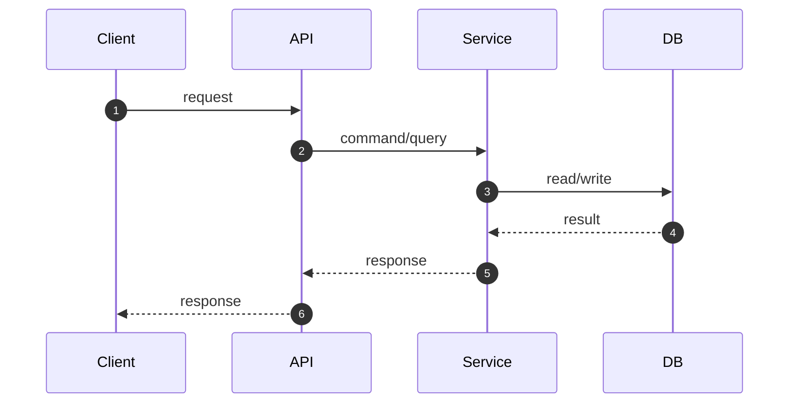

<!--
■ 공통 작성 규칙 (모든 섹션에 적용)

1) 한 줄에 몰아넣지 않는다.
   `- 배경: 이러이러해서 저러저러합니다` 처럼 라벨 뒤에 문장을 길게 붙이지 말고,
   라벨만 남기고 내용은 아래에 4칸 들여쓴 하위 불릿으로 편다.

   ✗ - 배경: A라서 B가 필요했는데 C 때문에 D로 했습니다
   ✓ - 배경
         - A라서 B가 필요했습니다.
         - 그런데 C 때문에 그대로는 쓸 수 없었어요.

2) 하위 불릿 하나에 한 가지 사실만 담는다.
   "그런데 / 그래서 / 하지만 / 덕분에"로 이어지는 흐름은 줄을 나눠 순서대로 놓는다.
   지금 어떻게 되어 있는지 → 그게 왜 문제인지 → 그래서 어떻게 결정했는지 순서를 지키고,
   해결책부터 먼저 말하지 않는다.

3) 톤은 해요체로 부드럽게 풀되, 핵심 결정 한 문장은 습니다체로 눌러 마무리한다.
   개조식(~함, ~임)은 쓰지 않는다. 강조가 필요한 문장만 **볼드**로 표시한다.

4) 파일명·클래스명은 실제 이름을 백틱으로 그대로 언급한다.
-->

## 📌 Summary
<!--
무엇을/왜 바꿨는지 한눈에 보이게 작성한다.
결과 항목에는 "이 PR로 무엇이 달라지는가"를 적고, 동작이 바뀌지 않는 PR이라면 그 사실을 명시한다.
-->

- 배경
    -
    -
- 목표
    -
- 결과
    -

## 🧭 Context & Decision
<!--
설계 의사결정 기록을 남기는 영역이다. "왜 이렇게 했는가"가 핵심이다.
읽는 사람이 제목만 훑어도 무엇을 정했는지 알 수 있게 쓴다.
-->

### 문제 정의

- 현재 동작/제약
    -
- 문제(또는 리스크)
    -
- 성공 기준(완료 정의)
    -

### 선택지와 결정

- 고려한 대안
    - A —
    - B —
- 최종 결정: **A를 택했습니다.**
    -
    -
- 트레이드오프
    -
- 추후 개선 여지(있다면)
    -

<!--
■ 큰 결정을 내린 뒤 그 아래에서 정해야 했던 것들이 있다면 이어서 적는다.
   없으면 이 절 전체를 지운다.

   각 결정마다 `#### N. 무엇 → 결론` 제목을 달고, 아래를 라벨 붙인 불릿으로 나눈다.
   라벨은 아래에서 그 결정에 실제로 필요한 것만 골라 쓴다.

   - 선택지 / 결정 근거      (대부분의 결정에 필요)
   - 배경                   (전제 설명이 필요할 때)
   - 파생 효과               (그 결정 때문에 다른 곳이 바뀌었을 때)
   - 남은 문제               (해결하지 못하고 남긴 것. 리뷰 의견을 구할 때)
   - 헷갈리기 쉬운 점         (리뷰어가 오해할 만한 지점)
   - 얻은 것 / 함께 건 안전장치
-->

### 그 뒤에 이어진 결정들

#### 1. 무엇을 정했나 → 결론

- 선택지
    -
    -
- 결정 근거
    -

#### 2. 무엇을 정했나 → 결론

- 선택지
    -
- 결정 근거
    -

## 🏗️ Design Overview
<!--
구성 요소와 책임을 정리한다.
컴포넌트는 "무엇을 담당함" 식 명사형 대신, 왜 필요해졌는지/무엇을 대체했는지 문장으로 풀어 쓴다.
-->

### 변경 범위

- 영향 받는 모듈/도메인
    -
- 신규 추가
    -
- 제거/대체
    -

### 주요 컴포넌트 책임

- `ComponentA`
    -
    -
- `ComponentB`
    -

## 🔁 Flow Diagram
<!--
가능하면 Mermaid로 작성한다. (시퀀스/플로우 중 택1)
"핵심 경로"를 먼저 그리고, 예외 흐름은 아래에 분리한다.
다이어그램 앞뒤로 이 흐름이 왜 이 순서/구조여야 하는지 한두 문장을 덧붙인다.
예외 분기(alt/else)가 있다면 그 분기가 왜 필요한지도 짚어준다.
-->

### Main Flow

### 예외 흐름
<!-- 없으면 지운다. 있다면 그 분기가 왜 필요한지 문장으로 먼저 설명한다. -->

## ✅ 검증
<!--
"어떻게 확인했는가"를 적는다. 테스트 이름과 무엇을 증명하는지를 함께 쓴다.
동작이 바뀌지 않아야 정상인 PR이라면, 그 사실을 확인한 방법도 함께 적는다.
-->

- 테스트
    - `XxxTest` —
- 빌드
    - `./gradlew build` 전체 통과

## 📎 리뷰어께 드리는 참고
<!--
없으면 지운다. 리뷰어가 놓치기 쉬운 것, 의견을 구하고 싶은 지점, 조용히 잘못될 수 있는 함정을 적는다.
-->

-
