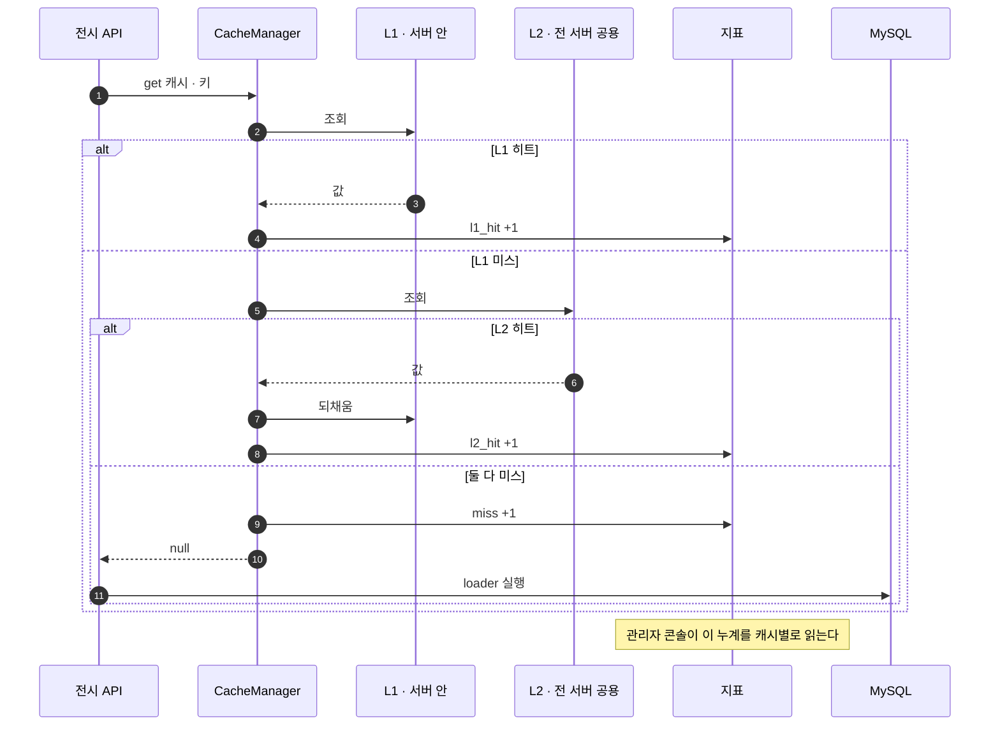

# 관리자 콘솔에 캐시 관측 화면을 추가한다

> base `develop` ← head `feat/cache-observability`
>
> 선행: [#157 조회 경로 캐시](https://github.com/team-yeowun/yeowun-backend/pull/157) · [#158 무효화 메시징](https://github.com/team-yeowun/yeowun-backend/pull/158) (둘 다 머지됨)

## 📌 Summary

- 배경
    - #157·#158로 2단 캐시와 무효화 방송까지 붙었어요.
    - 그런데 **캐시가 실제로 먹고 있는지 볼 방법이 없었습니다.** 히트율을 아무 데서도 세지 않았어요.
    - 무효화 실패는 예외를 삼켜 처리하기 때문에 로그 말고는 흔적도 남지 않습니다.
- 목표
    - 캐시가 제 몫을 하는지, 무효화 경로가 살아 있는지를 **관리자 콘솔에서 한눈에** 봅니다.
- 결과
    - 관리자 콘솔에 **캐시 탭**이 생겼어요. 캐시 선언별 계층 히트율과 무효화 건강 상태를 봅니다.
    - **조회 경로의 응답은 하나도 바뀌지 않습니다.** 창구가 세는 코드만 늘었어요.
    - 100만 건 부하 실험 결과를 [실행 결과 문서](../docs/전시_읽기최적화_설계문서/전시_조회_캐시_전략/전시_조회_캐시_적용_실행결과.md)로 함께 남겼습니다.

---

## 🖥️ 구현 결과 — 관리자 콘솔 「캐시」 탭

화면이 보여 주는 것 셋입니다.

- **KPI 줄** — 전체 히트율과 그 분해(L1 / L2 / 미스), 그리고 무효화 경로의 건강 상태(구독 · 발행 실패).
- **캐시 선언별 표** — 선언 8종 각각의 히트율과 계층 분해, L1 엔트리 수와 축출, 양쪽 TTL, L2 적재 여부.
- **무효화 경로 표** — 각 숫자 옆에 "이 값이 뭘 뜻하는지"를 같이 적었어요. 보는 사람이 문서를 찾지 않아도 되게요.

위 캡처에서 조회가 없던 캐시들이 **`—`로 찍힌 것**이 의도한 동작입니다. `0%`가 아니에요.
0%로 보이면 아무도 안 쓴 캐시가 **전부 미스나는 고장난 캐시**로 읽히고, 그 오해로 멀쩡한 캐시를 걷어낼 수 있습니다.

`ExhibitionDetail`의 「L2 적재」가 `키별`인 것도 의도예요. 전시 id마다 키가 달라 대표 키라는 것이 없습니다.

---

## 🧭 Context & Decision

### 지금 캐시는 이렇게 생겼습니다

값은 **L1(서버 안 Caffeine) → L2(전 서버 공용 Redis) → DB** 순으로 찾고, 찾은 곳보다 위 계층을 채우며 올라옵니다.

### 문제 정의

- 현재 동작/제약
    - `CacheManager`가 캐시 접근의 유일한 창구인데, **조회가 어느 계층에서 끝났는지 아무도 세지 않았어요.**
    - 무효화 실패는 `swallowRun`이 삼켜서 로그만 남습니다.
- 문제(또는 리스크)
    - 캐시가 안 먹고 있어도, 무효화가 조용히 실패하고 있어도 **밖에서는 알 수 없습니다.**
    - 특히 구독이 끊긴 서버는 요청이 200이라 정상으로 보입니다. 그동안 그 서버만 옛 값을 서빙해요.
- 성공 기준(완료 정의)
    - 캐시별 L1/L2/미스 비율을 화면에서 본다.
    - 구독이 끊기거나 발행이 실패하면 화면이 그것을 드러낸다.

### 선택지와 결정

- 고려한 대안
    - A — Redis `INFO keyspace_hits`를 읽어 히트율로 씁니다.
    - B — 창구(`CacheManager`)가 계층별로 직접 셉니다.
- 최종 결정: **B를 택했습니다.**
    - `keyspace_hits`는 **Redis 인스턴스 전체 값**이에요. 조회수 누산(`HINCRBY`)과 AI 임시저장까지 섞여 있습니다.
    - 그 값을 "캐시 히트율"이라고 화면에 띄우면 **틀린 숫자를 보고하는 셈**이 됩니다.
    - L1/L2/미스를 판정하는 자리가 `CacheManager.get` 하나뿐이라, 정확한 값은 거기서만 나옵니다.
- 트레이드오프
    - 창구에 계측 호출이 들어갑니다. 조회당 카운터 증가 한 번이라 비용은 무시할 수준이에요.

### 그 뒤에 이어진 결정들

#### 1. 조회가 없는 캐시의 히트율을 어떻게 표시할까 → `0%`가 아니라 `—`(모름)

- 결정 근거
    - `0%`로 찍으면 **아무도 안 쓴 캐시**가 **전부 미스나는 고장난 캐시**로 보입니다.
    - 그 오해로 멀쩡한 캐시를 걷어내는 판단을 할 수 있어요.
    - 그래서 조회 수가 0이면 -1을 내려보내고 화면은 `—`로 그립니다.
- 함께 건 안전장치
    - `AdminCacheFacadeTest`가 "조회 없으면 -1"을 고정합니다.

#### 2. 구독 여부 게이지는 누가 가질까 → 리스너가 아니라 컨테이너

- 결정 근거
    - 리스너 콜백으로 1/0 플래그를 들면 **콜백이 오지 않는 형태의 단절에서 값이 굳습니다.**
    - 게이지가 1인데 실제로는 끊겨 있는 상태가 가장 나쁩니다.
    - `RedisMessageListenerContainer.isListening()`은 실제 상태를 그때그때 읽어요.
- 파생 효과
    - 지표 클래스는 "재구독이 몇 번 일어났나"만 셉니다. 이 값이 계속 오르면 구독이 flapping 중이라는 신호예요.

#### 3. 수동 워밍 버튼을 이 컨트롤러에 또 만들까 → 만들지 않습니다

- 결정 근거
    - `POST /api-admin/v1/exhibitions/cache/warm`이 이미 있어요.
    - 같은 일을 하는 문을 둘로 만들면 나중에 한쪽만 바뀝니다.
    - 탭의 「목록 캐시 재적재」 버튼은 기존 엔드포인트를 부릅니다.

---

## 🏗️ Design Overview

### 변경 범위

- 신규 추가
    - `CacheLookupMetrics` — 계층별 히트/미스 카운터
    - `AdminCacheFacade` · `AdminCacheResult` — 캐시 현황 조립
    - `AdminCacheV1Controller` · `AdminCacheV1ApiSpec` — `GET /api-admin/v1/cache/stats`
- 수정
    - `CacheManager` — `get`에서 계층 판정을 기록, Caffeine 통계·L2 적재 여부 노출
    - `admin.html` — 캐시 탭
- 제거/대체
    - 없습니다. 조회 경로의 동작은 그대로입니다.

### 주요 컴포넌트 책임

- `CacheLookupMetrics`
    - 창구가 판정한 결과(L1 히트 / L2 히트 / 미스)를 캐시별로 셉니다.
    - Micrometer 카운터와 스냅샷 두 벌로 들고 있어요. 앞은 Grafana용, 뒤는 대시보드가 한 번에 읽을 누계입니다.
- `AdminCacheFacade`
    - 선언 목록을 순회해 캐시별 현황을 모읍니다. L1 엔트리 수와 축출만 Caffeine 자체 통계에서 읽어요.

---

## 🔁 Flow Diagram

### 히트율이 집계되는 자리

계층 판정이 일어나는 그 자리에서 세는 것이 이 PR의 전부입니다.

### 관리자 수정 — 커밋 뒤에 지운다

### 조회는 세 갈래로 갈린다

워머는 파사드가 아니라 서비스를 부릅니다. 파사드를 부르면 캐시의 옛 값이 그대로 돌아와 워밍이 아무 일도 하지 않아요.

---

## 🚨 이 화면이 드러내는 장애 지점

무효화가 실패할 수 있는 지점은 셋입니다. 화면의 「무효화 경로」 표가 각각에 대응해요.

### 틈 ① 발행 실패 — 화면의 `발행 실패` 카운터

핵심 피해는 방송 유실이 아니라 **L2 오염**입니다. 다른 서버의 L1을 지워도 다음 조회가 오염된 L2에서 옛 값을 다시 가져오니까요.
자동 재발행 대기열은 두지 않았고, 6시간 내 배치가 L2를 덮습니다. **이 카운터가 그 판단의 검증 수단**이에요.

### 틈 ② 구독 단절 — 화면의 `구독 상태` · `재구독 횟수`

구독이 끊긴 서버는 **요청이 200이라 밖에서는 정상으로 보입니다.** 화면이 대신 드러내야 하는 상태가 이것이고, 상단 경고 배너가 뜹니다.

### 틈 ③ 수신 처리 실패 — 화면의 `수신 실패` 카운터

캐시에서 안전한 실패는 옛 값을 지키는 것이 아니라 **비우는 것**입니다. 예외를 밖으로 던지면 구독이 죽어 틈 ③이 틈 ②로 번져요.

---

## ✅ 검증

- 테스트
    - `AdminCacheFacadeTest`(6) — 선언 전체 노출 · **조회 없으면 0%가 아니라 모름** · 계층별 집계 · 전체 합산 · 상세는 단일 엔트리 아님 · 무효화 상태 반영
    - `CacheManagerTest` · `CacheInvalidationMetricsTest` — 계측 추가로 깨지지 않는지
- 실제 서버에 띄워 확인
    - 세 상태를 직접 만들어 카운터가 그 이유로 움직이는지 봤어요.

    | 조작 | L1 | L2 | 미스 | 히트율 |
    |---|---:|---:|---:|---:|
    | 캐시 비우고 1회 조회 | 0 | 0 | 1 | 0.00 |
    | 연속 3회 조회 | 3 | 0 | 1 | 0.75 |
    | 방송으로 L1만 비움 | 3 | **1** | 1 | 0.80 |

    세 번째 줄이 핵심이에요. **L1만 비웠더니 L2 히트로 잡히고 L1 엔트리가 다시 1로 돌아옵니다** — 되채움까지 숫자로 보입니다.
- 빌드
    - `./gradlew build` 전체 통과(469개).
    - 인라인 JS는 `node --check`로 문법 확인했습니다.

---

## 📎 리뷰어께 드리는 참고

- **렌더링을 눈으로 확인하지 못했습니다.** 로컬에서 `localhost:18090/admin.html` → 캐시 탭으로 봐 주세요. 레이아웃만 봐주시면 됩니다.
- 히트율의 분모는 **창구를 통과한 조회**입니다. `CacheManager`를 우회해 `RedisCacheManager`를 직접 쓰면 그 조회는 집계에 안 잡혀요. 창구를 지키는 규율이 곧 지표의 정확도입니다.
- 상세 캐시는 전시 id마다 키가 달라 「L2 적재」를 `키별`로만 표시합니다. 대표 키라는 것이 없어서예요.
- 100만 건 실험은 **의도적 극단**입니다. 결론은 볼륨 간 상대 비교로만 읽어 주세요.
