# 전시 조회 2단 캐시 적용 — 실행 결과

> 측정일 2026-08-11 · 대상 PR [#157](https://github.com/team-yeowun/yeowun-backend/pull/157)(조회 경로) · [#158](https://github.com/team-yeowun/yeowun-backend/pull/158)(무효화 메시징)
>
> 설계 판단의 근거는 [`내용/`](내용/)의 주제별 문서에 있다.

## 한 줄 결론

전시 **100만 건**에서 캐시 대상 목록·배너의 응답이 **수백 ms → 2~3ms**로 내려갔고, 지속 부하 60초 동안 **실패 0건**이었다. 무효화 방송이 실제로 소비되는 것까지 실측으로 확인했다.

---

## 1. 숫자 요약

### 1-1. 단건 응답 (전시 100만 건, 캐시별 진짜 콜드 → 웜)

콜드는 **방송으로 L1을 비우고 L2 키를 지운 뒤** 잰 값이다. `FLUSHALL`만으로는 L1이 남아 콜드가 되지 않는다.
웜은 10회 평균이다.

| 엔드포인트         |      콜드 |           웜 |     배율 | 기대 대비                       |
|---------------|--------:|------------:|-------:|-----------------------------|
| 전시 상세         |  42.8ms | **11.20ms** |     4× | 기대 내(조회수 누산이 매 요청 남음)       |
| 홈 배너          |  23.6ms |  **1.64ms** |    14× | 기대 내                        |
| 섹션 무료         | 287.9ms |  **1.82ms** |   158× | 기대 내                        |
| 목록 인기순        | 458.0ms |  **2.16ms** |   212× | 기대 내                        |
| 목록 종료임박       | 432.6ms |  **1.77ms** |   244× | 기대 내                        |
| 목록 최신순        | 457.5ms |  **1.82ms** |   251× | 기대 내                        |
| 지역 필터(캐시 비대상) |       — |    166.83ms | **1×** | **설계대로** — 캐시를 태우지 않기로 한 경로 |

상세가 4×에 그치는 이유는 `personalize`가 캐시 히트든 미스든 **매 요청 조회수를 누산**하기 때문이다(Redis `HINCRBY` 1회 + 로그인 시 관심·기록 조회). 캐시가 아끼는 것은 조립 쿼리
쪽이다.

### 1-2. 지속 부하 60초 (목록 30VU + 상세 20VU + 비대상 5VU)

| 경로            |        med |       p95 | 비고                               |
|---------------|-----------:|----------:|----------------------------------|
| 목록·배너(캐시 대상)  | **2.98ms** | **8.2ms** | 100만 건인데 소규모와 차이가 없다             |
| 지역 필터(캐시 비대상) |      852ms |   1,380ms | 단독 호출 167ms → **동시성에서 8배로 무너진다** |

전체 **418,784 요청 / 6,953 RPS / 실패 0%**.

비대상 경로의 숫자가 이 표의 핵심이다. **캐시가 막아 주고 있는 것이 무엇인지**를 같은 조건에서 보여 준다.

### 1-3. 무효화 동작 (실측)

| 확인 항목        | 결과                                                |
|--------------|---------------------------------------------------|
| 구독 배선        | `무효화 채널 구독 확인 … 구독자수=1` 로그 + `PUBSUB NUMSUB` = 1  |
| 방송 → L1 삭제   | 8.7ms(L1 히트) → **554.6ms**(방송 후 DB까지) → 2.2ms(재웜) |
| 자기 방송 자기 수신  | 수동 워밍 1회에 **publish +7 / receive +7**             |
| 워밍 적재        | L2 키 8종 전부 생성                                     |
| Redis 재시작 복구 | 키 0 → 구독 자동 복구 → 재구독 시 L1 전체 삭제 → 수초 내 정상         |

가운데 **554.6ms**가 방송이 실제로 먹었다는 증거다. 방송이 무시됐다면 계속 8ms대였을 것이다.

---

## 2. 캐시는 어떻게 도는가

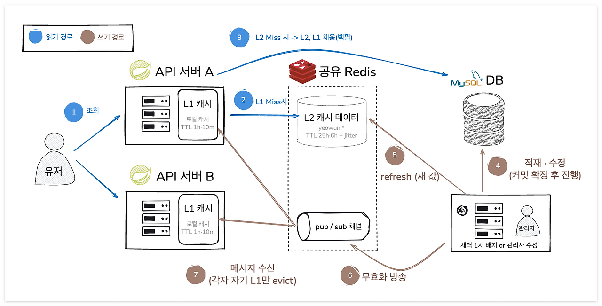

읽기(파랑)와 쓰기(갈색)가 한 장에 있다. **두 경로가 Redis에서 만나는 것**이 이 그림의 요점이다 — 읽기는 L2를 읽고, 쓰기는 L2를 갱신한 뒤 같은 Redis의 채널로 방송해 각 서버의 L1을
지운다.

같은 흐름을 조회 시점에서만 보면 세 갈래가 된다.

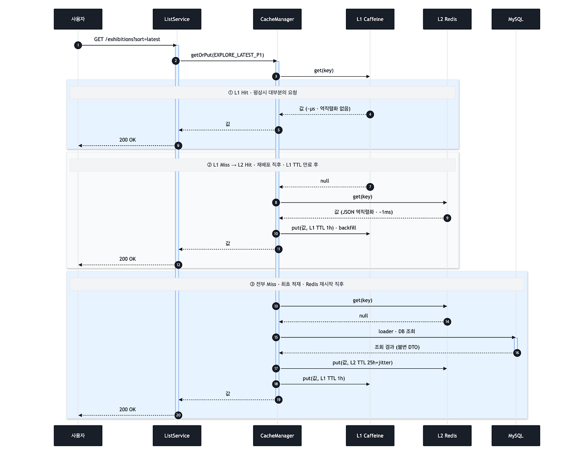

값은 **L1(서버 안 Caffeine) → L2(전 서버 공용 Redis) → DB** 순으로 찾고, 찾은 곳보다 위 계층을 채우며 올라온다.
캐시에는 **익명 결과만** 담고 요청자별 값(관심 여부)은 캐시 밖에서 덮어쓴다 — 개인화가 섞이면 남의 상태가 새어 나간다.

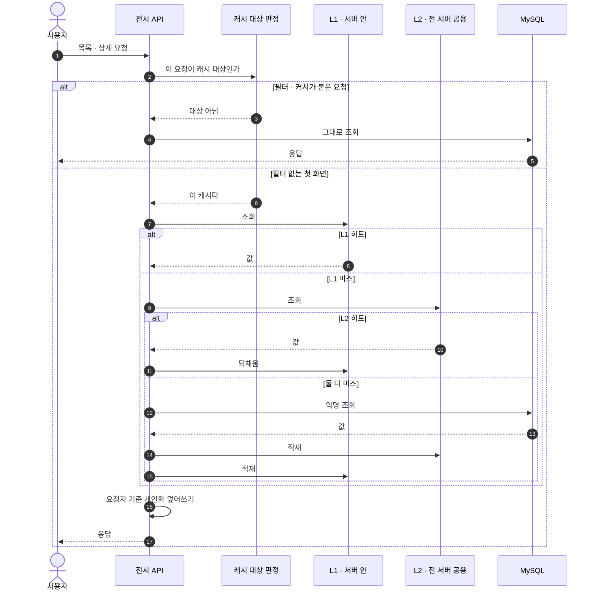

캐시 대상은 **필터 없는 첫 페이지 7종과 CATALOG 상세**뿐이다. 필터 조합까지 담으면 키가 폭발하고 각 키의 히트율이 떨어진다.

위 두 그림이 **순서**라면 아래는 **배치**다 — 창구 하나 뒤에 L1·L2·DB·방송이 어떻게 늘어서 있는지.

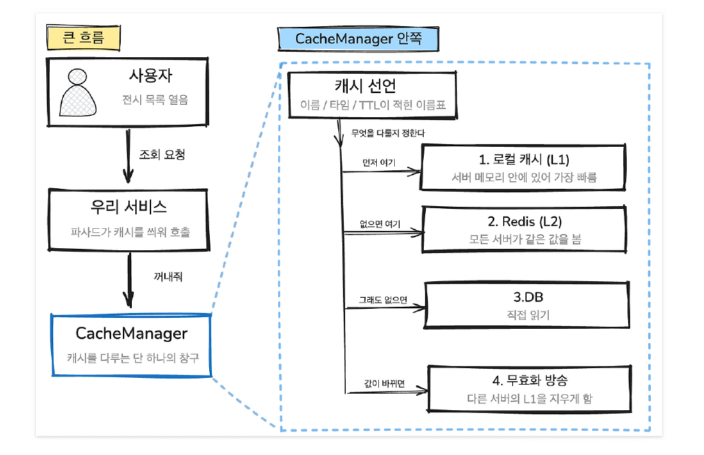

---

## 3. 무효화와 재적재

값이 바뀌는 길은 둘이다. **관리자 수정**(즉시 지우기)과 **주기 워밍**(새 값으로 덮기).
둘 다 전 서버에 알려야 하는데, 메시지에는 **삭제할 키만** 싣고 값은 싣지 않는다. 데이터 원본이 L2 하나라 재생 대신 재조회로 충분하기 때문이다.

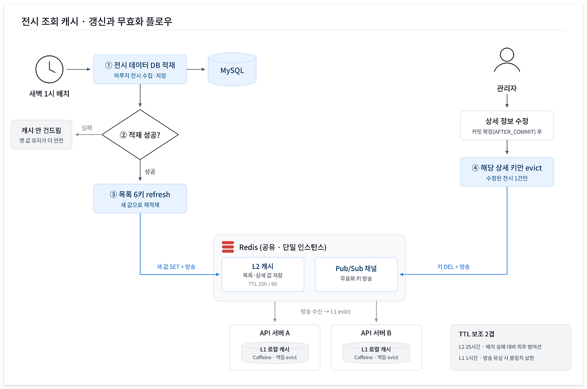

### 3-1. 관리자 수정 — 커밋 뒤에 지운다

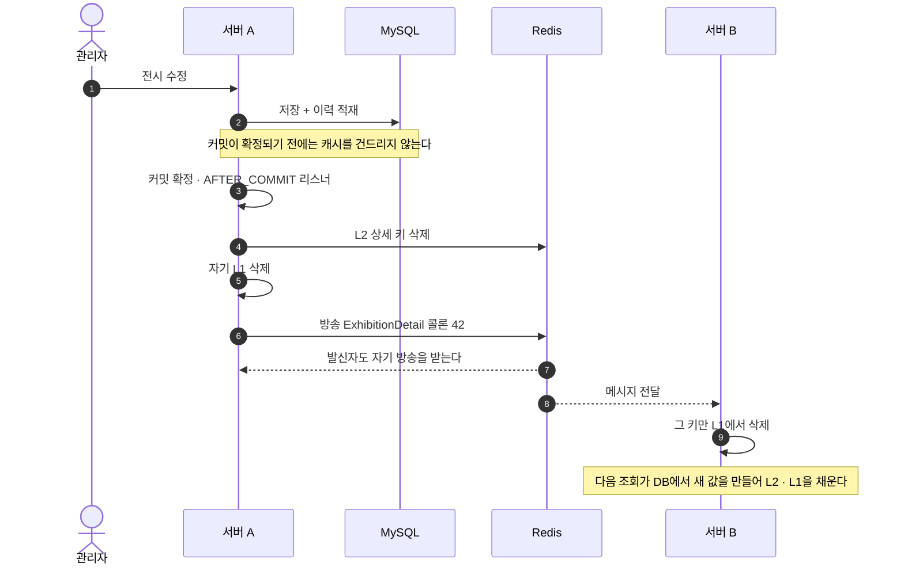

커밋 전에 지우면 롤백된 경우 **DB는 옛 값 그대로인데 전 서버의 멀쩡한 캐시만 날아간다.**
값이 실제로 바뀌지 않았으면 이벤트 자체가 나가지 않는다.

### 3-2. 주기 워밍 — 사용자가 미스를 겪기 전에 채운다

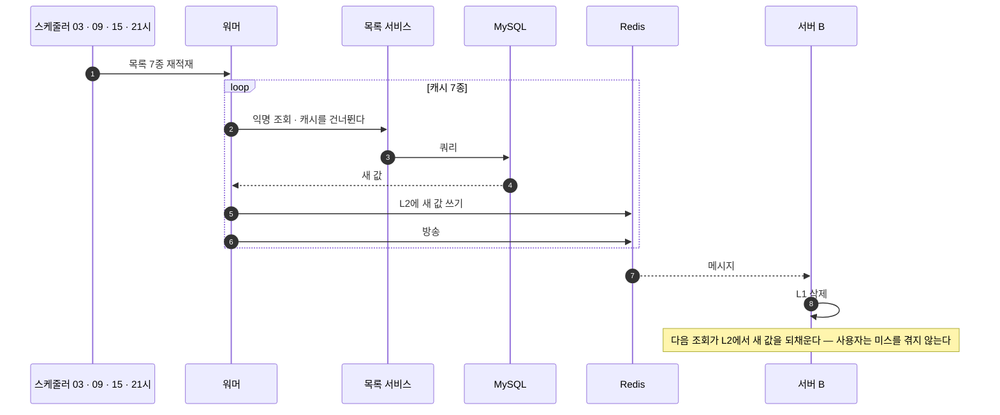

워머가 **파사드가 아니라 서비스를 부르는 것**이 요점이다. 파사드를 부르면 캐시에 있던 옛 값이 그대로 돌아와 워밍이 아무 일도 하지 않는다.
조회수 반영 배치 **30분 뒤**에 도는 것도 의도다 — 인기순과 배너가 조회수로 정렬되므로, 먼저 돌면 한 창 전의 조회수로 만든 목록이 6시간 동안 서빙된다.

---

## 4. 장애 지점별 동작

무효화가 실패할 수 있는 지점은 셋이다. 공통 원칙은 **"상황을 파악할 수 없으면 L1을 비우고 L2에서 다시 시작한다"** 이다.

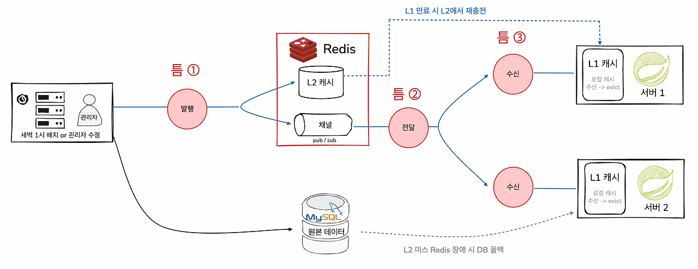

### 4-1. 발행 실패 — Redis가 죽어 있을 때

**케이스 A — Redis가 다운된 채 유지될 때.** L2를 읽지 못해 DB로 폴백하므로 사용자는 최신 데이터를 본다.

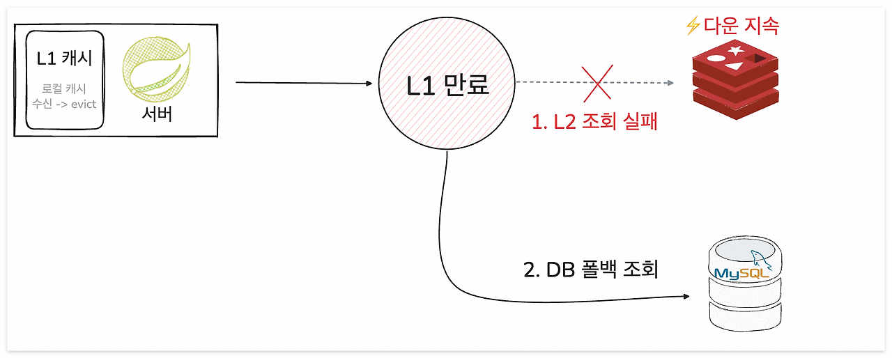

**케이스 B — 갱신·발행만 실패하고 Redis는 곧 정상화될 때.** 이쪽이 진짜 문제다. 읽기가 성공하므로 폴백이 발동하지 않고, 만료된 L1이 오염된 L2에서 옛 값을 계속 되채운다.

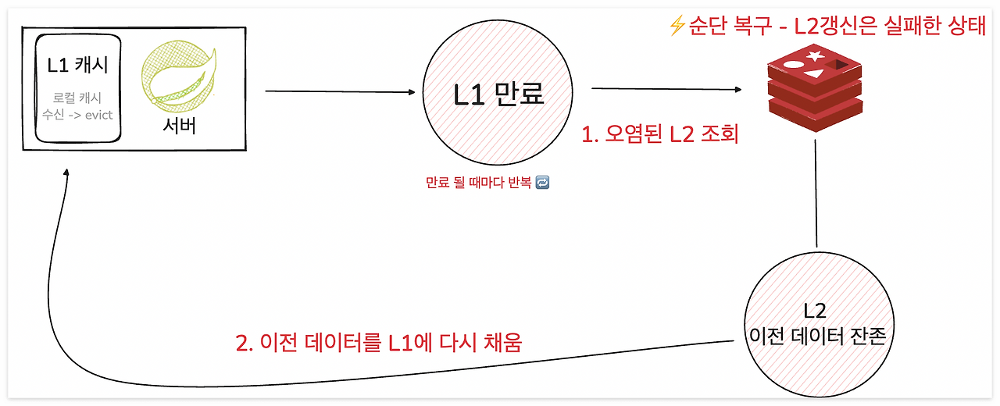

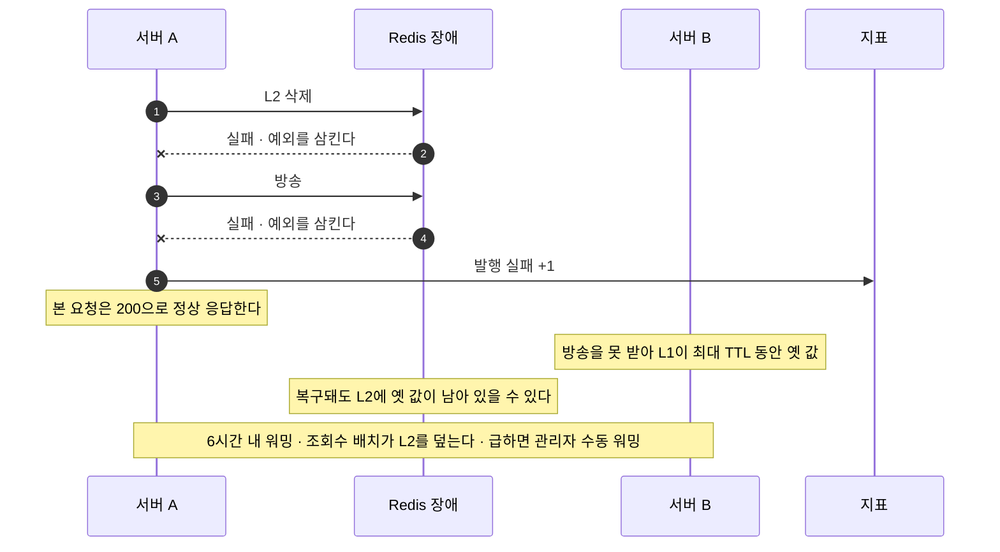

핵심 피해는 방송 유실이 아니라 **L2 오염**이다. 다른 서버의 L1을 지워도 다음 조회가 오염된 L2에서 옛 값을 다시 가져오기 때문이다.
자동 재발행 대기열은 두지 않았다 — 배치가 6시간 안에 덮으므로 대기열이 줄이는 것은 그 6시간뿐이라고 판단했다. 대신 **이 실패 카운터가 그 판단의 검증 수단**이다.

### 4-2. 구독 단절 — 메시지가 오지 않을 때

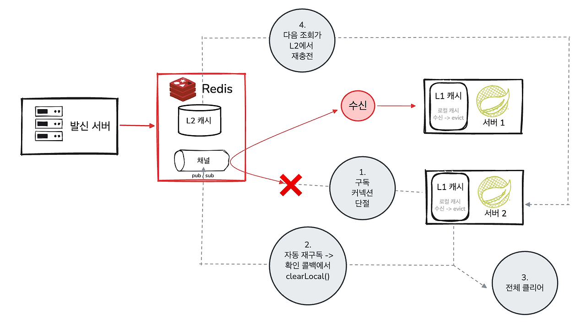

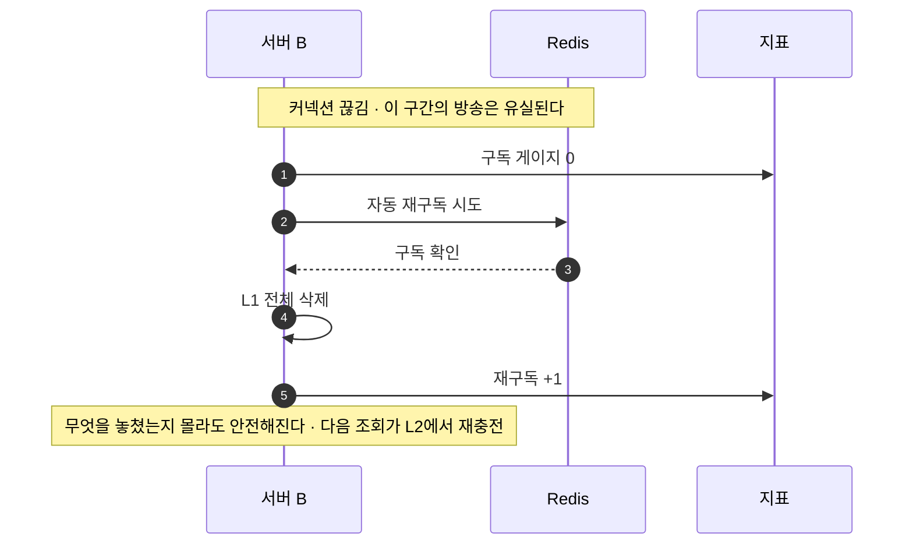

놓친 메시지를 재생(replay)하지 않고 **상태를 다시 조회(re-pull)** 한다. 메시지가 삭제 키만 담고 원본이 L2 하나라 둘이 등가이기 때문이다. 비용은 고정 키의 L2 재조회뿐이다.

### 4-3. 수신 처리 실패 — 메시지는 왔는데 처리가 안 될 때

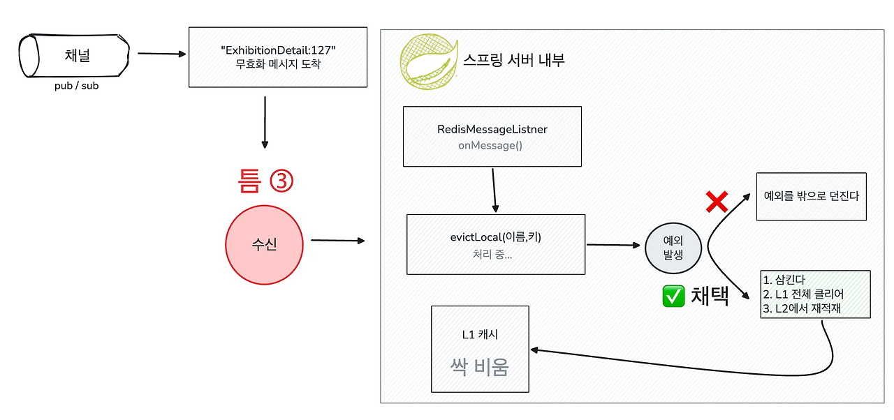

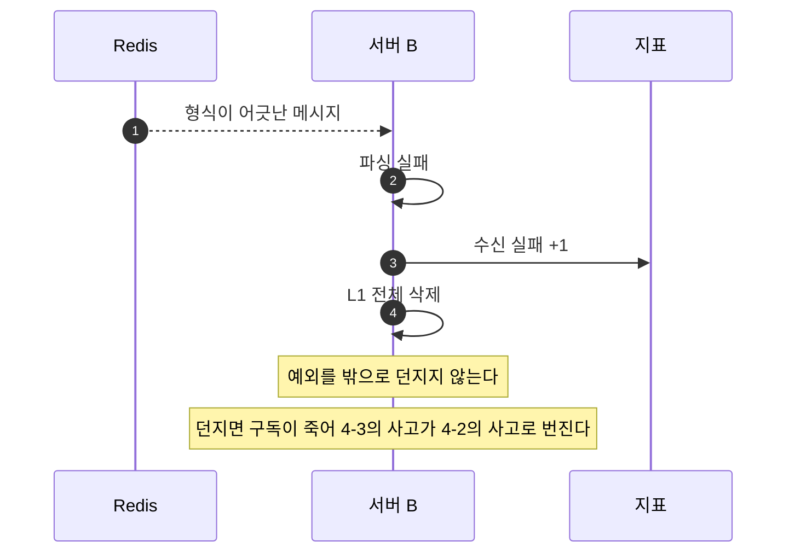

캐시에서 **안전한 실패는 옛 값을 지키는 것이 아니라 비우는 것**이다. 피해가 가장 작은 지점의 사고가 가장 큰 지점의 사고로 번지는 것을 여기서 끊는다.

---

## 5. STEP별 변경

| STEP  | 파일                                                                                                      | 무엇을                                             |
|-------|---------------------------------------------------------------------------------------------------------|-------------------------------------------------|
| 4     | `ExhibitionFacade`                                                                                      | 배너를 `getOrPut`으로 감쌈                             |
| 5-1   | `ExhibitionPageSize`(신규) · `ExhibitionCriteria` · `ExhibitionCache` · `ExhibitionListCacheResolver`(신규) | 캐시 대상 판정을 요청·페이지 정책·리졸버 셋으로 분리                  |
| 5-2~4 | `ExhibitionResult` · `ExhibitionListAssembler` · `ExhibitionListService`                                | 익명 결과에 관심 여부만 덮어쓰는 개인화 경로                       |
| 5-5   | `ExhibitionFacade`                                                                                      | 목록 캐시 배선(익명 로더 + 개인화)                           |
| 6     | `ExhibitionDetailService` · `ExhibitionFacade` · `ExhibitionViewCountService`                           | `getDetail` 분해, CATALOG만 캐시, 반영 배치가 상세 캐시 evict |
| 7     | `ExhibitionCacheWarmer`(신규) · `ExhibitionCacheWarmScheduler`(신규)                                        | 6시간 워밍(조회수 반영 30분 뒤)                            |
| 8     | `ExhibitionAdminUpdatedEvent`·`ExhibitionCacheEvictListener`(신규) · `AdminExhibitionFacade`              | 관리자 수정 시 AFTER_COMMIT 무효화                       |
| 9~10  | `CacheManager` · `CacheInvalidationMetrics`(신규)                                                         | 실패 감지(`swallowRun` 반환값) + 발행·수신 계측              |
| 11    | `RedisMessageListener`(신규) · `CacheConfig`                                                              | 수신부와 구독 배선                                      |
| 13    | `AdminExhibitionV1Controller`                                                                           | 수동 워밍 트리거                                       |
| —     | `CacheConfig` · `CacheSubscriptionWatchdog`(신규)                                                         | Redis가 죽어 있어도 기동되게 + 재구독 워치독                    |

---

## 6. 측정하지 않은 것

- **운영 환경에서 재지 않았다.** 전부 로컬(호스트 JVM + Docker MySQL/Redis)이다. 운영은 vCPU 2 EC2에 앱·MySQL·Redis가 함께 있어 경합 조건이 다르다.
- **100만 건은 의도적 극단**이다. 운영 실제 전시 수는 이보다 훨씬 작다. 이 보고서의 결론은 **볼륨 간 상대 비교**로만 읽어야 한다.
- **이번 측정 구간의 히트율은 남아 있지 않다.** 계층별 히트율은 이후 관리자 콘솔(캐시 탭)에 노출했지만, 위 숫자를 잰 시점에는 없던 기능이라 그때의 히트 비율은 소급해 알 수 없다.
- **다중 인스턴스로 재현하지 않았다.** 서버 간 무효화는 단일 인스턴스가 자기 방송을 받는 것으로만 확인했다. 2대 이상에서의 전파 지연은 측정 대상이 아니었다.
- **이 보고서의 범위는 웜 서빙 경로다.** 콜드 스타트 거동과 상세 롱테일 접근 특성은 이 문서에서 다루지 않는다(별도 추적).
