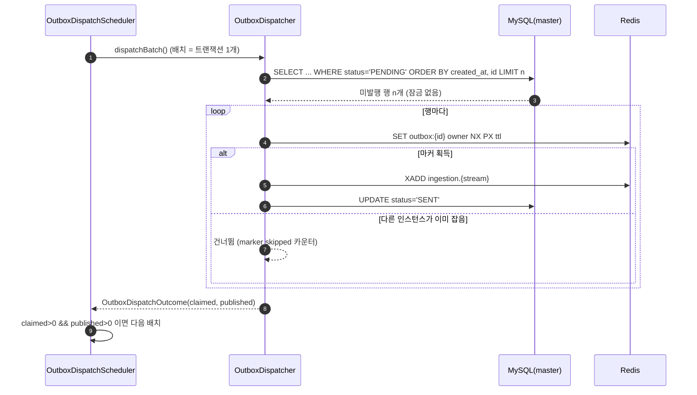

<!-- PR #166 본문 초안 · base: #165 · head: feat/ingestion-v2-scheduler-lock -->

## 📌 Summary

- 배경
    - 아웃박스 발송 스케줄러는 인스턴스마다 하나씩 돌아요. 서버가 2대가 되면 같은 시각에 같은 미발행 행을 두 앱이 함께 읽습니다.
    - 지금은 선점 조회가 `FOR UPDATE SKIP LOCKED` 한 가지뿐이라, 중복을 막는 판정이 전부 DB 행 잠금에 묶여 있어요.
    - 미발행 100만 행을 놓고 앱 2대를 띄우는 부하 실험을 돌려 락 방식별로 무엇이 달라지는지 실측했고, 그 수치로 방식을 골랐습니다.
- 목표
    - 중복 판정을 DB 밖으로 옮기고, 발송 경로에서 DB 행 잠금을 없앱니다.
    - 락 방식을 프로퍼티로 바꿔 같은 조건에서 비교 측정할 수 있게 만듭니다.
- 결과
    - 발송 경로의 중복 판정이 행 단위 Redis 마커(`SET outbox:{id} NX PX`)로 바뀌었어요.
    - 100만 행 실험에서 중복 0건, DB 행 잠금 대기 0ms를 확인했습니다.
    - 회수·정리·트리밍 세 잡에는 잡 단위 락이 붙어 인스턴스 한 대만 돌아요.

## 🧭 Context & Decision

### 문제 정의

- 현재 동작/제약
    - `OutboxDispatchScheduler.dispatch` 가 틱마다 `OutboxDispatcher` 를 부르고, 선점은 `OutboxJpaRepository.claimPending` 의 `FOR UPDATE SKIP LOCKED` 하나로 고정돼 있어요.
    - 중복을 막는 주체가 DB 행 잠금이라, 선점·갱신이 전부 마스터 한 대로 몰립니다.
- 문제(또는 리스크)
    - 잠금으로 판정하면 잠금을 놓친 인스턴스가 대기하거나 빈손으로 돌아가요.
    - 잠금 범위가 커지면 커밋에서 부딪혀 트랜잭션이 통째로 롤백되는데, 대기열 발행은 트랜잭션 밖이라 되돌아가지 않아 그대로 중복이 됩니다.
- 성공 기준(완료 정의)
    - 앱 2대 · 미발행 100만 행에서 중복 0건.
    - `Innodb_row_lock_waits` 델타 0.
    - 기존 통합 테스트 전부 green.

### 선택지와 결정

- 고려한 대안
    - A — 행 단위 Redis 마커로 판정을 옮기고 발송 조회에서는 잠금 절을 뺍니다.
    - B — `FOR UPDATE SKIP LOCKED` 와 배치 상한을 유지합니다.
    - C — 발송 전체를 잡 단위 분산락으로 감쌉니다.
- 최종 결정: **A를 택했습니다.**
    - B는 중복을 막지만 판정이 계속 DB 안에 있어, 인스턴스를 늘릴수록 마스터가 상한이 돼요.
    - C는 인스턴스 한 대만 일하게 만들어서 "인스턴스를 늘린 만큼 처리량이 는다"는 목표와 정면으로 부딪힙니다.
- 트레이드오프
    - 발송 경로가 Redis 가용성에 묶여요. 마커가 사라지면 사라진 만큼 중복이 납니다.
    - 이 계층은 원래 at-least-once 이고 소비 쪽이 멱등이라, 이 구간은 수용하기로 했습니다.
- 추후 개선 여지(있다면)
    - 두 인스턴스가 여전히 같은 목록을 각자 읽어요. 이 낭비는 대기열이 소비자에게 밀어 주는 구조로 바꿔야 사라집니다.

### 그 뒤에 이어진 결정들

#### 1. 마커를 언제 푸는가 → 성공은 TTL, 실패는 즉시 해제

- 선택지
    - 발행 직후 항상 해제합니다.
    - 항상 TTL 에 맡깁니다.
- 결정 근거
    - 발행 직후 해제하면 아직 커밋되지 않은 행을 다른 인스턴스가 다시 집어요.
    - 실패 행을 TTL 에 맡기면 그 행의 재시도가 TTL 동안 통째로 멈춥니다. 기존 `OutboxPublishFailureTest` 3개가 이 지점을 red 로 짚어 줬어요.
    - 그래서 성공 행은 TTL, 실패 행은 그 자리에서 해제로 갈랐습니다.

#### 2. 소진 루프를 트랜잭션 안에 둘 것인가 → 밖에 둡니다

- 선택지
    - 루프 전체를 한 트랜잭션으로 감쌉니다.
    - 배치 하나를 트랜잭션 하나로 두고 루프는 밖에 둡니다.
- 결정 근거
    - 루프를 트랜잭션 안에 넣으면 한 틱이 잡은 잠금과 변경이 틱 전체 동안 쌓여, 배치를 나눈 의미가 사라져요.
    - 실측에서도 상한 없는 대량 트랜잭션이 커밋에서 50초 잠금 대기로 롤백됐습니다.

#### 3. 잡 단위 락을 어디에 거는가 → 회수·정리·트리밍 셋에만

- 선택지
    - 발송에도 겁니다.
    - 전체를 훑는 잡에만 겁니다.
- 결정 근거
    - 발송에 걸면 인스턴스 한 대만 일해요.
    - 수집 회차는 회차 키 유일 제약이 이미 단일 실행을 만들어서 그대로 뒀습니다.
    - 해제는 소유자를 비교해 지우는 Lua 한 덩어리예요. 값 비교와 삭제 사이에 만료가 끼면 남의 락을 지우게 됩니다.

## 🏗️ Design Overview

### 변경 범위

- 영향 받는 모듈/도메인
    - `ingestionv2/common` 의 발송 경로(선점 · 발행 · 표시)와 스케줄러 셋.
    - 코어 `support/db`·`config` 에 읽기 라우팅 데이터소스가 새로 붙어요.
- 신규 추가
    - `ingestionv2/common/lock/RedisMarkerLock.java` · `ingestionv2/common/lock/IngestionJobLock.java`
    - `ingestionv2/common/outbox/OutboxClaimStrategy.java` · `OutboxReadSource.java` · `OutboxDispatchOutcome.java` · `OutboxReplicaReader.java`
    - `support/db/DataSourceRole.java` · `support/db/RoutingDataSource.java` · `config/DataSourceConfig.java`
- 제거/대체
    - 선점 방식이 `FOR UPDATE SKIP LOCKED` 고정에서 `claim-strategy` 로 선택되는 형태로 바뀌었어요. 쿼리 자체는 지우지 않고 남겨 뒀습니다.

### 주요 컴포넌트 책임

- `RedisMarkerLock`
    - 중복 판정의 유일한 원시 연산인 `SET key owner NX PX` 를 감쌉니다.
    - 획득 실패를 대기가 아니라 "다른 인스턴스가 맡았다"는 사실로 다뤄요.
- `OutboxDispatcher`
    - 선점 전략을 적용하고, 마커를 잡은 행만 발행·표시합니다.
    - 못 잡은 행은 그 틱에서 다시 읽지 않아요. 소진 루프가 같은 행을 붙잡고 도는 것을 막습니다.
- `OutboxDispatchScheduler`
    - 틱 하나가 배치를 소진할 때까지 반복하되, 반복은 트랜잭션 밖입니다.
    - `cleanup` 은 잡 락을 잡은 인스턴스에서만 돌아요.
- `OutboxJpaRepository`
    - 선점 쿼리 6개를 갖습니다. 조건과 정렬은 전부 같고 잠금 절과 `LIMIT` 유무만 달라요.
- `RoutingDataSource` · `DataSourceConfig`
    - `readOnly` 트랜잭션만 복제본으로 보냅니다. 복제본 주소가 설정된 환경에서만 등록돼요.

## 🔁 Flow Diagram

발송 틱은 "선점 → 판정 → 발행 → 표시"를 배치마다 한 트랜잭션으로 끊습니다. 판정이 DB 밖으로 나갔기 때문에 선점 조회에는 잠금 절이 없고, 그 대신 행마다 마커를 잡는 단계가 들어갔어요.

### Main Flow

### 예외 흐름

발행이 실패한 행은 시도 횟수만 올리고 그 행의 마커를 즉시 해제해요. 그래야 다음 틱이 그 행을 다시 집을 수 있습니다. 재시도 상한을 넘긴 행만 `FAILED` 로 걷어냅니다.

## ✅ 검증

- 테스트
    - `IngestionLockTest` — 마커 배타성, TTL 만료 후 재획득, 소유자가 다른 해제가 남의 락을 지우지 않는 것, 잡 락의 단일 실행을 고정해요.
    - `OutboxClaimStrategyTest` — 선점 경로 여덟 갈래(전략 4 × 상한 유무 — 쿼리 6개에 매핑)가 전부 실행되고, 상한 0이 전부를 집고, 오래된 순으로 정렬되는지 확인합니다.
    - `OutboxClaimConcurrencyTest` — 두 트랜잭션이 동시에 열린 상태에서 잠금 없음은 같은 집합을 두 번 주고, `SKIP LOCKED` 는 겹치지 않는다는 것을 고정해요.
    - `OutboxConcurrentDispatchTest` — 운영 기본값에서 두 발송기가 동시에 밀어도 대기열 항목 수가 행 수와 같은지 봅니다.
    - `OutboxPayloadFormatTest` — payload JSON 형식을 고정합니다.
- 빌드
    - `./gradlew test --tests "modi.backend.ingestionv2.*"` 161개 통과.
    - `./gradlew build` 전체 통과.

## 📎 리뷰어께 드리는 참고

- 실측 요약 (미발행 100만 행 · 앱 2대(마지막 행만 1대) · MySQL 8.4.10 · Redis 7.4.9 · 각 1회)

| 선점 방식 | 배치 | 중복 | DB 락 대기(회 / ms) | 롤백 | 소진 시간 |
|---|---|---|---|---|---|
| 없음 | 상한 없음 | 2,000,000 | 1 / 50,013 | 1 | 1,085초 |
| `FOR UPDATE` | 상한 없음 | 0 | 4 / 200,315 | 4 | 408초 |
| `FOR UPDATE SKIP LOCKED` | 상한 없음 | 381,009 | 2 / 54,882 | 1 | 453초 |
| `FOR UPDATE SKIP LOCKED` | 500 | 0 | 0 / 0 | 0 | 318초 |
| Redis 마커 | 500 | 238(마커 삭제 60초 주입 구간 · 주입 밖 0) | 0 / 0 | 0 | 549초 |
| Redis 마커(앱 1대) | 500 | 0 | 0 / 0 | 0 | 535초 |

- 운영 기본값이 실제로 바뀌는 값이 둘 있어요. 둘 다 눈에 띄게 적어 둡니다.
    - `app.ingestion.v2.claim-strategy` 기본값이 `REDIS_MARKER` 입니다. 발송 경로에서 DB 잠금이 사라지는 대신 Redis 가 죽으면 발송이 멈춰요.
    - `app.ingestion.v2.dispatch-drain` 기본값이 `true` 입니다. 한 틱이 적체를 비울 때까지 도는 동작이라 회복은 빨라지지만, 몰아치는 구간이 생겨요. **이 기본값을 `false` 로 되돌릴지는 아직 정하지 않았습니다.**
- `OutboxReplicaReader` 는 읽기 복제 분산이 왜 안 되는지를 재현하려고 남긴 경로예요. 조회 커넥션이 쓰기 트랜잭션 밖이라 원자적이지 않다는 사실을 클래스 주석에 적어 뒀습니다.
- `dispatch-batch-size` 운영 기본값은 100 그대로예요. 500은 실험 설정에서만 씁니다.
