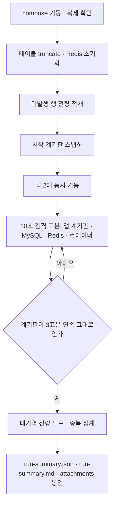

<!-- PR #167 본문 초안 · base: #166 · head: feat/ingestion-v2-outbox-lock-lab -->

## 📌 Summary

- 배경
    - #166 에서 선점 방식을 프로퍼티로 고를 수 있게 만들었어요. 어느 방식을 운영 기본값으로 둘지는 수치로 정해야 합니다.
    - 그런데 "앱 2대가 같은 행을 동시에 집는" 상황은 단위 테스트로 재현되지 않아요. 앱·DB·Redis 가 실제로 떠 있어야 합니다.
- 목표
    - 운영과 같은 구성으로 앱 2대를 띄우고, 프로퍼티만 바꿔 같은 조건에서 락 방식을 비교 측정하는 도구를 둡니다.
    - 측정 결과를 다시 돌려볼 수 있도록 조건과 원시 계기판을 파일로 남깁니다.
- 결과
    - `lab/outbox-lock/` 아래에 실험 무대와 실행 스크립트, 변형 9개, 관측 스크립트가 들어왔어요.
    - 변형 9개를 각 1회 실행한 원시 수치와 그 해석 문서가 함께 들어옵니다.
    - **프로덕션 코드는 이 PR에서 한 줄도 바뀌지 않습니다.**

## 🧭 Context & Decision

### 문제 정의

- 현재 동작/제약
    - 통합 테스트는 컨텍스트 하나로 도는 구조라 "인스턴스 2대"를 문서에 적을 수 있는 형태로 재현하지 못해요.
    - 락 대기·롤백·복제 지연 같은 값은 앱 계기판만으로는 안 보이고 MySQL·Redis 계기판을 함께 떠야 합니다.
- 문제(또는 리스크)
    - 실험 창에 다른 스케줄러가 끼어들면 `Com_select` 나 명령 통계가 오염돼요.
    - 대기열에 100만 건이 쌓이면 기본 설정의 Redis 메모리 상한을 넘깁니다.
- 성공 기준(완료 정의)
    - 변형 사이에 바뀌는 것이 프로퍼티뿐이어야 합니다.
    - 한 번 실행하면 조건·계기판·중복 집계가 파일로 봉인돼야 합니다.

### 선택지와 결정

- 고려한 대안
    - A — 별도 compose 한 벌을 두고 프로퍼티 토글만 바꿔 변형을 만듭니다.
    - B — 기존 `compose.yaml` 을 재사용하고 값만 바꿔 씁니다.
- 최종 결정: **A를 택했습니다.**
    - 프로젝트 이름이 `outboxlock` 이라 볼륨과 네트워크가 기존 것과 겹치지 않아요.
    - 실험용으로 스트림 상한과 메모리를 크게 잡아야 하는데, 그 설정이 개발 환경으로 새어 들어가면 안 됩니다.
- 트레이드오프
    - 이미지 빌드가 한 번 더 필요해요. 대신 실험이 개발 환경을 건드리지 않습니다.

### 그 뒤에 이어진 결정들

#### 1. 중복을 무엇으로 세는가 → 대기열에 실제로 실린 것

- 선택지
    - 앱의 발행 성공 카운터 합에서 `SENT` 행수를 뺍니다.
    - 대기열을 전량 덤프해 이벤트 식별자의 총계와 고유 수를 셉니다.
- 결정 근거
    - 카운터 기반 공식은 롤백이 끼면 값이 어긋나요. 실제로 롤백이 난 변형에서 두 값이 갈립니다.
    - 그래서 덤프 기반을 주 지표로 두고 카운터 공식을 보조로 병기합니다. `observe/dump-stream.sh` 와 `observe/duplicate-count.sh` 가 그 일을 해요.

#### 2. 실험 창을 어떻게 비우는가 → 다른 잡을 전부 재웁니다

- 선택지
    - 그대로 두고 노이즈를 감수합니다.
    - 실험 env 에서 주기 잡을 전부 끕니다.
- 결정 근거
    - 트리밍이 살아 있으면 대기열 길이가 상한으로 깎여 중복 대조가 거짓이 돼요.
    - 수집 회차가 살아 있으면 외부 API 를 호출하며 아웃박스에 행을 더합니다.
    - `variants/_base.env` 에서 트리밍·정리·수집 회차와 코어 주기 잡을 모두 껐고, 그 사실을 각 실행 요약의 조건에 적습니다.

## 🏗️ Design Overview

### 변경 범위

- 영향 받는 모듈/도메인
    - `lab/outbox-lock/**` 만 새로 들어옵니다. 프로덕션 소스는 변경 없어요.
- 신규 추가
    - `lab/outbox-lock/compose.lab.yaml` · `lab/outbox-lock/run.sh` · `lab/outbox-lock/README.md`
    - `lab/outbox-lock/variants/_base.env` 와 변형 9개(`s0.env` ~ `s5-1.env`)
    - `lab/outbox-lock/seed/seed-loop.sh` · `seed/smoke-gate.sh` · `lab/outbox-lock/inject-marker-loss.sh`
    - `lab/outbox-lock/observe/` 아홉 개 스크립트(`scrape-apps.sh` · `mysql-status.sh` · `replica-status.sh` · `redis-info.sh` · `innodb-status.sh` · `docker-stats.sh` · `dump-stream.sh` · `duplicate-count.sh` · `env.sh`)
    - `lab/outbox-lock/mysql/{master.cnf,replica.cnf,init-replication.sh}` · `lab/outbox-lock/nginx/nginx.conf`
    - 실행 결과와 해석 문서: `docs/전시수집_파이프라인_v2문서/AI-Driven-Development/` 아래 이 주제 폴더의 `action/`(다섯 편), `evidence/key-metrics.md`, `evidence/design-notes.md`, 그리고 실행마다 봉인된 `run-summary.json` · `run-summary.md` · `attachments/`

### 주요 컴포넌트 책임

- `run.sh`
    - 인프라 기동, 복제 확인, 테이블과 Redis 초기화, 적재, 앱 동시 기동, 10초 간격 표본 수집, 종료 계기판 봉인을 한 번에 합니다.
    - 변형 이름 하나만 받아요. 값은 전부 `variants/*.env` 에 있습니다.
- `variants/_base.env`
    - 모든 변형이 공유하는 무대예요. 틱 간격, 컨슈머 스위치, 힙, 꺼야 할 주기 잡이 여기 모여 있습니다.
- `observe/dump-stream.sh` · `observe/duplicate-count.sh`
    - 대기열을 전량 훑어 이벤트 식별자 목록을 만들고 중복을 셉니다. 이 값이 주 지표예요.
- `inject-marker-loss.sh`
    - 실행 중 마커 키를 지워 판정 근거가 사라진 상태를 만듭니다. 지운 키와 시각을 파일로 남겨요.

## 🔁 Flow Diagram

한 번의 실행은 아래 순서를 지킵니다. 적재를 먼저 끝내고 앱을 띄우는 이유는, 첫 틱이 쌓인 전량을 대상으로 삼아야 변형 사이의 조건이 같아지기 때문이에요.

### Main Flow

### 예외 흐름

마커 삭제를 주입하는 변형에서는 앱 기동 뒤 정해진 시점에 `inject-marker-loss.sh` 가 60초 동안 돌아요. 지운 키 목록과 시작·종료 시각을 남겨서, 주입 구간 안과 밖을 나눠 읽을 수 있게 합니다.

## ✅ 검증

- 테스트
    - 이 PR 에는 프로덕션 코드 변경이 없어서 새 테스트가 없어요. #166 의 테스트가 그대로 기준입니다.
    - 형식 확인은 100행짜리 짧은 실행으로 했습니다. 판정 없는 설정에서 중복이 나오고, 마커 설정에서 0이 나오는 것까지 확인했어요.
- 빌드
    - `./gradlew build` 전체 통과(#166 기준 그대로).

## 📎 리뷰어께 드리는 참고

- 변형 9개를 각 1회 실행한 결과입니다. 조건이 다른 두 줄은 표시해 뒀어요.

| 변형 | 선점 방식 | 배치 | 조회 | 앱 | 규모 | 중복 | DB 락 대기(회 / ms) | 소진 |
|---|---|---|---|---|---|---|---|---|
| s0 | 없음 | 상한 없음 | master | 2 | 100만 | 2,000,000 | 1 / 50,013 | 1,085초 |
| s1 | `FOR UPDATE` | 상한 없음 | master | 2 | 100만 | 0 | 4 / 200,315 | 408초 |
| s2 | `SKIP LOCKED` | 상한 없음 | master | 2 | 100만 | 381,009 | 2 / 54,882 | 453초 |
| s3a | `SKIP LOCKED` | 500 | master | 2 | 100만 | 0 | 0 / 0 | 318초 |
| s3b | `FOR UPDATE` | 500 | master | 2 | **10만** | 0 | 20,110 / 52,684 | 59초 |
| s4a | `FOR UPDATE` | 500 | **replica** | 1 | **10만** | 3,500 | 0 / 0 | 83초 |
| s4b | 없음 | 500 | **replica** | 1 | **10만** | 100,000 | 0 / 0 | 82초 |
| s5 | Redis 마커 | 500 | master | 2 | 100만 | 238(마커 삭제 주입 구간) | 0 / 0 | 549초 |
| s5-1 | Redis 마커 | 500 | master | 1 | 100만 | 0 | 0 / 0 | 535초 |

- 읽을 때 주의할 점 세 가지예요.
    - s3b·s4a·s4b 는 10만 행 짧은 실행이에요. 100만 행 실행과 배수로 견주지 않습니다.
    - s0 의 분당 처리량은 속도가 아니에요. 같은 100만 건을 확정하려고 300만 번 발행한 결과입니다.
    - s4a 는 미발행 81,000 행을 남긴 채 관측이 끝났어요. 소진 감지가 복제본 쪽 잠금 대기를 활동으로 세지 못했습니다. 중복이 났다는 판정에만 씁니다.
- 실행 순서와 재현 방법은 `lab/outbox-lock/README.md` 에 있어요. 실행 중에는 같은 머신에서 다른 컨테이너나 빌드를 돌리지 않아야 수치가 흔들리지 않습니다.
- 해석은 `action/` 아래 다섯 편(`01-비관락.md` ~ `05-Redis 분산락.md`)에 나눠 적었고, 숫자의 출처는 `evidence/key-metrics.md` 에 한 장으로 모았습니다.
