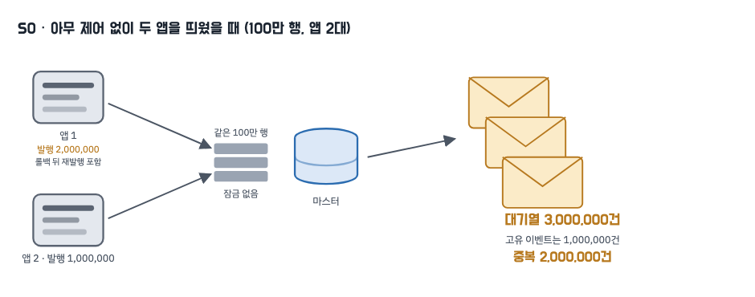
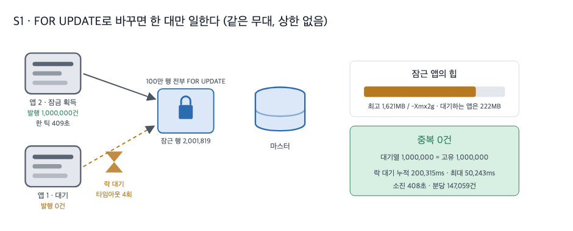
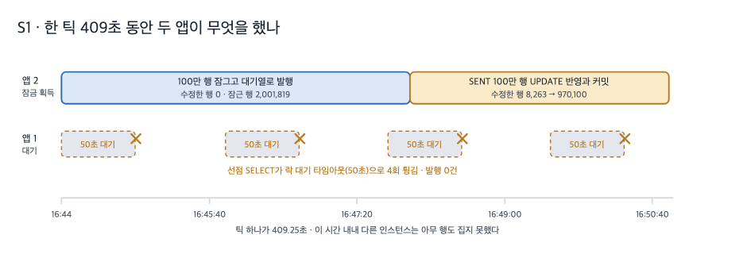

# 1. 비관적 락

## 무엇을 재려고 했나

아웃박스에 쌓인 이벤트는 발송 스케줄러가 주기적으로 조회해 대기열로 내보냅니다. 이 스케줄러는 인스턴스마다 하나씩 돌기 때문에, 서버가 두 대가 되는 순간 같은 시각에 같은 미발행 행을 두 앱이 함께 읽습니다. 저희가 답해야 했던 요구는 두 가지였습니다. **중복을 차단할 것, 그리고 인스턴스를 늘린 만큼 처리량이 늘 것.**

이 두 요구를 말로 정리하는 대신, 락 방식만 바꿔 가며 같은 무대에서 한 번씩 돌려 숫자를 남기기로 했습니다. 무대는 운영 구성과 같은 모양의 docker compose 한 벌입니다. Nginx 뒤에 같은 이미지의 앱 두 대를 두고, MySQL 마스터와 복제본, Redis를 붙였습니다. 각 변형은 프로퍼티 토글 하나만 다르고 나머지는 전부 같습니다.

| 무대 조건 | 값 |
|---|---|
| 적재 | 미발행 행 1,000,000건을 **한 번에** 넣고 그 뒤에 두 앱을 동시 기동 |
| 발송 틱 | 60,000ms · 한 틱은 적체를 소진할 때까지 배치를 반복 |
| 배치 상한 | 없음(`dispatch-batch-size=0`) |
| 인스턴스 | 앱 2대 동시 기동 · 힙 `-Xmx2g` 동일 |
| 미들웨어 | MySQL 8.4.10(master/replica) · Redis 7.4.9 · 컨슈머 OFF |
| 반복 | N=1(변형당 1회) · 커밋 `14323e7` |

원시값은 변형마다 `run-summary.json`·`run-summary.md`와 계기판 원문 `attachments/`로 남겼습니다. 이 글의 수치는 전부 그 파일에서 옵니다.

## 기준선 — 아무 제어도 걸지 않으면

먼저 잠금도 마커도 없는 상태(`claim-strategy=NONE`)를 재서 이후 모든 단계의 before로 삼았습니다.



두 앱은 미발행 행을 통째로 집었습니다. 선점 호출은 합쳐 11회인데 집어 온 행은 3,000,000행이고(행은 1,000,000개뿐입니다), 대기열에는 3,000,000건이 실렸습니다. 고유한 이벤트는 1,000,000건이므로 **중복은 2,000,000건**입니다. 주 지표와 보조 공식(발행 성공 합 − SENT 행수)이 같은 값을 냅니다 [raw: `../_workspace/03_measurer_raw/s0/run-summary.json`]. 중복된 식별자 목록은 1,000,000줄, 즉 예외 없이 모든 행이 두 번 이상 나갔습니다 [raw: `../_workspace/03_measurer_raw/s0/attachments/stream-duplicate-ids.txt`].

중복이 행 수의 두 배까지 간 이유는 인스턴스가 둘이어서만은 아닙니다. 잠금 없이 읽더라도 발송을 마친 행에 SENT를 표시하는 UPDATE는 행 잠금을 잡습니다. 두 앱이 같은 행을 갱신하려 부딪히면서 앱1의 트랜잭션이 `innodb_lock_wait_timeout`(50초)에 걸려 커밋 시점에 통째로 롤백됐습니다(락 대기 1회 / 50,013ms, `Com_rollback` 1) [raw: `../_workspace/03_measurer_raw/s0/attachments/app-logs.txt`].

```
18:01:21.582 WARN  org.hibernate.orm.jdbc.error - Lock wait timeout exceeded; try restarting transaction
org.springframework.dao.CannotAcquireLockException: could not execute statement
  [update ingestion_outbox set ... status=? where id=?]
  at org.springframework.orm.jpa.JpaTransactionManager.doCommit(JpaTransactionManager.java:556)
```

무제어에서는 중복이 인스턴스 수만큼 난다는 문장이 실측으로 확인됐습니다. 그렇다면, 같은 행을 한 번에 한 앱만 읽게 하려면 무엇을 바꿔야 할까요?

## 선택지와 기준

기준은 하나였습니다. **어디에서 "이 행은 내 것"을 판정하는가.** 판정 주체가 어디에 있느냐에 따라 뒤에 온 인스턴스가 기다리는지, 건너뛰는지, 아예 다른 행으로 가는지가 갈립니다.

| 방식 | 판정 주체 | 뒤에 온 인스턴스 | 이 편에서 재는 것 |
|---|---|---|---|
| 잠금 없음 | 없음 | 같은 행을 함께 발행 | 기준선(S0) |
| `SELECT … FOR UPDATE` | DB 행 잠금 | 잠금이 풀릴 때까지 대기 | **이 편(S1)** |
| `FOR UPDATE SKIP LOCKED` | DB 행 잠금 | 잠긴 행을 건너뜀 | 다음 편 |
| 행 단위 Redis 마커 | DB 밖 | 마커를 못 잡으면 건너뜀 | 마지막 편 |

가장 먼저 시도할 것은 `FOR UPDATE`였습니다. 판정을 DB에게 맡기면 코드에는 조회 한 줄만 바뀌고, "한 앱만 처리한다"는 보장을 데이터베이스가 대신 서 줍니다. 대신 뒤에 온 인스턴스가 무엇을 하게 되는지는 재 봐야 알 수 있는 값이었습니다.

## 무엇을 바꿨나

선점 조회를 전략 값으로 고르게 하고, 잠금 절만 다른 쿼리를 나란히 두었습니다. 비교가 성립하려면 조건과 정렬이 한 글자도 달라선 안 됩니다.

```java
// src/main/java/modi/backend/ingestionv2/common/outbox/OutboxJpaRepository.java:51
@Query(value = """
        SELECT * FROM ingestion_outbox
        WHERE status = 'PENDING'
        ORDER BY created_at, id
        FOR UPDATE
        """, nativeQuery = true)                 // 상한 없음 + 대기하는 잠금
List<Outbox> claimAllPendingForUpdate();
```

상한 없는 쿼리를 따로 둔 이유가 있습니다. 무제한을 큰 수 바인딩으로 흉내 내면 옵티마이저는 여전히 `LIMIT`을 보고 계획을 세우기 때문에, "상한이 없다"는 조건 자체가 재현되지 않습니다. 전략 값은 프로퍼티 하나(`app.ingestion.v2.claim-strategy`)로 바뀌며, `NONE`·`PESSIMISTIC`·`SKIP_LOCKED`는 이 부하 실험의 비교용 값임을 enum 주석에 남겨 두었습니다.

한 틱은 선점·발행·표시를 한 트랜잭션에 담고, 적체가 남아 있으면 배치를 반복합니다. 이때 반복은 트랜잭션 밖입니다. 루프를 트랜잭션 안에 넣으면 틱 하나가 잡은 잠금이 틱 전체 동안 쌓여 배치를 나눈 의미가 사라집니다(`common/interfaces/OutboxDispatchScheduler.dispatch` L54~69).

## 측정



| 지표 | S0 잠금 없음 | S1 `FOR UPDATE` | N | 조건 |
|---|---|---|---|---|
| 중복(대기열 `aggregateId` 총계 − 고유) | 2,000,000건 | **0건** | 1 | 위 무대 조건 동일 |
| 대기열 항목 / 고유 이벤트 | 3,000,000 / 1,000,000 | 1,000,000 / 1,000,000 | 1 | |
| 락 대기 횟수 / 누적 / 최대 | 1회 / 50,013ms / 50,013ms | 4회 / 200,315ms / 50,243ms | 1 | `Innodb_row_lock_*` 델타 |
| 트랜잭션 롤백(`Com_rollback` 델타) | 1 | 4 | 1 | |
| 선점 호출 / 선점 행수 | 11회 / 3,000,000행 | 3회 / 1,000,000행 | 1 | |
| 앱별 발행 성공 | 앱1 2,000,000 · 앱2 1,000,000 | **앱1 0 · 앱2 1,000,000** | 1 | S1은 앱2가 잠금을 잡았다 |
| 힙 최고(스크랩 표본 최댓값) | 1,764MB · 1,828MB(두 앱) | 1,621MB(잠근 앱) · 222MB(대기한 앱) | 1 | `-Xmx2g` |
| 소진 시간 / 분당 SENT | 1,085초 / 55,300건 | 408초 / 147,059건 | 1 | |
| master `Com_select` / `Innodb_rows_read` | 458회 / 5,000,116행 | 282회 / 2,000,116행 | 1 | 델타 |

원시: S0 `../_workspace/03_measurer_raw/s0/run-summary.json` · S1 `../_workspace/03_measurer_raw/s1/run-summary.json`. 앱별 발행·선점·틱 값은 두 앱의 prometheus 표본 원문 `../_workspace/03_measurer_raw/s1/attachments/{app1,app2}/prom-*.txt`, 힙은 같은 표본의 `jvm_memory_used_bytes{area="heap"}` 합계 최댓값입니다.

중복은 목표대로 0이 됐습니다. 대기열에 실린 항목 수가 고유 이벤트 수와 정확히 같고, 보조 공식(발행 성공 합 − SENT 행수)도 0으로 일치합니다.

## 한 틱 안에서 벌어진 일

문제는 그 0을 만든 방식입니다.



두 앱은 16:44:21에 함께 떴고, 먼저 조회를 시작한 앱2가 미발행 행 1,000,000건을 통째로 잠갔습니다. 이 트랜잭션은 16:44:19에 시작해 런이 끝날 때까지 살아 있었고, 잠근 행은 첫 표본에서 이미 2,001,819개였습니다 [raw: `../_workspace/03_measurer_raw/s1/attachments/trx-samples.txt`]. 잠근 뒤 약 4분 동안 수정한 행은 0인 채로 대기열 발행만 이어졌고, 16:48:15 무렵부터 수정한 행이 8,263 → 970,100으로 올라갑니다. 발행이 끝난 뒤 SENT 표시 100만 건이 한꺼번에 반영되는 구간입니다. 이 한 틱의 소요는 **409.25초**였습니다(`ingestion_outbox_dispatch_tick_seconds` count 1 / sum 409.250637394).

그동안 앱1은 아무 행도 집지 못했습니다. 선점 조회가 앞선 잠금에 걸려 50초를 기다린 뒤 타임아웃으로 튕기고, 다음 틱에 다시 시도하기를 네 번 반복했습니다.

```
16:45:09.895 WARN  org.hibernate.orm.jdbc.error - Lock wait timeout exceeded; try restarting transaction
org.springframework.dao.CannotAcquireLockException: JDBC exception executing SQL
  [SELECT * FROM ingestion_outbox WHERE status = 'PENDING' ORDER BY created_at, id FOR UPDATE]
```

같은 오류가 16:45:09 · 16:47:00 · 16:48:50 · 16:50:40에 반복됩니다 [raw: `../_workspace/03_measurer_raw/s1/attachments/app-logs.txt`]. (같은 로그 파일에는 컨테이너 수명이 더 길어 폐기한 1차 런의 항목도 남아 있습니다. 이 런의 창은 앱 기동 16:44:21 이후입니다.) 앱1의 발행 카운터는 런이 끝날 때까지 표본에 등록조차 되지 않았고, 유일하게 성공한 선점 한 번은 0행을 집었습니다(`ingestion_outbox_claim_total` 1.0 / `ingestion_outbox_claim_rows_total` 0.0). 잠금이 풀렸을 때는 이미 모든 행이 SENT였기 때문입니다. 힙도 이 사실을 그대로 보여 줍니다. 잠근 앱은 1,621MB까지 올라간 반면 대기한 앱은 165MB에서 222MB로 완만히 오르기만 했고, 컨테이너 CPU 최대치도 3.66%에 그쳤습니다 [raw: `../_workspace/03_measurer_raw/s1/attachments/docker-stats.csv`].

정리하면, 인스턴스를 두 대로 늘렸는데 실제로 일한 것은 한 대였습니다. 처리량을 기준선과 견주지는 않습니다. 기준선은 같은 100만 건을 확정하려고 300만 번 발행한 결과라 속도로 읽을 수 있는 값이 아닙니다. "두 대가 되면 빨라진다"가 성립하지 않는다는 사실은 이 런 안에서 이미 드러납니다. 한 대가 100만 건을 전부 내보내는 409초 동안 다른 한 대의 발행은 0건이었고, 두 대가 함께 있었다는 흔적은 락 대기 200,315ms뿐입니다.

## 롤백은 이미 나간 발행을 되돌리지 못합니다

두 런 모두 롤백이 있었지만 결과는 정반대였습니다.

잠금 없는 기준선에서는 롤백이 **발행 이후**에 났습니다. 대기열 발행은 트랜잭션 밖의 XADD라 되돌아가지 않고, 되돌아간 것은 SENT 표시뿐입니다. 그래서 그 행들은 다시 미발행으로 보이고 다음 틱이 그것을 또 집어 갑니다. 계기판이 이 과정을 그대로 담고 있습니다. 앱1은 100만 행을 집어 100만 건을 발행한 뒤 커밋에서 튕겼고, 다음 틱에 같은 100만 행을 다시 집어 한 번 더 발행했습니다. 그래서 앱1의 발행 카운터는 2,000,000, 앱2는 1,000,000이고 두 값의 합 3,000,000이 대기열 항목 수와 정확히 같습니다 [raw: `../_workspace/03_measurer_raw/s0/attachments/{app1,app2}/prom-*.txt`]. 행 하나를 확정하는 데 발행이 세 번 나간 셈입니다.

비관적 락에서는 롤백이 네 번이나 났는데도 중복이 0입니다. 롤백이 **선점 조회 단계**에서 났기 때문에 되돌릴 발행 자체가 없었습니다. 같은 롤백이라도 이미 나간 발행 뒤에 오면 중복이 되고, 발행 전에 오면 빈 틱이 됩니다. 발행과 확정이 서로 다른 시스템에 있다는 사실이 무엇을 만들어 내는지가 두 런의 대비에 그대로 남았습니다.

## 판정과 남은 문제

| 요구 | 결과 | 근거 |
|---|---|---|
| 중복을 차단할 것 | 충족 | 중복 0건, 대기열 1,000,000 = 고유 1,000,000 |
| 인스턴스를 늘린 만큼 처리량이 늘 것 | **미충족** | 한 대가 1,000,000건 · 다른 한 대가 0건, 락 대기 4회 / 200,315ms, 소진 408초 |

비관적 락은 채택하지 않았습니다. 정확히 말하면 중복 차단이라는 절반의 목적은 달성했지만, 그 대가로 두 번째 인스턴스가 아무 일도 하지 못하는 구조를 얻었습니다. README의 첫 번째 Action 문장, 즉 "비관적 락으로 한 인스턴스만 처리하도록 제한했으나 인스턴스를 추가하면 락을 획득하지 못한 인스턴스의 대기가 발생했습니다"는 이 런의 락 대기 4회·누적 200,315ms와 "한 대 1,000,000건 · 다른 한 대 0건"이라는 발행 분포가 뒷받침합니다.

근거로 쓰지 않기로 한 것도 함께 남깁니다.

| 쓰지 않은 것 | 이유 |
|---|---|
| 변형 간 처리량 차이의 통계적 유의성 | 변형당 1회만 돌렸습니다(N=1). 이 편의 수치는 방향을 보여 주는 단일 관측입니다 |
| 앞서 다른 적재 방식으로 돌린 런 | 적재를 나눠 넣던 초기 런은 조건이 달라 폐기했고 인용하지 않습니다 |
| 힙 수치의 절대 크기 | 10초 간격 표본의 최댓값이라 표본 사이의 순간 최고치는 잡히지 않습니다. 두 앱의 대비를 읽는 용도로만 씁니다 |
| 기준선의 분당 SENT를 처리 속도의 근거로 | 같은 행을 세 번까지 발행한 결과라 처리량으로 셀 수 없습니다 |

그렇다면, 기다릴 이유가 있을까요? 다른 인스턴스가 잠갔다는 것은 그 행이 이미 발송되는 중이라는 뜻입니다. 잠긴 행 앞에서 50초를 서 있는 대신 그냥 건너뛰게 하면 어떻게 되는지를 다음 편에서 같은 무대로 잽니다.
