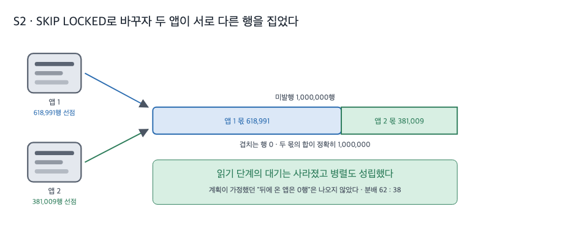
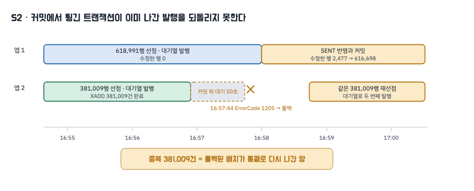

# 2. SKIP LOCKED

## 왜 이 시도였나

앞 편에서 `FOR UPDATE`는 중복을 0으로 만들었지만, 잠금을 잡지 못한 인스턴스는 50초를 서 있다가 타임아웃으로 튕기기를 네 번 반복했습니다. 발행은 한 대가 1,000,000건, 다른 한 대가 0건으로 갈렸고, 잠금을 놓친 쪽은 CPU 최대 3.66%로 사실상 놀았습니다.

그런데 기다릴 이유가 있을까요. 다른 인스턴스가 그 행을 잠갔다는 것은 그 행이 이미 발송되는 중이라는 뜻입니다. 기다려 봐야 얻는 것은 "이미 처리된 행"뿐입니다. 그렇다면 잠긴 행 앞에서 대기하지 말고 건너뛴 뒤 아직 아무도 잡지 않은 행으로 넘어가면 어떻게 될까요. 이 편은 그 한 줄만 바꿔 같은 무대에서 다시 잰 기록입니다.

무대는 앞 편과 같습니다. 미발행 1,000,000행을 한 번에 적재한 뒤 앱 두 대를 동시 기동하고, 틱 60초 · 배치 상한 없음 · 컨슈머 OFF · 힙 `-Xmx2g` · MySQL 8.4.10 · Redis 7.4.9 · N=1입니다. 바뀐 것은 `claim-strategy`가 `PESSIMISTIC`에서 `SKIP_LOCKED`로 간 것뿐입니다 [raw: `../_workspace/03_measurer_raw/s2/attachments/before-check.txt`].

## 무엇을 바꿨나

선점 조회의 잠금 절 하나만 다릅니다. 조건과 정렬은 앞 편의 쿼리와 한 글자도 같습니다.

```java
// src/main/java/modi/backend/ingestionv2/common/outbox/OutboxJpaRepository.java:34
@Query(value = """
        SELECT * FROM ingestion_outbox
        WHERE status = 'PENDING'
        ORDER BY created_at, id
        FOR UPDATE SKIP LOCKED
        """, nativeQuery = true)                 // 잠긴 행은 기다리지 않고 건너뛴다
List<Outbox> claimAllPending();
```

`SKIP LOCKED`는 조회 시점에 **이미 잠겨 있는 레코드**만 건너뜁니다. 두 인스턴스의 조회가 시간상 겹치면 서로 상대가 아직 잡지 못한 행을 이어서 집게 되고, 조회 시작 간격이 크게 벌어지면 먼저 온 쪽이 전부 가져갑니다. 실험을 설계할 때 저희는 상한이 없으니 후자, 즉 뒤에 온 앱이 0행을 받으리라 가정했습니다. 결과는 달랐습니다.

## 측정 — 두 앱이 함께 일했습니다



두 앱은 16:54:38에 같이 떴고, 각자의 선점 조회가 같은 초(16:54:37)에 트랜잭션을 열었습니다 [raw: `../_workspace/03_measurer_raw/s2/attachments/trx-samples.txt`]. 그 결과 앱1이 618,991행, 앱2가 381,009행을 집었습니다. 두 몫의 합은 정확히 1,000,000이고 겹친 행은 없습니다 [raw: `../_workspace/03_measurer_raw/s2/attachments/{app1,app2}/prom-*.txt`의 `ingestion_outbox_claim_rows_total`].

| 지표 | S1 `FOR UPDATE` | S2 `SKIP LOCKED` | N | 조건 |
|---|---|---|---|---|
| 앱별 첫 선점 행수 | 0 : 1,000,000 | **618,991 : 381,009** | 1 | 앱1 : 앱2, 배치 상한 없음 |
| 선점 조회의 락 대기 타임아웃 | 4건 | **0건** | 1 | 앱 로그 `ErrorCode 1205` 중 SELECT 문 |
| 락 대기 횟수 / 누적 / 최대 | 4회 / 200,315ms / 50,243ms | 2회 / 54,882ms / 50,035ms | 1 | `Innodb_row_lock_*` 델타 |
| 힙 최고(표본 최댓값) | 222MB / 1,621MB | 1,343MB / 1,331MB | 1 | 앱1 / 앱2, `-Xmx2g` |
| 컨테이너 CPU 최고 | 3.66% / 279.85% | 277.76% / 398.27% | 1 | 앱1 / 앱2 |
| 소진 시간 / 분당 SENT | 408초 / 147,059건 | 453초 / 132,450건 | 1 | |
| **중복** | 0건 | **381,009건** | 1 | 대기열 `aggregateId` 총계 − 고유 |

원시: S1 `../_workspace/03_measurer_raw/s1/run-summary.json` · S2 `../_workspace/03_measurer_raw/s2/run-summary.json`. 힙은 10초 간격 표본의 `jvm_memory_used_bytes{area="heap"}` 합 최댓값, CPU는 `../_workspace/03_measurer_raw/s2/attachments/docker-stats.csv`입니다.

읽기 단계의 대기는 사라졌습니다. 앞 편에서 네 번 반복되던 선점 SELECT의 타임아웃이 이 런에는 한 건도 없고, 두 앱의 CPU와 힙이 모두 올라간 것이 두 대가 실제로 함께 일했다는 표시입니다. README의 두 번째 Action 문장, 즉 "SKIP LOCKED로 대기를 건너뜀으로 전환하여 인스턴스가 늘어나도 병렬로 처리하도록 만들었습니다"는 여기까지는 실측으로 뒷받침됩니다.

**다만 저희가 세운 가정 하나는 틀렸습니다.** 계획에는 "상한이 없으니 먼저 온 앱이 전부 잠그고 뒤에 온 앱은 0행을 받는다"고 적어 두었는데, 실제 분배는 62 대 38이었습니다. 두 조회가 거의 동시에 시작해 서로 상대가 아직 잠그지 않은 행을 이어서 집었기 때문입니다. 이 비율 자체는 조회 시작 간격이 만드는 값이라 재현되는 상수로 쓰지 않습니다. 확실한 것은 "대기를 없애면 병렬이 된다"가 아니라 **"두 조회가 시간상 겹쳤을 때 병렬이 됐다"**는 것뿐입니다.

## 그런데 중복이 381,009건 났습니다

문제는 그다음입니다. 잠금 절만 바꾼 이 런에서 중복이 다시 나타났습니다. 대기열에는 1,381,009건이 실렸고 고유 이벤트는 1,000,000건, 중복은 381,009건입니다. 주 지표(대기열 덤프)와 보조 공식(발행 성공 합 − SENT 행수)이 381,009로 일치하고, 중복 식별자 목록도 381,009줄입니다 [raw: `../_workspace/03_measurer_raw/s2/run-summary.json` · `attachments/stream-duplicate-ids.txt`].



시간선을 따라가면 이렇습니다.

1. 앱2가 381,009행을 선점하고 16:57 무렵까지 대기열 발행(XADD)을 끝냅니다.
2. SENT 표시를 반영하는 커밋 단계에서 첫 UPDATE가 잠금 대기에 걸립니다. 16:56:56 표본에서 이 트랜잭션은 `LOCK WAIT` 상태이고 수정한 행은 1입니다 [raw: `attachments/trx-samples.txt`].
3. 50초 뒤 타임아웃으로 트랜잭션 전체가 롤백됩니다.

```
16:57:44.445 WARN  org.hibernate.orm.jdbc.error - HHH000247: ErrorCode: 1205, SQLState: 40001
org.springframework.dao.CannotAcquireLockException: could not execute statement
  [update ingestion_outbox set ... status=? where id=?]
  at org.springframework.orm.jpa.JpaTransactionManager.doCommit(JpaTransactionManager.java:556)
```

4. 롤백된 것은 SENT 표시뿐입니다. 대기열 발행은 트랜잭션 밖의 XADD라 되돌아가지 않습니다. 그 381,009행은 미발행으로 되돌아갔고, 16:58:44에 시작한 다음 트랜잭션이 같은 행들을 다시 선점해(선점 행수 누계 381,009 → 762,018) 두 번째로 발행했습니다 [raw: `attachments/app2/prom-1788076736.txt` 이후].

중복 381,009건은 롤백된 배치의 크기와 정확히 같습니다. 최종적으로 아웃박스 1,000,000행은 모두 SENT가 됐지만(앱1 618,991 + 앱2 381,009), 대기열에는 38만 건이 두 번 실렸습니다. 처리량이 앞 편보다 나빠진 것(453초 · 분당 132,450건)도 같은 원인입니다. 같은 100만 건을 확정하려고 138만 번 발행했기 때문입니다.

## 무엇이 커밋을 막았는지는 확정하지 못했습니다

원시에서 확인되는 사실은 여기까지입니다. 앱2가 기다린 시점에 앱1의 트랜잭션은 아직 열려 있었고, 잠금 구조 1,239,801개를 쥔 채 수정한 행은 0이었습니다. 즉 앱1은 그 시점까지 발행만 하고 있었고 아직 SENT 표시를 반영하지 않은 상태였습니다 [raw: `attachments/trx-samples.txt`].

원인은 해석 후보 두 가지로 남깁니다.

| 후보 | 내용 | 확인 상태 |
|---|---|---|
| 1 | 두 조회가 같은 인덱스 구간을 훑으며 남긴 잠금이 겹쳤다. `SKIP LOCKED`는 이미 잠긴 **레코드**를 건너뛸 뿐, 스캔이 남기는 나머지 잠금까지 나눠 주지는 않는다 | 미확정 |
| 2 | 선점 조회가 타는 인덱스 `idx_ingestion_outbox_status_created (status, created_at)`(`V55__outbox_event_shape.sql:31`)를 SENT 갱신이 그대로 건드린다. 상태를 바꾸면 인덱스 항목이 이동하므로 상대 트랜잭션이 잡고 있는 구간과 부딪힐 수 있다 | 미확정 |

둘 중 무엇인지 이 런으로는 가릴 수 없습니다. 런 종료 시점에 뜬 InnoDB 상태 덤프에는 열린 트랜잭션이 하나도 없어 대기 그래프가 남지 않았기 때문입니다 [raw: `attachments/innodb-status-end.txt`]. 이 이상은 추측이므로 단정하지 않습니다.

다만 어느 후보든 처방은 같은 곳을 가리킵니다. **한 트랜잭션이 수십만 행을 잠근 채로 몇 분씩 열려 있다는 점**입니다. 앱1의 트랜잭션은 잠금 구조를 120만 개 넘게 쥔 채 6분 가까이 살아 있었고, 앱2는 그 위에서 커밋을 시도했습니다. 부딪힐 면적이 그만큼 넓었습니다.

## 판정과 남은 문제

| 요구 | 결과 | 근거 |
|---|---|---|
| 중복을 차단할 것 | **미충족** | 중복 381,009건 · 대기열 1,381,009 대 고유 1,000,000 |
| 인스턴스를 늘린 만큼 처리량이 늘 것 | 부분 충족 | 선점 618,991 : 381,009, 읽기 대기 타임아웃 0건, 두 앱 CPU·힙 모두 상승 |

SKIP LOCKED는 남깁니다. 읽기 단계에서 인스턴스가 서로를 기다리지 않게 만드는 목적은 달성했고, 그 값은 이후 단계에서도 유지할 이유가 있습니다. 하지만 이것만으로 중복이 막히지 않는다는 사실도 같이 남습니다. 잠금 절은 "누가 읽을 것인가"를 정할 뿐이고, 중복은 "발행과 확정 사이"에서 생기기 때문입니다.

근거로 쓰지 않기로 한 것도 적어 둡니다.

| 쓰지 않은 것 | 이유 |
|---|---|
| 62 대 38이라는 분배 비율 | 두 조회의 시작 간격이 만드는 값입니다. 같은 쿼리를 쓰는 동시성 테스트(`OutboxClaimConcurrencyTest`)에서도 분배는 실행마다 달라졌습니다. 이 편은 "겹치지 않았다"와 "양쪽 모두 일했다"만 근거로 씁니다 |
| 커밋 충돌의 메커니즘 | 위 표의 후보 2개 중 어느 것도 이 런의 원시로 확정되지 않습니다 |
| S1 대비 처리량 저하폭 | 재발행 38만 건이 같은 창에 섞여 있어 순수한 처리 속도 비교가 아닙니다 |
| 변형 간 차이의 통계적 유의성 | 변형당 1회입니다(N=1) |

그렇다면, 트랜잭션을 작게 쪼개면 어떻게 될까요. 한 번에 잠그는 행을 수백 건으로 제한하면 부딪힐 면적도, 롤백 한 번이 되돌리는 발행량도 함께 줄어듭니다. 다음 편에서 배치 상한을 걸고 같은 무대로 다시 잽니다.
