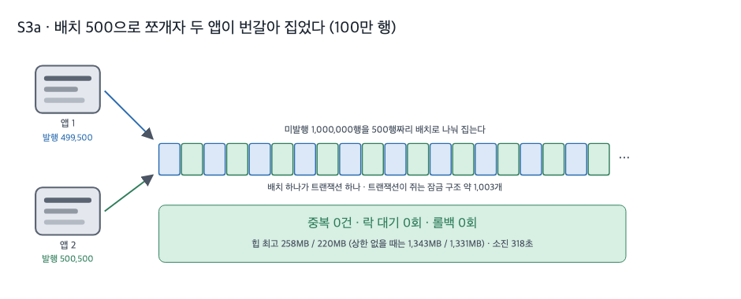
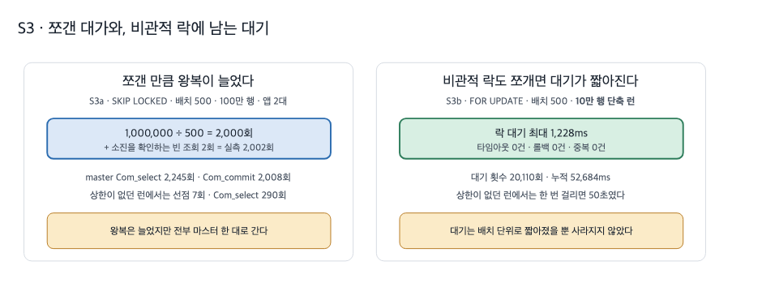

# 3. 배치 크기 LIMIT

## 왜 이 시도였나

앞 편에서 `SKIP LOCKED`는 읽기 단계의 대기를 없앴지만 중복 381,009건을 남겼습니다. 원인은 잠금 절이 아니라 트랜잭션의 크기였습니다. 한 인스턴스가 수십만 행을 잠근 채 몇 분씩 트랜잭션을 열어 두었고, 그 위에서 다른 인스턴스가 커밋을 시도하다 50초 만에 튕겼습니다. 대기열 발행은 트랜잭션 밖의 XADD라 되돌아가지 않았기 때문에, 롤백된 배치가 통째로 다시 나갔습니다.

그렇다면 한 번에 잠그는 행을 수백 건으로 제한하면 어떻게 될까요. 부딪힐 면적도, 롤백 한 번이 되돌리는 발행량도, 힙에 올리는 행 수도 함께 줄어듭니다. 이 편은 배치 상한 500을 걸고 같은 무대에서 두 번 잰 기록입니다. 하나는 `SKIP LOCKED`와의 조합(S3a), 하나는 앞서 기각했던 비관적 락과의 조합(S3b)입니다.

## 무엇을 바꿨나

바꾼 것은 상한이 있는 선점 쿼리를 고르게 한 것과, 한 틱이 배치를 소진할 때까지 반복하도록 한 것입니다.

```java
// src/main/java/modi/backend/ingestionv2/common/interfaces/OutboxDispatchScheduler.java:54
public void dispatch() {
    Timer.Sample sample = Timer.start(meterRegistry);
    int batches = 0;
    OutboxDispatchOutcome outcome;
    do {
        outcome = outboxDispatcher.dispatchBatch();   // 배치 하나 = 트랜잭션 하나
        batches++;
    } while (properties.dispatchDrain() && outcome.drainable()
            && batches < properties.dispatchDrainMaxBatches());
    sample.stop(Timer.builder(TICK_TIMER).publishPercentileHistogram().register(meterRegistry));
}
```

여기서 중요한 것은 **소진 루프가 트랜잭션 밖에 있다는 점**입니다. 반복을 트랜잭션 안으로 넣으면 한 틱이 집은 행 잠금이 틱 전체 동안 쌓여, 배치를 나눈 의미가 사라집니다. 앞 편이 보여 준 문제가 그대로 돌아오는 셈입니다. 배치 하나가 트랜잭션 하나이므로, 500행을 발행하고 표시한 뒤 곧바로 커밋되고 잠금이 풀립니다.

무대는 앞 두 편과 같습니다(틱 60초 · 컨슈머 OFF · 힙 `-Xmx2g` · MySQL 8.4.10 · Redis 7.4.9 · N=1). 바뀐 것은 `dispatch-batch-size`가 0에서 500으로 간 것뿐입니다 [raw: `../_workspace/03_measurer_raw/s3a/attachments/before-check.txt`].

## 측정 — 반반으로 갈렸고 힙이 내려앉았습니다



| 지표 | S2 상한 없음 | S3a 배치 500 | N | 조건 |
|---|---|---|---|---|
| 중복 | 381,009건 | **0건** | 1 | 둘 다 `SKIP LOCKED` · 100만 행 · 앱 2대 |
| 앱별 발행 성공 | 618,991 : 381,009 | **499,500 : 500,500** | 1 | 앱1 : 앱2 |
| 선점 호출 / 선점 행수 | 7회 / 1,381,009행 | 2,002회 / 1,000,000행 | 1 | |
| 락 대기 횟수 / 누적 | 2회 / 54,882ms | **0회 / 0ms** | 1 | `Innodb_row_lock_*` 델타 |
| 롤백(`Com_rollback` 델타) | 1 | **0** | 1 | |
| 힙 최고(표본 최댓값) | 1,343MB / 1,331MB | **258MB / 220MB** | 1 | 앱1 / 앱2, `-Xmx2g` |
| 소진 시간 / 분당 SENT | 453초 / 132,450건 | 318초 / 188,679건 | 1 | |
| master `Com_select` / `Innodb_rows_read` | 290회 / 2,381,126행 | 2,245회 / 2,000,116행 | 1 | 델타 |

원시: `../_workspace/03_measurer_raw/s2/run-summary.json` · `../_workspace/03_measurer_raw/s3a/run-summary.json`. 앱별 값은 `../_workspace/03_measurer_raw/s3a/attachments/{app1,app2}/prom-*.txt`, 힙은 그 표본의 `jvm_memory_used_bytes{area="heap"}` 합 최댓값입니다.

읽어야 할 것이 네 가지입니다.

**첫째, 중복이 0으로 돌아왔습니다.** 대기열에 실린 항목이 1,000,000건, 고유 이벤트가 1,000,000건이고 보조 공식도 0입니다. 롤백이 한 번도 없었으므로 되돌아간 발행도 없습니다.

**둘째, 분배가 거의 반반입니다.** 앱1이 499,500건, 앱2가 500,500건을 발행했습니다. 선점 호출은 앱1이 1,000회, 앱2가 1,002회이고 그중 각각 한 번은 "더 집을 것이 없다"를 확인하는 빈 조회입니다. 즉 500행짜리 배치를 999회와 1,001회씩 나눠 가진 셈입니다. 앞 편의 62 대 38이 조회 시작 간격이 만든 우연한 분배였다면, 이번에는 배치를 번갈아 집는 구조 자체가 분배를 만듭니다.

**셋째, 힙이 내려앉았습니다.** 상한이 없을 때 두 앱은 1.3GB대를 썼지만, 배치 500에서는 258MB와 220MB에 그쳤습니다. 한 번에 힙에 올리는 행이 수십만에서 500으로 줄었기 때문입니다. 잠금도 마찬가지입니다. 실행 중 트랜잭션 표본을 보면 각 트랜잭션이 쥔 잠금 구조는 1,003개 안팎이고, 표본마다 트랜잭션 번호가 바뀝니다. 짧게 열리고 곧 닫힌다는 뜻입니다 [raw: `../_workspace/03_measurer_raw/s3a/attachments/trx-samples.txt`].

**넷째, 락 대기가 0이 됐습니다.** 앞 두 편에서 대기와 롤백을 만들어 낸 조합, 즉 "긴 트랜잭션 + 넓은 잠금 면적"이 사라지자 대기 자체가 발생하지 않았습니다. 앱 로그에도 오류 한 줄이 없습니다 [raw: `../_workspace/03_measurer_raw/s3a/attachments/app-logs.txt`].

여기까지가 README 세 번째 Action의 앞부분, "배치 크기 LIMIT으로 조회를 분할하여 단일 쿼리의 DB 부하를 낮췄다"에 해당합니다.

## 대가 — 분할한 횟수만큼 왕복이 늘었습니다



README는 이 대가를 "10만 건 / 배치 500 = 200회의 네트워크 I/O"라고 적었습니다. 실측은 그 계산과 그대로 맞습니다. 100만 행을 500씩 나누면 2,000회이고, 여기에 소진을 확인하는 빈 조회 2회가 붙어 선점 호출은 **2,002회**입니다. 같은 배치 크기로 10만 행을 돌린 단축 런에서는 선점 호출이 **202회**로, README가 적은 200회에 빈 조회 2회를 더한 값이 그대로 나왔습니다 [raw: `../_workspace/03_measurer_raw/s3a/run-summary.json` · `../_workspace/03_measurer_raw/s3b/run-summary.json`].

왕복이 늘어난 자리는 DB 계기판에도 남습니다. 마스터의 `Com_select` 델타는 290회에서 2,245회로, 커밋 횟수는 12회에서 2,008회로 늘었습니다. 반대로 읽은 행 수는 2,381,126행에서 2,000,116행으로 줄었습니다. 재발행분이 사라졌기 때문입니다. 한 번에 크게 읽던 것을 잘게 나눠 읽는 쪽으로 부하의 모양이 바뀐 것이지, 총량이 늘어난 것은 아닙니다.

## 비관적 락도 쪼개 봤습니다

배치 상한이 대기를 만든 원인 자체를 없앴다면, 앞서 기각한 비관적 락은 어떨까요. 같은 배치 500으로 `FOR UPDATE`를 다시 돌렸습니다. 다만 이 런은 판정만 확인하는 단축 런이라 **10만 행**입니다. 100만 행으로 돌린 다른 런과 규모가 다르므로, 아래 값은 100만 행 런들과 나란히 비교하지 않습니다.

| 지표 | S3b `FOR UPDATE` · 배치 500 | 조건 |
|---|---|---|
| 중복 | 0건 | 10만 행 · 앱 2대 · 단축 런 |
| 앱별 발행 성공 | 50,000 : 50,000 | 선점 호출 각 101회(빈 조회 1회 포함) |
| 락 대기 횟수 / 누적 / 최대 | 20,110회 / 52,684ms / **1,228ms** | `Innodb_row_lock_*` 델타 |
| 타임아웃 / 롤백 | 0건 / 0회 | 앱 로그에 오류 없음 |
| 소진 시간 | 59초 | |

원시: `../_workspace/03_measurer_raw/s3b/run-summary.json` · `attachments/app-logs.txt`.

읽을 것은 대기의 **모양**입니다. 상한이 없던 1편에서는 한 번 걸리면 50초를 서 있다가 타임아웃으로 튕겼습니다. 배치를 쪼개자 대기는 여러 번 일어나되 한 번의 길이가 최대 1,228ms로 짧아졌고, 타임아웃도 롤백도 없었습니다. 실행 중 트랜잭션 표본에도 상대 배치를 기다리는 선점 SELECT가 잠금 두 개를 걸고 잠깐 서 있는 모습만 남습니다 [raw: `../_workspace/03_measurer_raw/s3b/attachments/trx-samples.txt`].

그래도 대기는 남습니다. `SKIP LOCKED`와 같은 배치 크기에서 한쪽은 대기 0회, 다른 쪽은 대기가 계속 발생한다는 차이가 이 두 런의 결론입니다. 비관적 락은 배치를 쪼개면 견딜 만해질 뿐, 기다린다는 성질 자체는 그대로입니다. 그래서 선점 방식은 `SKIP LOCKED` 쪽을 유지하기로 했습니다.

## 판정과 남은 문제

| 요구 | 결과 | 근거 |
|---|---|---|
| 중복을 차단할 것 | 충족 | 중복 0건 · 롤백 0회 · 대기열 1,000,000 = 고유 1,000,000 |
| 인스턴스를 늘린 만큼 처리량이 늘 것 | 충족(2대 기준) | 발행 499,500 : 500,500 · 락 대기 0회 · 소진 318초 |

배치 상한 500과 `SKIP LOCKED`의 조합은 채택했습니다. 앞 두 편이 남긴 문제, 즉 대기와 중복과 힙이 한꺼번에 정리됐습니다.

다만 남은 것이 있습니다. **모든 선점과 갱신이 여전히 마스터 한 대로 갑니다.** 이번 런에서 마스터가 받은 조회는 2,245회, 읽은 행은 2,000,116행이고, 여기에 커밋 2,008회가 더해집니다. 인스턴스를 세 대, 네 대로 늘리면 왕복 수는 그만큼 더 늘어나는데 그것을 받아 주는 데이터베이스는 계속 한 대입니다. 중복 판정을 DB의 행 잠금에 맡기는 한, 확장의 상한은 앱이 아니라 마스터가 정합니다.

근거로 쓰지 않기로 한 것도 적어 둡니다.

| 쓰지 않은 것 | 이유 |
|---|---|
| S3b와 다른 런의 수치 비교 | S3b는 **10만 행 단축 런**이고 나머지는 100만 행입니다. 규모가 다르므로 배수·비율로 견주지 않고, "대기가 배치 단위로 짧아졌으나 사라지지는 않았다"는 판정에만 씁니다 |
| 499,500 대 500,500을 "정확히 반반"의 근거로 | 배치를 번갈아 집는 구조가 만든 분배이지 보장된 균등 분배가 아닙니다. 다음 소진 루프에서 한쪽이 더 빨리 돌면 비율은 달라집니다 |
| 분당 SENT의 개선폭 | 앞 런에는 재발행 38만 건이 섞여 있어 처리 속도의 순수 비교가 아닙니다 |
| 변형 간 차이의 통계적 유의성 | 변형당 1회입니다(N=1) |

그렇다면, 마스터에 몰린 조회를 읽기 복제본으로 나눠 보낼 수는 없을까요. 왕복이 2,002회로 늘어난 지금 가장 먼저 떠오르는 선택지입니다. 다음 편에서 이 안을 실제로 돌려 보고, 왜 철회했는지를 남깁니다.
