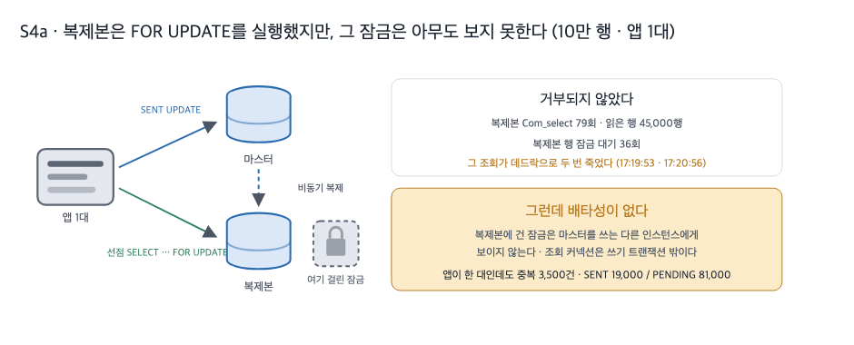
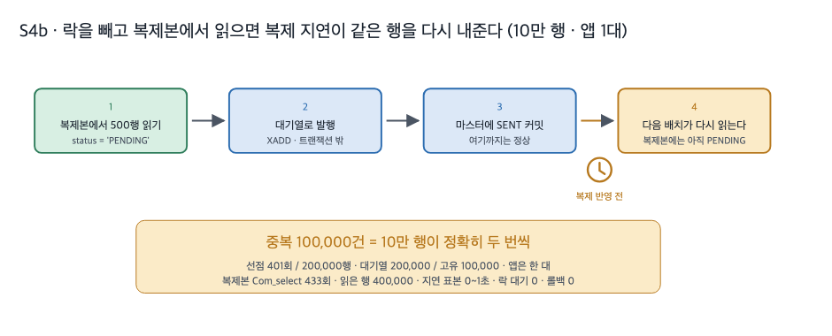

# 4. 읽기 복제 분산

## 왜 이 시도였나

앞 편에서 배치 500과 `SKIP LOCKED`의 조합은 중복도 대기도 0으로 만들었습니다. 그런데 계기판 한쪽에는 다른 숫자가 남았습니다. 100만 행을 처리하는 동안 마스터가 받은 조회는 2,245회, 커밋은 2,008회였습니다. 인스턴스를 세 대, 네 대로 늘리면 왕복은 그만큼 더 늘어나는데 그것을 받는 데이터베이스는 계속 한 대입니다.

그렇다면 서버를 두 대로 늘린 것처럼 데이터베이스도 늘리면 조회 부담이 나뉘지 않을까요. 읽기 전용 복제본을 두고 미발행 행 조회만 그쪽으로 보내는 안입니다. 이 편은 그 안을 실제로 돌려 보고 **왜 철회했는지**를 남긴 기록입니다. 채택하지 않은 단계지만, 왜 안 되는지를 재 두지 않으면 다음 단계의 선택이 근거를 잃습니다.

두 번 돌렸습니다. 하나는 잠금 조회를 복제본으로 보낸 경우(S4a), 하나는 잠금을 빼고 복제본에서 읽은 경우(S4b)입니다. **두 런 모두 앱 1대 · 10만 행 단축 런**입니다. 판정 지표만 확인하는 것이 목적이라 규모를 줄였고, 그래서 앞 편들의 100만 행 런과 배수나 비율로 견주지 않습니다.

## 무엇을 바꿨나

읽기 대상만 프로퍼티로 가릅니다. 복제본에서는 식별자만 읽어 오고, 표시(UPDATE)는 원본 트랜잭션이 그대로 소유합니다.

```java
// src/main/java/modi/backend/ingestionv2/common/outbox/OutboxReplicaReader.java:41
public List<Long> readPendingIds(int limit, OutboxClaimStrategy strategy) {
    String sql = BASE + (limit > 0 ? "LIMIT " + limit + "\n" : "") + lockClause(strategy);
    return replicaJdbcTemplate.queryForList(sql, Long.class);   // 복제본 전용 커넥션 = 쓰기 트랜잭션 밖
}
```

이 구성은 원자적이지 않습니다. 조회 커넥션이 원본 트랜잭션 바깥에 있기 때문에 복제본에서 잡은 잠금은 커밋과 무관하게 풀리고, 마스터를 쓰는 다른 인스턴스에게 보이지도 않습니다. 실험을 설계할 때부터 이 점을 알고 있었지만, "복제본이 잠금 조회를 아예 거부할 것"이라는 예상과 함께 확인해 보기로 했습니다. 결과는 예상과 달랐습니다.

## S4a — 복제본은 거부하지 않았습니다



계획에 적어 둔 기대는 "읽기 전용 복제본이 `FOR UPDATE`를 거부하고, 그래서 조회는 결국 마스터로만 간다"였습니다. 실제로는 복제본이 그 조회를 받아 실행했습니다. 런 동안 복제본의 `Com_select`는 79회 늘었고 읽은 행은 45,000행입니다 [raw: `../_workspace/03_measurer_raw/s4a/attachments/mysql-replica-status-{start,end}.txt`]. 거부 오류 원문을 근거로 쓰려던 계획은 여기서 무효가 됩니다.

대신 다른 것이 나왔습니다. 복제본에서 실행된 그 조회가 두 번 죽었습니다.

```
17:19:53.290 ERROR o.s.s.s.TaskUtils$LoggingErrorHandler - Unexpected error occurred in scheduled task
org.springframework.dao.CannotAcquireLockException: StatementCallback; SQL [SELECT id FROM ingestion_outbox
WHERE status = 'PENDING'
ORDER BY created_at, id
LIMIT 500
FOR UPDATE]; Deadlock found when trying to get lock; try restarting transaction
  at modi.backend.ingestionv2.common.outbox.OutboxReplicaReader.readPendingIds(OutboxReplicaReader.java:43)
```

같은 오류가 17:20:56에 한 번 더 납니다 [raw: `../_workspace/03_measurer_raw/s4a/attachments/app-logs.txt`]. 복제본 계기판에는 행 잠금 대기가 36회 기록됐습니다. 앱은 한 대뿐이므로 이 조회와 부딪힌 상대는 애플리케이션이 아닙니다. 복제본에서 쓰기를 하는 주체는 복제 적용 스레드뿐이라는 점에서 그쪽과의 경합이 유력한 해석 후보이지만, 이 런의 원시로는 상대 트랜잭션을 특정하지 못했습니다. 단정하지 않고 후보로 남깁니다.

| 후보 | 내용 | 확인 상태 |
|---|---|---|
| 1 | 복제 적용 스레드가 같은 행에 SENT를 반영하는 중이라 잠금 조회와 부딪혔다 | 미확정(복제본 행 잠금 대기 36회가 정황) |
| 2 | 두 세션이 같은 인덱스 구간을 서로 다른 순서로 훑어 데드락 판정을 받았다 | 미확정 |

**그리고 앱이 한 대인데 중복이 3,500건 났습니다.** 대기열에 22,500건이 실렸고 고유 이벤트는 19,000건입니다(주 지표와 보조 공식 일치) [raw: `../_workspace/03_measurer_raw/s4a/run-summary.json`]. 인스턴스가 하나뿐인데 중복이 나는 이유는 하나입니다. 마스터에서 SENT로 바뀐 행이 복제본에는 아직 PENDING으로 남아 있어 다음 배치가 그 행을 다시 집었기 때문입니다. 복제본에 건 잠금은 이 재선점을 막지 못했습니다. **잠금이 없는 것이 아니라, 있어도 배타성이 없습니다.**

조건 하나를 함께 적어 둡니다. 이 런은 SENT 19,000행 · PENDING 81,000행 상태에서 관측이 끝났습니다. 소진을 감지하는 관측 스크립트가 복제본 쪽 잠금 대기를 활동으로 세지 못해 정지로 판정했기 때문입니다. 스크립트의 한계이고, 이 편의 판정(잠금이 배타성을 주지 못한다)에는 영향이 없습니다.

## S4b — 락을 빼면 지연이 그대로 중복이 됩니다



두 번째 런은 잠금을 빼고 복제본에서 읽었습니다. 결과는 더 분명합니다. 10만 행이 **정확히 두 번씩** 발행됐습니다. 대기열 200,000건, 고유 100,000건, 중복 100,000건이고 중복 식별자 목록도 100,000줄입니다 [raw: `../_workspace/03_measurer_raw/s4b/run-summary.json` · `attachments/stream-duplicate-ids.txt`].

| 지표 | S4a 잠금 조회 | S4b 무락 조회 | 조건 |
|---|---|---|---|
| 중복 | 3,500건 | **100,000건** | 둘 다 앱 1대 · 10만 행 단축 런 · 배치 500 · `outbox-read=REPLICA` |
| 대기열 항목 / 고유 이벤트 | 22,500 / 19,000 | 200,000 / 100,000 | 주 지표와 보조 공식 일치 |
| 선점 호출 / 선점 행수 | 45회 / 22,500행 | 401회 / 200,000행 | 행은 10만 개뿐 |
| 복제본 `Com_select` / 읽은 행 | 79회 / 45,000행 | 433회 / 400,000행 | 복제본 계기판 델타 |
| 복제본 행 잠금 대기 | 36회 | 0회 | |
| `Seconds_Behind_Source` 표본 | 전부 0초 | 0초 8개 · 1초 2개 | 10초 간격 표본 |
| 마무리 상태 | SENT 19,000 / PENDING 81,000 | SENT 100,000 / PENDING 0 | S4a는 소진 감지 스크립트의 한계로 조기 종료 |

원시: `../_workspace/03_measurer_raw/s4a/run-summary.json` · `../_workspace/03_measurer_raw/s4b/run-summary.json` · 각 `attachments/replica-lag.txt`.

배치 500을 복제본에서 읽고, 대기열로 발행하고, 마스터에 SENT를 커밋하는 사이에 다음 배치가 돌아옵니다. 그 시점의 복제본에는 방금 커밋한 SENT가 아직 반영되지 않아 같은 행이 다시 미발행으로 보입니다. 선점 호출이 401회, 선점 행수가 200,000행인데 실제 행은 10만 개뿐이라는 숫자가 이 반복을 그대로 보여 줍니다.

여기서 짚을 것이 하나 더 있습니다. **`Seconds_Behind_Source`는 이 문제를 잡아내지 못합니다.** S4a는 표본 전부가 0초였고 S4b도 0초와 1초뿐이었는데, 그 사이에 중복은 10만 건이 났습니다. 재선점을 만드는 지연은 초 단위 계기판보다 짧습니다. "복제 지연이 작으니 괜찮다"는 판단이 왜 위험한지가 이 대비에 남습니다.

## 철회한 이유

논증의 축은 둘입니다.

**첫째, 잠금 조회는 복제본을 쓰지 못하는 것이 아니라 써도 의미가 없습니다.** 복제본은 `FOR UPDATE`를 실행해 줬지만, 그 잠금은 마스터를 쓰는 다른 인스턴스와 조율되지 않습니다. 중복 판정을 하려고 거는 잠금이 판정을 못 하는 자리에 걸리는 셈입니다. 앱 한 대짜리 런에서 중복 3,500건이 난 것이 그 증거입니다. 여기에 복제 적용 스레드와의 경합으로 조회 자체가 데드락으로 죽는 일까지 겹쳤습니다.

**둘째, 잠금을 빼면 복제 지연이 그대로 중복이 됩니다.** 10만 행이 전부 두 번씩 나갔습니다.

그렇다면 조회를 마스터로 되돌리면 어떻게 될까요. 그 순간 앞 편의 상태로 정확히 돌아갑니다. 마스터 조회 2,245회와 커밋 2,008회를 그대로 지고 가는 것입니다. **읽기 복제본은 부하를 나누지 못했고, 나누려는 순간 판정이 깨졌습니다.** 그래서 이 안은 채택하지 않고 철회했습니다.

| 요구 | 결과 | 근거 |
|---|---|---|
| 중복을 차단할 것 | 미충족 | S4a 3,500건 · S4b 100,000건(둘 다 앱 1대) |
| 마스터의 조회 부담을 나눌 것 | 미충족 | 복제본이 읽어 준 만큼 판정이 깨졌고, 되돌리면 부하는 3편 그대로 |

근거로 쓰지 않기로 한 것도 적어 둡니다.

| 쓰지 않은 것 | 이유 |
|---|---|
| S4a·S4b와 100만 행 런의 수치 비교 | 이 편의 두 런은 **앱 1대 · 10만 행 단축 런**입니다. 배수·비율로 견주지 않고 "중복이 났다 / 나지 않았다"의 판정에만 씁니다 |
| "복제본이 잠금 조회를 거부한다" | 계획의 기대였으나 **실측으로 반증**됐습니다. 복제본은 `FOR UPDATE`를 실행했습니다 |
| 데드락의 원인 | 위 표의 후보 2개 중 어느 것도 이 런의 원시로 확정되지 않습니다 |
| S4a의 처리량·소진 시간 | 소진 감지 스크립트가 복제본 잠금 대기를 활동으로 세지 못해 SENT 19,000행에서 조기 종료됐습니다. 처리량 지표로 쓸 수 없습니다 |
| `Seconds_Behind_Source`를 지연의 크기로 | 10초 간격 표본이라 재선점을 만든 짧은 지연을 담지 못합니다. 표본이 0초여도 중복은 났습니다 |

## 남은 질문

여기까지 오면 시도할 수 있는 데이터베이스 쪽 선택지는 거의 소진됩니다. 잠금은 대기를 만들고(1편), 대기를 없애면 트랜잭션 크기가 문제가 되고(2편), 트랜잭션을 쪼개면 왕복이 마스터 한 대에 몰리고(3편), 그 부하를 나누려 하면 판정이 깨집니다(이 편).

그래서 질문을 바꿨습니다. **우리가 데이터베이스에 바라던 것은 무엇이었을까요.** 정렬도, 트랜잭션도, 내구성도 아닙니다. "같은 행을 두 번 보내지 마라"는 판정 하나였습니다. 그 판정을 꼭 데이터베이스가 해야 할 이유는 없습니다. 다음 편에서는 판정만 DB 밖으로 꺼냅니다. 조회는 잠금 없이 하고, 행마다 Redis에 도장을 찍어 도장을 잡은 인스턴스만 발행하게 하는 방식입니다.
