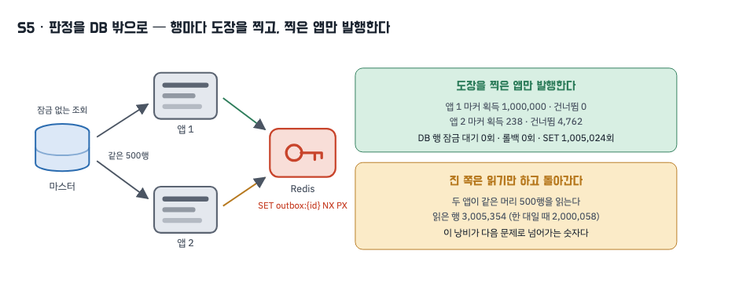
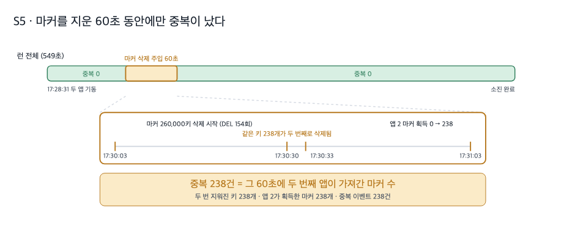
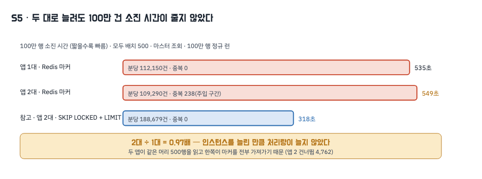

# 5. Redis 분산락

## 왜 이 시도였나

앞 편까지 네 번을 돌리는 동안 데이터베이스 쪽 선택지는 거의 소진됐습니다. 잠금은 대기를 만들었고, 대기를 없애자 트랜잭션 크기가 문제가 됐고, 트랜잭션을 쪼개자 왕복이 마스터 한 대에 몰렸고, 그 부하를 나누려 하자 판정이 깨졌습니다.

그래서 질문을 바꿨습니다. 우리가 데이터베이스에 바라던 것은 정렬도 트랜잭션도 아니고 **"같은 행을 두 번 보내지 마라"는 판정 하나**였습니다. 그 판정을 꼭 데이터베이스가 해야 할 이유는 없습니다. 조회는 잠금 없이 하고, 행마다 다른 곳에 도장을 찍어 도장을 잡은 인스턴스만 발행하게 하면 됩니다. 이 편은 그 판정을 Redis로 옮긴 기록이고, 최종적으로 채택한 방식입니다.

무대는 3편과 같습니다. 미발행 1,000,000행을 한 번에 적재한 뒤 두 앱을 동시 기동하고, 배치 500 · 틱 60초 · 마스터 조회 · 힙 `-Xmx2g` · MySQL 8.4.10 · Redis 7.4.9 · N=1입니다. 여기에 두 가지를 더했습니다. 하나는 같은 설정을 **앱 1대**로 돌린 런(S5-1)이고, 하나는 실행 중간에 **마커 키를 강제로 지우는 주입**입니다.

## 무엇을 바꿨나

판정의 원시 연산은 한 줄입니다.

```java
// src/main/java/modi/backend/ingestionv2/common/lock/RedisMarkerLock.java:41
public boolean tryAcquire(String key, String owner, Duration ttl) {
    Boolean acquired = redisTemplate.opsForValue().setIfAbsent(key, owner, ttl);  // SET key owner NX PX
    return Boolean.TRUE.equals(acquired);   // 실패는 "다른 인스턴스가 맡았다"는 사실 - 기다리지 않는다
}
```

발송 경로는 이렇게 바뀝니다. 선점 조회에서 잠금 절이 사라지고(`SELECT … WHERE status='PENDING' ORDER BY created_at, id LIMIT 500`), 읽어 온 행마다 `outbox:{id}` 키를 잡습니다. 잡은 행만 발행하고, 못 잡은 행은 그 틱에서 다시 시도하지 않습니다. 그 행은 마커를 잡은 인스턴스가 같은 틱에 처리하기 때문입니다(`OutboxDispatcher.acquireMarkers` L93~108).

설계에서 갈린 지점이 둘 있었습니다.

**발행에 성공한 행의 마커는 해제하지 않습니다.** 그 행은 곧 SENT가 되어 다시 조회되지 않으므로 TTL에 맡깁니다. 발행 직후 해제하면 아직 커밋되지 않은 행을 다른 인스턴스가 다시 집습니다. 반대로 **발행에 실패한 행의 마커는 그 자리에서 해제합니다.** 실패한 행은 미발행으로 남아 다음 틱이 다시 집어야 하는데, 마커를 두면 TTL이 지날 때까지 어떤 인스턴스도 손대지 못해 재시도가 통째로 멈춥니다. 이 두 번째 규칙은 기존 통합 테스트 세 개가 red로 알려 준 것이고, 테스트를 약화하지 않고 설계를 고쳤습니다.

**TTL은 5분입니다.** 틱 간격 60초의 다섯 배로 두어 정상 구간에서는 만료되지 않고, 인스턴스가 통째로 죽었을 때는 5분 뒤 다른 인스턴스가 그 행을 이어받습니다.

## 측정 — 중복 0, DB 락 대기 0



주입이 없는 앱 1대 런(S5-1)부터 보면 결과가 깨끗합니다. 대기열 1,000,000건, 고유 1,000,000건, 중복 0건이고 마커는 1,000,000개를 잡아 하나도 건너뛰지 않았습니다 [raw: `../_workspace/03_measurer_raw/s5-1/run-summary.json`].

| 지표 | S3a `SKIP LOCKED`+LIMIT · 2대 | S5-1 마커 · 1대 | S5 마커 · 2대 | 조건 |
|---|---|---|---|---|
| 중복 | 0건 | 0건 | 238건(주입 구간) | 100만 행 정규 런 · 배치 500 · N=1 |
| DB 락 대기 / 롤백 | 0회 / 0 | **0회 / 0** | **0회 / 0** | `Innodb_row_lock_waits` · `Com_rollback` |
| 선점 호출 / 선점 행수 | 2,002회 / 1,000,000행 | 2,001회 / 1,000,000행 | 2,012회 / 1,005,000행 | |
| 마커 획득 / 건너뜀 | — | 1,000,000 / 0 | 1,000,238 / 4,762 | |
| master `Com_select` / 읽은 행 | 2,245회 / 2,000,116행 | 2,248회 / 2,000,058행 | 2,333회 / **3,005,354행** | 델타 |
| 소진 시간 / 분당 SENT | 318초 / 188,679건 | 535초 / 112,150건 | 549초 / 109,290건 | |

원시: `../_workspace/03_measurer_raw/s3a/run-summary.json` · `../_workspace/03_measurer_raw/s5-1/run-summary.json` · `../_workspace/03_measurer_raw/s5/run-summary.json`.

**DB에서 행 잠금이 완전히 사라졌습니다.** 1편에서 200,315ms였던 락 대기 누적이 0이고 롤백도 0입니다. 잠금 절이 없으니 대기할 자리 자체가 없습니다. Redis 쪽 비용은 `SET` 1,005,024회, `XADD` 1,000,238회이고 메모리는 최고 339.57MB, 종료 시점 마커 키는 372,188개였습니다(나머지는 TTL로 이미 만료) [raw: `../_workspace/03_measurer_raw/s5/attachments/redis-{end-commandstats,end-keys,end-memory}.txt`]. Redis 컨테이너 CPU는 최대 65.09%였습니다 [raw: `attachments/docker-stats.csv`].

대신 읽은 행이 늘었습니다. 앱 1대일 때 2,000,058행이던 것이 2대에서는 3,005,354행입니다. 두 앱이 같은 머리 500행을 함께 읽고 마커 경쟁에서 진 쪽이 그 행을 버리기 때문입니다. 이 낭비의 크기가 곧 앱2의 건너뜀 4,762건입니다.

## 락이 사라진 상태를 주입했을 때



README의 첫 번째 Result 문장은 "Redis 마스터 장애와 비동기 복제 지연이 동시에 발생해 락이 유실되는 경우는 남아 있다"입니다. 이 실험의 Redis는 **단일 노드**이므로 마스터 장애도 복제 지연도 일어나지 않습니다. 그래서 장애를 재현한 것이 아니라, **락이 사라진 상태를 직접 주입**했습니다. 실행 중간 60초 동안(17:30:03~17:31:03) 마커 키를 지웠습니다. 지운 키는 260,000개, `DEL` 호출은 154회입니다 [raw: `../_workspace/03_measurer_raw/s5/attachments/deleted-keys.txt` · `redis-end-commandstats.txt`].

그 60초 안에서 세 숫자가 맞물립니다.

1. 삭제 로그에서 **같은 키 238개가 두 번 지워졌습니다**(17:30:30과 17:30:31). 한 번 지운 키가 다시 나타났다는 것은 그 사이에 누군가 그 키를 새로 잡았다는 뜻입니다.
2. 그때까지 마커를 하나도 잡지 못하던 앱2의 획득 카운터가 **0에서 238로** 뛰었습니다(17:30:33 표본).
3. 런 전체의 중복은 **238건**입니다(주 지표와 보조 공식 일치).

주입 구간 밖에서 앱2가 잡은 마커는 0개이므로, 중복도 그 구간 밖에서는 나지 않았습니다. 즉 **마커가 살아 있는 한 두 번 발행되지 않고, 마커를 지운 순간 정확히 지워진 만큼 두 번 나갑니다.** 이것이 README가 "확장성을 얻기 위해 의도적으로 수용했다"고 적은 구간의 실제 크기입니다.

대조에 관해 한 가지는 확정하지 못했습니다. 중복 이벤트의 식별자(`lab-1-23-3101` 형식)와 삭제 로그의 행 id를 1:1로 맞추려면 둘을 잇는 대응표가 필요한데, 그 표를 원시로 남기지 않았습니다. 단순 산술로 맞춘 매핑으로는 두 집합이 겹치지 않았습니다(0/238). 산술 매핑 자체가 불가능하기 때문입니다. 적재가 여러 덩어리로 나뉘어 들어가면서 자동 증가 id가 덩어리 순서와 어긋나 있고, 실제로 id 1,000,000번 행의 식별자는 `lab-1-62-637`입니다. 그래서 위의 개수 일치(238 = 238 = 238)와 시각 일치(17:30:30~17:30:33)를 근거로 삼았습니다. 식별자 단위 대조는 남은 검증 항목이며, 다시 측정할 때 행 id를 함께 담은 덤프(`stream-duplicate-rows.txt`)를 남기면 1:1로 맞출 수 있습니다.

## 회수·정리·트리밍에는 잡 단위 락을 걸었습니다

발송은 행 단위로 판정하지만, 전체를 훑는 잡(대기열 미확인 항목 회수, 발행 완료 기록 정리, 스트림 트리밍)은 두 대가 같은 대상을 동시에 훑을 이유가 없습니다. 이 셋에는 `lock:{job}` 키로 잡 단위 단일 실행을 겁니다. 해제는 소유자를 비교해 지우는 Lua 한 덩어리입니다. 값 비교와 삭제 사이에 만료가 끼면 이전 소유자의 해제가 남의 락을 지우기 때문입니다(`RedisMarkerLock.release` L47).

발송에는 잡 락을 걸지 않았습니다. 걸면 인스턴스 한 대만 일하게 되어 1편의 상태로 돌아갑니다. 수집 회차도 그대로 뒀습니다. 회차 키의 유일 제약이 이미 단일 실행을 만들기 때문입니다. 이 부분은 부하 실험 대상이 아니어서 측정치가 없고, 동작은 단위 테스트(`IngestionLockTest` — 마커 배타성 · TTL 만료 후 재획득 · 소유자 비교 해제 · 잡 락 단일 실행)로만 고정했습니다.

## 그런데 인스턴스를 늘려도 빨라지지 않았습니다



여기서 정직하게 적어야 할 결과가 있습니다. 같은 100만 행을 앱 1대는 535초에, 앱 2대는 549초에 비웠습니다. 분당 SENT는 112,150건과 109,290건입니다. **배율로 0.97, 즉 두 대로 늘려도 처리량은 늘지 않았습니다.**

원인은 계기판에 그대로 보입니다. 앱1은 선점 2,001회로 1,000,000행을 잡아 마커를 전부 획득하고 한 틱(539.59초) 안에 전부 발행했습니다. 앱2는 선점 11회로 5,000행을 읽었는데 그중 획득은 238개뿐이고 4,762개를 건너뛰었으며, 열 번의 틱을 합쳐도 3.93초만 일했습니다 [raw: `../_workspace/03_measurer_raw/s5/attachments/{app1,app2}/prom-*.txt`].

두 앱이 같은 조회를 씁니다. `ORDER BY created_at, id LIMIT 500`은 언제나 **같은 머리 500행**을 돌려주므로, 두 앱은 매번 같은 행을 놓고 경쟁하고 먼저 도착한 쪽이 500개를 전부 가져갑니다. 진 쪽에는 읽기 낭비만 남습니다. 중복은 막았지만 일을 나누지는 못한 것입니다. 이것이 이 방식이 인정하고 들어가는 잔여 비효율이고(조회·확인 횟수가 건수 ÷ 배치 × 인스턴스 수만큼 늘어납니다), 다음 문제로 넘어가는 숫자입니다. 왜 한쪽이 매번 이기는지에 대한 해석 후보(예: 인스턴스마다 다른 구간을 읽게 하는 분할 조회)는 설계 노트에서 다룹니다.

## 이 실험이 뒷받침하는 것과 뒷받침하지 못하는 것

| README 문장 | 이 실험의 판정 | 근거 |
|---|---|---|
| Action 5 "DB 락을 철회하고 Redis 분산락을 채택해 중복 판정을 DB 밖으로 이관" | **뒷받침함** | DB 락 대기 0회 · 롤백 0 · 마커 획득 1,000,000(1대) · 판정이 `SET NX PX` 한 줄로 이동 |
| Result 1 "중복 발송 차단" | **뒷받침함** | 1대 중복 0 · 2대 주입 구간 밖 중복 0 |
| Result 1 "락 유실 구간은 의도적 수용" | **부분** | 마커를 지운 60초에만 중복 238건. 다만 단일 Redis라 마스터 장애·복제 지연 자체는 재현하지 못했고, **락이 사라진 상태를 주입**한 것입니다 |
| Result 2 "락 대기 병목 제거" | **뒷받침함** | `Innodb_row_lock_waits` 0회(1편 4회·200,315ms 대비) |
| Result 2 "인스턴스가 서로를 기다리지 않고 병렬로 처리" | **부분** | 서로 기다리지 않는 것은 맞지만 병렬로 나뉘지도 않았습니다. 앱2 발행 238건 · 건너뜀 4,762 |
| Result 3 "인스턴스를 늘린 만큼 처리량 증가 / 쓰기 확장 제약 해소" | **뒷받침하지 못함** | 1대 535초 · 2대 549초(0.97배). 같은 무대에서 `SKIP LOCKED`+LIMIT 2대는 318초였습니다 |

마지막 줄이 이 편의 가장 중요한 결과입니다. 채택한 방식이 모든 면에서 앞 단계보다 나은 것은 아닙니다. 중복 판정을 DB 밖으로 옮겨 락 병목과 롤백을 없앤 대신, 두 인스턴스가 같은 행을 함께 읽는 낭비는 그대로 남았고 처리량은 오히려 3편보다 느립니다.

## 근거로 쓰지 않기로 한 것

| 쓰지 않은 것 | 이유 |
|---|---|
| "Redis 마스터 장애를 재현했다" | 단일 노드 Redis입니다. 재현한 것은 **마커가 사라진 상태**이지 장애나 복제 지연이 아닙니다 |
| 중복 238건과 삭제 키의 식별자 단위 일치율 | 행 id ↔ `aggregateId` 는 산술로 환산되지 않고(id 1,000,000 = `lab-1-62-637`) 대응표를 원시에 남기지 않아 1:1 대조가 불가능합니다. 개수·시각 일치까지만 근거로 쓰고, 재측정 시 `stream-duplicate-rows.txt` 로 채웁니다 |
| S5 런의 처리량을 정밀 수치로 | 관측 루프가 도구 상한에 걸려 중단돼 봉인을 다시 했고, 소진 시각은 표본에서 역산했습니다. 방향(1대와 거의 같다)에만 씁니다 |
| 잡 단위 락의 효과 | 부하 실험 대상이 아니어서 측정치가 없습니다. 동작은 단위 테스트로만 고정했습니다 |
| 왜 한쪽이 마커 경쟁에서 매번 이기는가 | 이 런의 원시로는 확정되지 않습니다. 해석 후보는 설계 노트로 넘깁니다 |
| 변형 간 차이의 통계적 유의성 | 변형당 1회입니다(N=1) |

## 남은 문제

다섯 단계를 거치며 중복은 사라졌고 DB의 락 병목도 사라졌습니다. 그러나 마지막 숫자가 남습니다. 두 인스턴스가 **같은 행을 함께 읽고 한쪽이 그것을 버립니다.** 인스턴스를 늘릴수록 이 낭비는 커집니다(읽기 낭비 4,762건, 읽은 행 100만 초과분 약 100만 행).

근본 원인은 방식이 아니라 구조입니다. 지금은 각 인스턴스가 **스스로 같은 목록을 가지러 갑니다.** 아무도 "너는 이 행, 너는 저 행"이라고 나눠 주지 않기 때문에, 판정을 어디서 하든 경쟁은 조회 시점에 이미 일어납니다.

그렇다면 누군가 행을 나눠 주면 어떻게 될까요. 인스턴스가 가지러 가는 대신 받아 가는 구조, 즉 대기열이 소비자에게 밀어 주는 방식으로 바꾸면 같은 행을 두 번 읽을 이유 자체가 사라집니다. 그것이 다음 문제(DB 폴링에서 Redis Streams로)의 출발점이고, 이 편이 남긴 4,762라는 숫자가 그 문제의 크기입니다.
