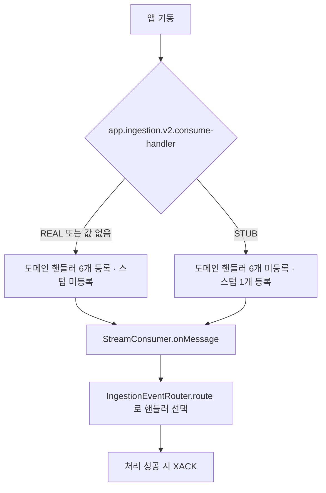

<!-- PR #168 본문 초안 · base: #167 · head: feat/ingestion-v2-consume-handler-switch -->

## 📌 Summary

- 배경
    - 배달 계층은 이미 Redis Streams 위에 서 있어요. 남은 일은 그것이 정말로 일을 나눠 주는지를 수치로 보이는 것입니다.
    - 그런데 대기열에서 꺼낸 이벤트를 맡는 핸들러 여섯 중 넷이 유료 API 경로예요. 10만 건을 흘리면 그만큼 외부 호출이 나갑니다.
    - 라우터가 첫 번째로 맞는 핸들러를 고르는 구조라, 빈 하나를 더 등록하는 것만으로는 그 여섯을 비켜 갈 수 없어요.
- 목표
    - 부하 측정 중에만 도메인 핸들러를 통째로 내리고 지연만 흉내내는 빈 하나가 대신 서게 합니다.
    - 회수 주기와 방치 판정 시간을 실험에서 앞당길 수 있도록 환경변수 자리를 엽니다.
    - Redis 클러스터 구성을 환경변수만으로 켤 수 있다는 사실을 코드에 남깁니다.
- 결과
    - **프로덕션 기본 동작은 한 군데도 바뀌지 않습니다.** 새 프로퍼티의 기본값이 `REAL`·`0`·`60`·`30000`이고 `matchIfMissing=true`라, 값을 주지 않은 컨텍스트는 지금까지와 같은 핸들러 여섯을 그대로 등록해요.
    - 측정용 스위치 `app.ingestion.v2.consume-handler`가 생겼어요. `STUB`으로 뜬 앱만 도메인 핸들러 대신 스텁 하나를 등록합니다.
    - 기본값이 뒤집히는 회귀를 잡는 테스트가 함께 들어옵니다.

## 🧭 Context & Decision

### 문제 정의

- 현재 동작/제약
    - `IngestionEventRouter.route`는 `supports`가 참인 첫 핸들러를 고릅니다.
    - 도메인 핸들러 여섯(`CollectedEventHandler`·`DetailReadyEventHandler`·`GenreReadyEventHandler`·`HoursReadyEventHandler`·`InspectEventHandler`·`StageEventHandler`)은 전부 외부 API나 DB 작업으로 이어져요.
- 문제(또는 리스크)
    - 부하 측정에서 유료 호출이 한 건이라도 나가면 안 됩니다.
    - 스텁을 "더하기"로 넣으면 실제 핸들러가 빈으로 살아남아, 회수나 관리자 재시도 같은 다른 진입점에서 되살아날 수 있어요.
- 성공 기준(완료 정의)
    - 스위치를 주지 않은 컨텍스트의 빈 구성이 이전과 같아야 합니다.
    - `STUB`일 때 `IngestionEventHandler` 타입 빈이 스텁 하나뿐이어야 합니다.

### 선택지와 결정

- 고려한 대안
    - A — 실제 핸들러 여섯과 스텁에 `@ConditionalOnProperty`를 걸어 등록 단계에서 갈라 놓습니다.
    - B — 라우터가 프로퍼티를 보고 스텁을 우선 고르게 합니다.
    - C — `BeanFactoryPostProcessor`로 실제 핸들러를 걷어냅니다.
- 최종 결정: **A를 택했습니다.**
    - B는 라우터가 운영 파라미터를 알게 돼요. 라우터의 책임은 이벤트 종류와 핸들러를 잇는 것 하나입니다.
    - B는 무엇보다 실제 핸들러가 컨텍스트에 남습니다. "유료 호출 0건"의 근거가 *부르지 않았다*가 되어버려요.
    - C는 테스트 전용 장치라 프로덕션 컨텍스트에 둘 수 없고, 결국 측정용 이미지와 운영 이미지가 갈라집니다.
- 트레이드오프
    - 실제 핸들러 여섯에 어노테이션이 한 줄씩 붙어요. 대신 등록 단계에서 갈리므로 "빈이 아예 없다"를 테스트로 증명할 수 있습니다.
- 추후 개선 여지(있다면)
    - 측정 전용 프로파일로 옮기는 방법도 있어요. 지금은 프로퍼티 하나가 더 단순해서 그대로 뒀습니다.

### 그 뒤에 이어진 결정들

#### 1. 스텁이 남기는 집계 키를 어디에 둘까 → 스텁 클래스 안에만

- 선택지
    - 처리 키 집합과 중복 카운터를 공용 계층의 컴포넌트로 뺍니다.
    - 스텁 클래스 안에서만 다룹니다.
- 결정 근거
    - 공용 계층으로 올리면 운영 코드가 측정용 어휘를 갖게 돼요.
    - 키 접두를 `lab:`으로 두어 행 마커의 `outbox:`, 잡 락의 `lock:`과 갈랐습니다. 관측 스크립트의 키 집계가 섞이지 않아야 하거든요.

#### 2. Redis 클러스터 설정을 yaml에 넣을까 → 넣지 않습니다

- 선택지
    - `spring.data.redis.cluster:` 키를 두고 값을 비워 둡니다.
    - 환경변수 `SPRING_DATA_REDIS_CLUSTER_NODES`만 쓰고 yaml에는 주석만 남깁니다.
- 결정 근거
    - 빈 값으로 선언하면 `RedisProperties.Cluster`가 노드 0개로 만들어져 평소 기동이 깨져요. 복제본 데이터소스에서 겪은 것과 같은 함정입니다.
    - 변수를 주지 않으면 지금처럼 단일 노드로 뜹니다. 그래서 **yaml은 건드리지 않고 주석 두 줄만 남겼습니다.**

#### 3. 회수 파라미터를 왜 여는가 → 실험에서 앞당기기 위해서

- 선택지
    - 코드 기본값 그대로 두고 측정 때만 코드를 고칩니다.
    - `reclaim-idle-seconds`·`reclaim-interval-ms`에 환경변수 자리를 엽니다.
- 결정 근거
    - 방치 판정 60초는 짧은 실행에서 회수가 도는 것을 보기에 깁니다.
    - **기본값은 60초와 30,000ms 그대로예요.** 변수를 주는 환경에서만 달라집니다.

## 🏗️ Design Overview

### 변경 범위

- 영향 받는 모듈/도메인
    - `modi.backend.ingestionv2` 슬라이스만 바뀝니다. 코어 도메인은 변경 없어요.
    - `src/main` 10개(신규 2 · 수정 8), `src/test` 4개(신규 2 · 수정 2)입니다.
- 신규 추가
    - `common/queue/ConsumeHandler.java` — 값이 둘인 열거형(`REAL`·`STUB`)
    - `common/queue/StubEventHandler.java` — `STUB`일 때만 등록되는 package-private 컴포넌트
    - `common/queue/ConsumeHandlerDefaultTest.java` · `common/queue/ConsumeHandlerStubTest.java`
- 수정
    - 도메인 핸들러 여섯 — `enrich/interfaces/CollectedEventHandler.java` · `enrich/interfaces/DetailReadyEventHandler.java` · `enrich/interfaces/GenreReadyEventHandler.java` · `enrich/interfaces/HoursReadyEventHandler.java` · `inspect/interfaces/InspectEventHandler.java` · `stage/interfaces/StageEventHandler.java` 에 `@ConditionalOnProperty` 한 줄씩
    - `common/IngestionProperties.java` — 필드 두 개와 가드
    - `src/main/resources/application.yaml` — 신규 두 키, 회수 두 값의 환경변수 자리, Redis 클러스터 주석
    - `common/OutboxPayloadFormatTest.java` — 측정용 조합의 직렬화 케이스 두 개
    - `lab/retry/ReclaimBackoffLab.java` — `IngestionProperties` 를 손으로 만들던 자리라 늘어난 인자 두 개를 넘기는 동반 수정이에요. 동작은 그대로입니다.
- 제거/대체
    - 제거한 것은 없어요. 도메인 핸들러 여섯은 조건이 하나 붙었을 뿐 그대로입니다.

### 주요 컴포넌트 책임

- `ConsumeHandler`
    - 대기열에서 꺼낸 이벤트를 무엇이 처리할지를 값 하나로 표현합니다.
    - 운영 값은 `REAL` 하나예요. `STUB`은 측정 비교용이라는 사실을 yaml 주석에 적었습니다.
- `StubEventHandler`
    - 모든 이벤트를 맡고, `stub-latency-ms` 만큼 머문 뒤 처리한 식별자를 Redis 집합에 남깁니다.
    - 같은 식별자가 다시 들어오면 중복 카운터를 올려요. 재전달이 실제로 일어났는지를 이 값으로 셉니다.
- `IngestionProperties`
    - 필드 두 개가 늘었고 생성자에서 가드를 합니다. 값이 없으면 `REAL`, 음수 지연은 0으로 바로잡아요.
- `application.yaml`
    - `consume-handler`·`stub-latency-ms` 두 키가 새로 생겼습니다.
    - `reclaim-idle-seconds`·`reclaim-interval-ms`는 기본값을 유지한 채 환경변수 자리만 열었어요.
    - `spring.data.redis` 절에는 클러스터를 환경변수로 켠다는 주석 두 줄만 들어갑니다.

## 🔁 Flow Diagram

컨텍스트가 뜨는 시점에 이미 갈립니다. 라우터가 고르는 순간이 아니라 빈이 등록되는 순간에 갈라야, 다른 진입점에서도 도메인 핸들러가 되살아나지 않아요.

### Main Flow

### 예외 흐름

`STUB`으로 뜬 앱에서는 어떤 이벤트든 스텁이 맡아 확인 처리합니다. 그래서 운영에서 이 값을 켜면 이벤트가 아무 일도 하지 않은 채 소비돼요. 이 흐름이 존재한다는 사실 자체가 아래 리뷰 포인트의 첫 항목입니다.

## ✅ 검증

- 테스트
    - `ConsumeHandlerDefaultTest` — 프로퍼티를 주지 않으면 기본값이 `REAL`·지연 0이고, 컨텍스트에 스텁 빈이 없으며, 라우터가 도메인 핸들러를 고릅니다.
    - `ConsumeHandlerStubTest` — `STUB`이면 `IngestionEventHandler` 빈이 스텁 하나뿐이고, 모든 이벤트를 스텁이 맡으며, 같은 식별자를 두 번 처리하면 중복 1·집합 크기 1·호출 2가 됩니다.
    - `OutboxPayloadFormatTest` — 측정에서 쓰는 `DETAIL_READY`/`ENRICHMENT` 조합의 직렬화 문자열을 고정하고, 적재 스크립트가 만드는 payload가 그대로 역해석되는지 확인합니다.
    - `ingestionv2.*` 167개 통과.
- 빌드
    - `./gradlew build` — BUILD SUCCESSFUL (5분 59초, 테스트 636개 · 실패 0, 2026-08-30 21:51 완료)

## 📎 리뷰어께 드리는 참고

- **운영에서 `consume-handler: STUB`을 켜면 조용히 파이프라인이 빕니다.** 이벤트는 소비되고 확인까지 되는데 아무 일도 일어나지 않아요.
    - 막는 장치는 기본값 `REAL`과 yaml 주석("운영에서 고르지 말 것") 두 가지뿐입니다.
    - `ConsumeHandlerDefaultTest`가 기본값이 뒤집히는 회귀를 잡아요. 더 강한 장치가 필요하다고 보시면 의견 주세요.
- 스텁 배선을 라우터 필터가 아니라 조건부 빈 등록으로 한 이유는 위 「선택지와 결정」에 적었어요. 특히 "실제 핸들러가 빈으로 남으면 안 된다"는 부분을 봐 주시면 좋겠습니다.
- `application.yaml`에 `spring.data.redis.cluster:` 키를 넣지 않은 것은 의도예요. 빈 값이면 노드 0개 설정이 잡혀 기동이 깨집니다.
- 클러스터와 관련해 **선결 과제가 하나 있고 이 PR에서는 고치지 않았습니다.**
    - `infra/exhibition/redis/RedisExhibitionViewCounter.drain()`의 `RENAME exhibition:view:delta → exhibition:view:delta:draining`은 두 키의 슬롯이 달라 클러스터에서 `CROSSSLOT`으로 실패해요.
    - 해법은 두 키에 같은 해시태그(`{exhibition:view}`)를 주는 것입니다. 코어 도메인 변경이라 별도로 다루는 편이 낫다고 판단했습니다.
    - 그 밖의 Redis 사용처(행 마커 해제 Lua, 캐시 단일 키, AI 초안 보관, 스트림 명령 전부)는 단일 키 연산이라 클러스터에서 그대로 동작합니다.
