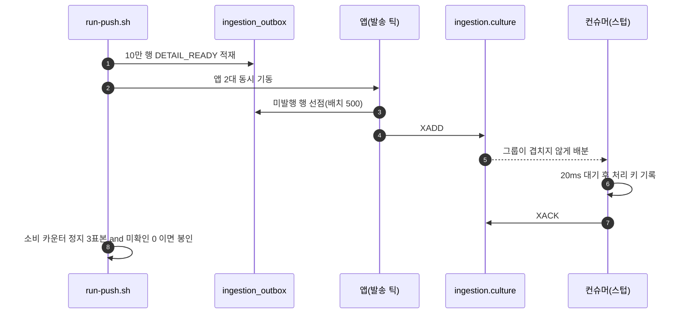
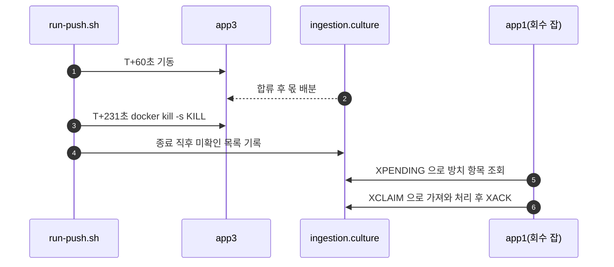

<!-- PR #169 본문 초안 · base: #168 · head: feat/ingestion-v2-push-lab -->

## 📌 Summary

- 배경
    - #168 로 측정 중에만 도메인 핸들러를 내리는 스위치가 생겼어요. 이제 그것을 켜고 실제로 재는 무대가 필요합니다.
    - 배달 계층이 정말로 일을 나눠 주는지, 인스턴스를 붙이면 몫이 갈리는지, 죽으면 그 몫이 회수되는지는 앱이 여러 대 떠 있어야 보입니다.
    - 앞 문제에서 만든 실행 스크립트는 발송 카운터로 소진을 판정해요. 이번 무대에서는 발행이 1분경 끝나서 그 식을 쓰면 소비가 한창일 때 실행이 닫힙니다.
- 목표
    - 앱 2~3대와 Redis 단일 노드·클러스터를 오가며 같은 조건으로 세 번 재는 도구를 둡니다.
    - 실행마다 조건과 계기판을 파일로 봉인해 나중에 다시 읽을 수 있게 합니다.
    - 원시 파일(요약·계기판 원문·로그·표본)은 저장소 규칙(`.gitignore`의 `_workspace/`)에 따라 로컬에만 보존하고, 저장소에는 해석 문서와 재현 도구만 올립니다. 원시가 필요하면 요청해 주세요.
- 결과
    - `lab/outbox-lock/` 아래에 실행 스크립트 한 벌과 변형 셋, 관측 스크립트 둘이 들어왔어요.
    - 세 번의 실행 결과를 해석한 문서(`action/` 두 편 · `evidence/` 둘 · README 판본 셋)가 함께 들어옵니다.
    - **프로덕션 코드는 이 PR에서 한 줄도 바뀌지 않습니다.**

## 🧭 Context & Decision

### 문제 정의

- 현재 동작/제약
    - 앞 문제의 `run.sh`와 `variants/_base.env`는 그 실험의 재현 자산이라 손대면 앞의 수치를 다시 만들 수 없어요.
    - `_base.env`는 컨슈머를 끈 상태이고 발송 틱이 60초예요. 이번 무대는 그 반대가 필요합니다.
- 문제(또는 리스크)
    - 소진 판정이 틀리면 실행이 일찍 닫혀 구간 표가 통째로 어긋나요.
    - 세 번째 인스턴스를 정상 종료로 내리면 회수할 대상이 남지 않아 되돌리기 시연이 성립하지 않습니다.
    - 클러스터를 세운 뒤 되돌리지 않으면 다음 실행이 오염됩니다.
- 성공 기준(완료 정의)
    - 세 실행 사이에 바뀌는 것이 변형 파일의 값과 Redis 구성뿐이어야 합니다.
    - 한 번 실행하면 조건·계기판·구간 표가 파일로 봉인돼야 합니다.

### 선택지와 결정

- 고려한 대안
    - A — `run.sh`를 고쳐 두 실험이 같은 스크립트를 쓰게 합니다.
    - B — `run-push.sh`를 새로 만들고 갈라진 지점만 명시합니다.
- 최종 결정: **B를 택했습니다.**
    - `run.sh`는 앞 문제 아홉 번의 실행을 만든 파일이에요. 소진 판정을 바꾸면 그 수치의 재현 조건이 달라집니다.
    - 대신 복제본이라는 사실과 갈라진 지점 셋(소진 판정·세 번째 인스턴스 훅·클러스터 경로)을 파일 머리 주석에 적었습니다.
- 트레이드오프
    - 비슷한 스크립트가 둘이 됩니다. 대신 앞 문제의 재현 자산이 그대로 남아요.

### 그 뒤에 이어진 결정들

#### 1. 소진을 무엇으로 판정할까 → 소비 카운터 정지와 미확인 0을 함께

- 선택지
    - 앞 문제처럼 발송 카운터가 멈추면 소진으로 봅니다.
    - 소비 카운터가 세 표본 연속 멈추고, 동시에 미확인 목록이 비었을 때만 소진으로 봅니다.
- 결정 근거
    - 발송은 1분경 끝나요. 그 시점을 소진으로 보면 소비가 한창일 때 닫힙니다.
    - 반대로 소비 카운터만 보면 회수를 기다리는 구간(카운터가 멈춥니다)을 소진으로 오판해요.
    - 두 조건이 서로의 오판을 막습니다. 여기에 세 번째 인스턴스의 합류·종료가 예정돼 있으면 아직 소진이 아니라는 가드를 더했어요.

#### 2. 세 번째 인스턴스를 어떻게 내릴까 → 강제 종료

- 선택지
    - `compose stop`으로 정상 종료합니다.
    - `docker kill -s KILL`로 강제 종료합니다.
- 결정 근거
    - 정상 종료면 컨테이너가 구독을 정리하면서 손에 쥔 레코드를 확인하거나 반납해요. 회수할 대상이 남지 않습니다.
    - 강제 종료해야 미확인 목록이 그 인스턴스 이름으로 남고, 회수 잡이 그것을 가져가는 것을 볼 수 있습니다.
    - 종료 직전 계기판을 한 번 더 뜨고 그 시각을 기록해 뒀어요. 마지막 표본과 종료 시각이 1초 차이라 계기 합이 실제 처리량보다 조금 적게 나옵니다.

#### 3. 클러스터를 어떻게 되돌릴까 → 클러스터 서비스 넷만 지웁니다

- 선택지
    - `docker compose down -v`로 전부 내립니다.
    - `--profile cluster rm -sf`로 클러스터 서비스 넷만 지웁니다.
- 결정 근거
    - 전부 내리면 앱·nginx·MySQL 두 대·단일 Redis까지 지워지고 익명 볼륨도 날아가요. 다른 실행의 재현 자산이 사라집니다.
    - 넷만 지운 뒤 단일 Redis에서 `cluster_enabled:0`을 확인하고, 100행짜리 짧은 실행을 다시 돌려 통과를 확인했습니다.

## 🏗️ Design Overview

### 변경 범위

- 영향 받는 모듈/도메인
    - `lab/outbox-lock/**` 와 이 주제의 문서 폴더만 바뀝니다. 프로덕션 소스는 변경 없어요.
- 신규 추가
    - `lab/outbox-lock/run-push.sh` · `lab/outbox-lock/seal-push.py`
    - `lab/outbox-lock/observe/stream-status.sh` · `lab/outbox-lock/observe/cluster-status.sh`
    - `lab/outbox-lock/variants/push-2.env` · `push-scale.env` · `push-cluster.env`
    - 해석 문서: `action/01-pull.md` · `action/02-push.md` · `action/image/` 다섯 장 · `evidence/key-metrics.md` · `evidence/design-notes.md` · `README-v2.md` · `README-v4.md` · `README-v5.md` · PR 본문 둘
- 제거/대체
    - 제거한 것은 없어요. `compose.lab.yaml`에 세 번째 앱과 클러스터 프로파일이 더해지고, `seed/seed-loop.sh`에 적재할 이벤트 종류를 넘길 자리가 생깁니다.
    - `lab/outbox-lock/README.md`에 「push 변형 돌리기」 절이 붙습니다. 실행 명령, 변형 셋의 차이, nohup 규칙, 클러스터 되돌리기 절차가 거기 있어요.
    - 앞 문제의 봉인 자산(`run.sh` · `variants/_base.env` · `variants/s*.env` · 기존 관측 스크립트 아홉)은 **무수정**입니다.

### 주요 컴포넌트 책임

- `run-push.sh`
    - 인프라 기동, 초기화, 적재, 앱 동시 기동, 표본 수집, 세 번째 인스턴스의 합류와 강제 종료, 종료 계기판 봉인을 한 번에 합니다.
    - 변형 이름 하나만 받아요. 값은 전부 `variants/push-*.env`에 있습니다.
    - 실행 전 확인표(`before-check.txt`)를 남깁니다. 스텁이 켜졌는지, 외부 API 감사 표가 비었는지, 소비 계기의 태그가 하나인지 세 줄이에요.
- `seal-push.py`
    - 표본에서 구간 경계를 되읽어 2대·3대·회수 후 구간으로 나누고 요약 파일 둘을 만듭니다.
    - 합류 경계는 기동을 요청한 시각이 아니라 소비 카운터가 처음 0을 넘은 표본의 **직전** 표본으로 정합니다. 그 표본까지는 세 번째 앱이 아직 한 건도 처리하지 않았으니까요.
- `observe/stream-status.sh`
    - 대기열 길이, 그룹 상태, 미확인 목록을 컨슈머별로 뜹니다.
- `observe/cluster-status.sh`
    - 클러스터 상태와 노드 목록, 키가 어느 슬롯의 어느 노드에 앉는지, 노드별 키 수와 대기열 길이를 남깁니다.

## 🔁 Flow Diagram

한 번의 실행은 적재를 먼저 끝내고 앱을 띄웁니다. 첫 틱이 쌓인 전량을 대상으로 삼아야 실행 사이의 조건이 같아지기 때문이에요.

### Main Flow

### 예외 흐름

`push-scale` 실행에서는 앱 두 대가 도는 도중에 세 번째 앱이 합류하고, 잠시 뒤 강제 종료됩니다. 이 분기가 필요한 이유는 "인스턴스를 늘리면 몫이 갈리는가"와 "줄이면 그 몫이 회수되는가"가 서로 다른 질문이기 때문이에요.

## ✅ 검증

- 테스트
    - 이 PR에는 프로덕션 코드 변경이 없어서 새 테스트가 없어요. #168 의 테스트가 그대로 기준입니다.
    - 형식 확인은 100행짜리 짧은 실행 셋으로 했습니다. 소비 100건·중복 0·미확인 0·외부 API 0을 세 변형에서 각각 확인했어요.
    - 짧은 실행이 결함 셋을 잡아 고쳤습니다. 첫 구간의 기준선, 표본 간격, 클러스터 초기화가 단일 노드를 비우지 않던 문제예요.
- 빌드
    - `./gradlew build` — BUILD SUCCESSFUL (5분 59초, 테스트 636개 · 실패 0, 2026-08-30 21:51 완료)

## 📎 리뷰어께 드리는 참고

- 세 번의 실행을 각 1회씩 돌린 결과예요. 조건이 다른 줄은 표시해 뒀습니다.

| 실행 | 앱 | 행수 | 소비 성공(앱별) | 중복 | 미확인(종료) | 발송 건너뜀 | 소진 |
|---|---|---|---|---|---|---|---|
| push-2 | 2 | 10만 | 100,000 (50,007 / 49,993) | 0 | 0 | 27,000 | 622초 |
| push-scale | 2→3→2 | 10만 | 99,991 (43,420 / 43,418 / 13,153) | 0 | 0 | 35,749 | 533초 |
| push-cluster | 2 | 10만 | 100,000 (49,956 / 50,044) | 0 | 0 | 33,588 | 617초 |

- 읽을 때 주의할 점 넷이에요.
    - `push-scale`의 소비 합 99,991은 유실이 아닙니다. 세 번째 앱의 마지막 계기판이 강제 종료 1초 전이라 그 뒤의 9건이 계기에 없어요. 잃은 것이 없다는 근거는 고유 처리 키 100,000입니다.
    - 구간별 처리율은 기록으로만 씁니다. 구간 길이가 61초·171초·343초로 다르고 실행마다 1회예요.
    - 클러스터 실행의 소진 617초를 단일 노드 622초와 배수로 견주지 않습니다. 노드 셋이 같은 호스트에 있고 복제도 없어 성능 비교의 조건이 아니에요.
    - 앞 문제(100만 행·컨슈머 없음)의 값과 개선율로 계산하지 않습니다. 재는 구간이 달라서 기준선으로만 인용했어요.
- 관측의 한계가 하나 있습니다. 행 마커의 수명이 300초라, 실행이 끝나는 시점에는 마커 키가 어느 노드에도 남아 있지 않아요. 그래서 키 배치 표의 값은 관측된 키가 아니라 **키 이름으로 계산한 슬롯**입니다. 문서에도 그렇게 적었습니다.
- 디렉터리 이름이 `outbox-lock`인데 이번 실험까지 담게 됐어요. 앞 문제의 아홉 번 실행이 그 이름으로 봉인돼 있어서 이번에는 그대로 뒀습니다. 이름을 바꾼다면 별도로 다루는 편이 좋겠습니다.
- 클러스터는 실험 뒤 되돌렸습니다. 클러스터 서비스 넷을 지우고 `cluster_enabled:0`을 확인한 뒤 100행 실행을 다시 돌려 통과했어요.
- 실행 순서와 재현 방법은 `lab/outbox-lock/README.md`에 있습니다. 세 실행은 같은 무대를 쓰므로 반드시 하나씩 순차로 돌리고, 실행 중에는 같은 머신에서 다른 컨테이너나 빌드를 돌리지 않아야 수치가 흔들리지 않아요.
- 해석은 `action/01-pull.md`와 `action/02-push.md`에 나눠 적었고, 숫자의 출처는 `evidence/key-metrics.md`에 한 장으로 모았습니다.
