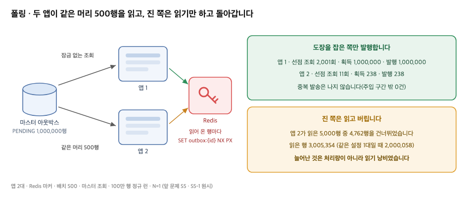
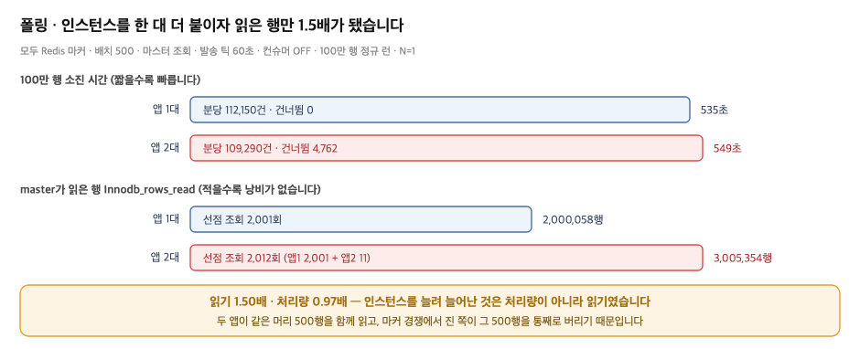

# 1. 폴링으로 처리 대상을 찾는 구조

## 왜 이 시도였나

앞 문제에서 중복 발송은 막았습니다. 행마다 Redis에 도장을 찍고 도장을 잡은 인스턴스만 발행하게 하자, 같은 설정의 앱 1대 런에서 중복이 0건이 됐고 DB 행 잠금 대기도 0회가 됐습니다 [raw: `01/_workspace/03_measurer_raw/s5-1/run-summary.json`].

그러나 바뀐 것은 **누가 발행할지를 정하는 방법**이었지, **처리 대상을 어떻게 찾는지**가 아니었습니다. 찾는 방법은 그대로 폴링입니다. 각 인스턴스가 자기 시계로 깨어나 아웃박스에서 미발행 행을 배치만큼 읽고, 읽어 온 행이 자기 몫인지 하나씩 확인합니다. 두 대가 있으면 두 대가 각자 같은 일을 합니다. 판정을 Redis로 옮긴 대가로 **조회해 온 행마다 확인 호출이 하나씩 더 붙었기 때문에**, 이 편의 관점에서 폴링의 비용은 오히려 앞 단계보다 커졌습니다. README가 Problem에 적은 문장이 겨눈 지점이 여기입니다.

이 편은 새로 돌린 실험이 아닙니다. 앞 문제의 마지막 런(Redis 마커 · 앱 2대)과 같은 설정을 **앱 1대**로 돌린 런을 나란히 놓고, 인스턴스를 한 대 더 붙였을 때 폴링이 얼마를 더 쓰는지를 읽은 기록입니다. 아래에서 `01/`은 `../../01-분산 환경 스케줄러 중복 실행 제어/`를 가리키고, 모든 숫자는 그 폴더의 원시 파일로 역추적됩니다.

## 폴링 한 틱이 하는 일

세 조각입니다. 먼저 틱은 **인스턴스마다 따로** 돕니다.

```java
// src/main/java/modi/backend/ingestionv2/common/interfaces/OutboxDispatchScheduler.java:53
@Scheduled(fixedDelayString = "${app.ingestion.v2.dispatch-interval-ms:1000}")
public void dispatch() {
    ...
    do {
        outcome = outboxDispatcher.dispatchBatch();   // 배치 하나 = 트랜잭션 하나
        published += outcome.published();
        batches++;
    } while (properties.dispatchDrain() && outcome.drainable()   // 집을 것이 없을 때까지 반복
            && batches < properties.dispatchDrainMaxBatches());
}
```

다음으로 조회 질의에는 **인스턴스를 가르는 항이 없습니다.**

```sql
-- src/main/java/modi/backend/ingestionv2/common/outbox/OutboxJpaRepository.java:58~64 (selectPending)
SELECT ... FROM ingestion_outbox
 WHERE status = 'PENDING'
 ORDER BY created_at, id
 LIMIT :limit
```

`ORDER BY created_at, id LIMIT 500`은 누가 물어도 같은 머리 500행을 돌려줍니다. 마지막으로 확인은 **행 단위**입니다. 읽어 온 500행에 `SET NX PX`가 한 번씩 나가고, 남이 이미 가져간 행이라는 사실은 읽고 나서야 알게 됩니다.

```java
// src/main/java/modi/backend/ingestionv2/common/outbox/OutboxDispatcher.java:93~107
private List<Outbox> acquireMarkers(List<Outbox> claimed) {
    for (Outbox outbox : claimed) {
        if (markerLock.tryAcquire(MARKER_KEY_PREFIX + outbox.getId(), owner, ttl)) {
            mine.add(outbox);          // 내가 맡은 행
        } else {
            skipped++;                 // 읽어 왔지만 버리는 행 = 읽기 낭비
        }
    }
    markerCounter("acquired").increment(mine.size());
    markerCounter("skipped").increment(skipped);   // 낭비의 크기를 세는 자리
}
```

세 조각을 이으면 비용의 모양이 나옵니다. 인스턴스는 스스로 목록을 가지러 가고, 모두 같은 목록을 받고, 남의 것인지는 확인해 봐야 압니다.

## 무엇을 재봤나

앞 문제의 두 런을 그대로 인용합니다. 미발행 100만 행을 한 번에 적재한 뒤 앱을 기동하고 소진까지 관측한 정규 런이며, 선점은 Redis 마커 · 배치 500 · 발송 틱 60초 · 마스터 조회 · 힙 `-Xmx2g` · MySQL 8.4.10 · Redis 7.4.9 · 변형당 1회(N=1)입니다. 컨슈머는 꺼져 있어 **아웃박스에서 대기열로 내보내는 발송 단계까지만** 잽니다 [raw: `01/_workspace/03_measurer_raw/s5/run-summary.md` · `01/_workspace/03_measurer_raw/s5-1/run-summary.md`].

앱 2대 런(S5)에는 실행 중간 60초 동안 마커 키를 강제로 지운 주입 구간이 있습니다. 그 구간이 만든 것은 중복 238건인데, 이 편이 쓰는 지표는 조회·읽기 비용이라 주입의 영향을 받지 않습니다. 주입 이야기는 앞 문제의 5편에 있습니다.

다음 편의 무대는 **여기와 다릅니다.** 10만 행 · 발송 틱 1초 · 컨슈머를 켜고 소비까지 재는 런입니다. 그래서 이 편의 숫자는 다음 편의 결과와 나란히 놓고 개선율로 계산하지 않고, **폴링 구조가 인스턴스를 늘렸을 때 무엇을 더 쓰는지**를 보이는 기준선으로만 씁니다.

## 측정 — 인스턴스를 늘리자 읽은 행만 늘었습니다



| 지표 | 앱 1대(S5-1) | 앱 2대(S5) | 읽을 것 |
|---|---|---|---|
| 선점 조회 호출 | 2,001회 | 2,012회 (앱1 2,001 + 앱2 11) | 이론값 1,000,000 ÷ 500 = 2,000회 |
| 선점 조회가 집어 온 행 | 1,000,000행 | 1,005,000행 | 앱2가 읽은 5,000행이 초과분 |
| 마커 획득 / 건너뜀 | 1,000,000 / 0 | 1,000,238 / **4,762** | 건너뜀 = 읽고 버린 행 |
| 앱별 발행 성공 | 1,000,000 | 1,000,000 : **238** | 진 쪽은 읽기만 했습니다 |
| master `Com_select` | 2,248회 | 2,333회 | 델타 |
| master `Innodb_rows_read` | 2,000,058행 | **3,005,354행** | 1.50배 |
| 소진 시간 / 분당 SENT | 535초 / 112,150건 | 549초 / 109,290건 | 0.97배 |

원시: `01/_workspace/03_measurer_raw/s5/run-summary.json` · `01/_workspace/03_measurer_raw/s5-1/run-summary.json`, 앱별 값은 `01/_workspace/03_measurer_raw/s5/attachments/{app1,app2}/prom-1788079086.txt`(마지막 스크랩)의 `ingestion_outbox_claim_total` · `ingestion_outbox_marker_total{result}` · `ingestion_outbox_publish_total{result="success"}`입니다. 이 원시 파일들은 저장소 `.gitignore`의 `_workspace/` 규칙에 따라 로컬에만 보존됩니다.

읽는 순서는 셋입니다.

**첫째, 조회 호출 수는 인스턴스를 늘려도 거의 그대로였습니다.** 2,001회가 2,012회가 됐을 뿐입니다. 앱2는 열한 번밖에 조회하지 못했는데, 한 틱이 배치를 소진할 때까지 반복하는 구조에서 앱1이 먼저 들어가 1,000,000행을 전부 가져갔기 때문입니다. 즉 조회 **횟수**는 배치 크기와 총 건수가 정하고, 인스턴스 수가 곱해지는 것은 그 아래 층입니다.

**둘째, 인스턴스 수만큼 늘어난 것은 읽은 행이었습니다.** 2,000,058행이 3,005,354행이 됐습니다. 두 앱이 같은 머리 500행을 함께 읽고, 마커 경쟁에서 진 쪽이 그 500행을 통째로 버리기 때문입니다. 앱2가 읽은 5,000행 중 4,762행이 그렇게 버려졌습니다.

**셋째, 그렇게 더 읽었는데 처리량은 늘지 않았습니다.** 100만 행 소진이 535초에서 549초로 오히려 길어졌습니다(0.97배). 탐색에 드는 비용은 인스턴스 수를 따라가는데, 처리량은 따라가지 않습니다.

## 이 실측이 뒷받침하는 것과 뒷받침하지 못하는 것

| README 문장 | 판정 | 근거 |
|---|---|---|
| Problem "각 인스턴스가 아웃박스 전체를 배치 단위로 조회하는 구조" | **뒷받침함** | 조회에 인스턴스를 가르는 항이 없습니다(`selectPending` L58~64). 두 앱의 선점 호출 합 2,012회 |
| Problem "조회 건마다 Redis 중복 체크가 더해져 폴링 비용이 커졌다" | **뒷받침함** | 읽어 온 행마다 `SET NX PX` 한 번(`acquireMarkers` L93~107). 2대 런의 마커 판정 1,005,000회 = 읽어 온 행 수 |
| Problem "조회 횟수 = (미처리 건수 / 배치 크기) × 인스턴스 수" | **부분** | 호출 수는 2,012회 대 2,001회로 사실상 같았습니다. 인스턴스 배수로 나타난 것은 호출 수가 아니라 **읽은 행 수**(2,000,058 → 3,005,354)입니다. 두 대가 같은 머리 500행을 함께 읽기 때문입니다 |
| Problem "그중 대부분이 낭비 조회" | **부분** | 진 쪽 한 대만 놓고 보면 읽은 5,000행 중 4,762행(95.2%)을 버렸습니다. 다만 런 전체로는 1,005,000행 중 4,762행, 0.5%입니다. "대부분"은 배치 상한이 없는 구조에 대한 서술이고, 배치 500으로 돌린 이 실측으로 그 서술을 대체하지 않습니다 |
| Problem "주기를 짧게 하면 빈 조회도 비례해 증가" | **미측정** | 구조 논증만 합니다. 발송 틱은 `dispatch-interval-ms`의 `fixedDelay`로 인스턴스마다 따로 돌고(`OutboxDispatchScheduler` L53), 이 두 런의 틱은 60초였습니다. 운영 기본값은 1초입니다. 유휴 구간의 빈 조회를 재는 런은 돌리지 않았습니다 |
| Problem "진 쪽은 읽기만 하고 처리는 하지 못한다" | **뒷받침함** | 앱2 발행 238건 · 건너뜀 4,762건. 앱1은 1,000,000건 |
| Action 1 "Pull에서 Push로 방향을 정했다" | **설계 결정** | 이 편은 그 결정의 근거이고, 결정 자체의 증명은 다음 편입니다 |

## 근거로 쓰지 않기로 한 것

| 쓰지 않은 것 | 이유 |
|---|---|
| 이 숫자와 다음 편 결과의 개선율 | 재는 구간이 다릅니다. 여기는 아웃박스에서 대기열까지(컨슈머 OFF), 다음 편은 소비까지입니다. 행수·틱 간격도 다릅니다 |
| 낭비 비중 0.5%를 README의 "대부분"으로 | 배치 500이 만든 값입니다. 배치 상한이 없으면 진 쪽이 읽는 행이 머리 500행이 아니라 미발행 전체가 됩니다 |
| 폴링 주기를 줄였을 때의 빈 조회 증가량 | 유휴 구간을 재는 런을 계획에 넣지 않았습니다. 구조 논증까지만 씁니다 |
| 두 런의 차이(14초)의 통계적 유의성 | 조건당 1회입니다(N=1). 방향과 자릿수에만 씁니다 |
| 왜 앱1이 마커 경쟁에서 매번 이겼는가 | 이 런의 원시로는 확정되지 않습니다. 해석 후보는 앞 문제의 설계 노트에 있습니다 |

## 남은 문제 / 판정



판정은 **구조를 바꿔야 한다**입니다. 앞 문제에서 고칠 수 있었던 것은 판정을 어디서 하느냐였고, 그것으로 중복과 DB 락 대기는 사라졌습니다. 그러나 **탐색 비용은 인스턴스 수에 비례하는데 처리량은 그렇지 않다**는 숫자가 그대로 남았습니다. 읽은 행 1.50배에 소진 시간 0.97배입니다.

원인은 어느 판정 방식을 고르느냐가 아니라 그 위의 구조입니다. 지금은 인스턴스가 **스스로 같은 목록을 가지러 갑니다.** 아무도 "너는 이 행, 너는 저 행"이라고 나눠 주지 않으므로, 판정을 DB에 두든 Redis에 두든 경쟁은 이미 조회 시점에 일어나 있습니다. 도장을 어디에 찍느냐를 바꿔서는 4,762라는 숫자가 사라지지 않습니다.

그렇다면 누군가 처리 대상을 나눠 주면 어떻게 될까요. 인스턴스가 가지러 가는 대신 배분받는 구조로 바꾸면, 같은 행을 두 번 읽을 이유 자체가 없어지고 인스턴스를 더 붙였을 때 늘어나는 것이 읽기 낭비가 아니라 처리량이 됩니다. 다음 편은 그 구조를 Redis Streams의 Consumer Group으로 세우고, 앱 두 대가 실제로 나눠 일하는지 · 한 대를 더 붙이면 몫이 셋으로 갈리는지 · 그 한 대가 죽으면 맡고 있던 몫이 회수되는지를 같은 무대에서 확인한 기록입니다.
