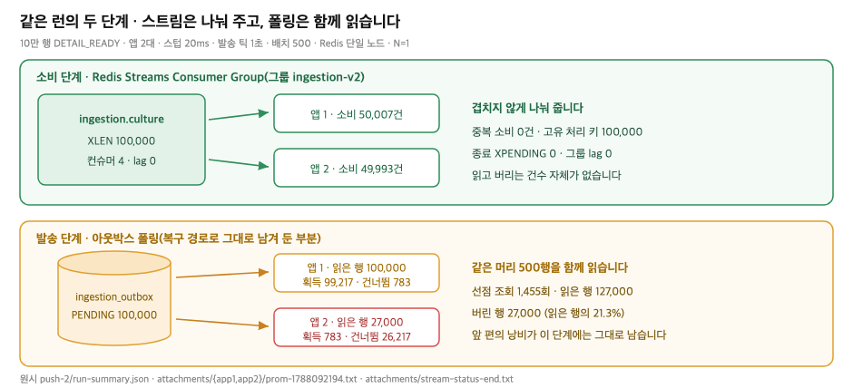
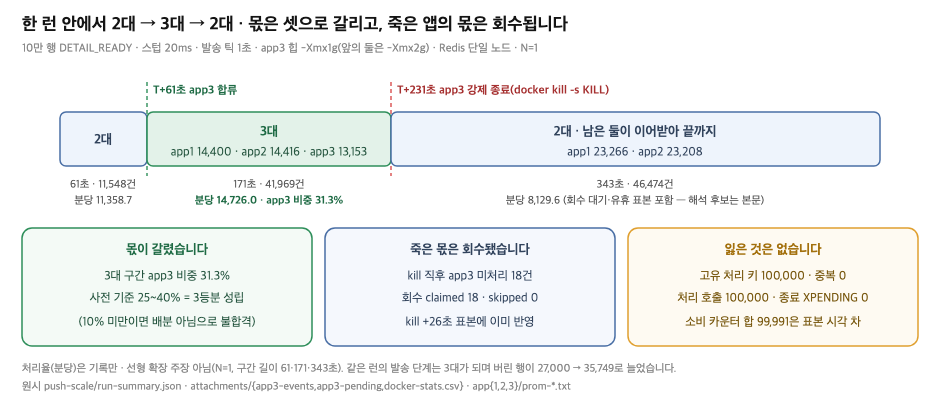
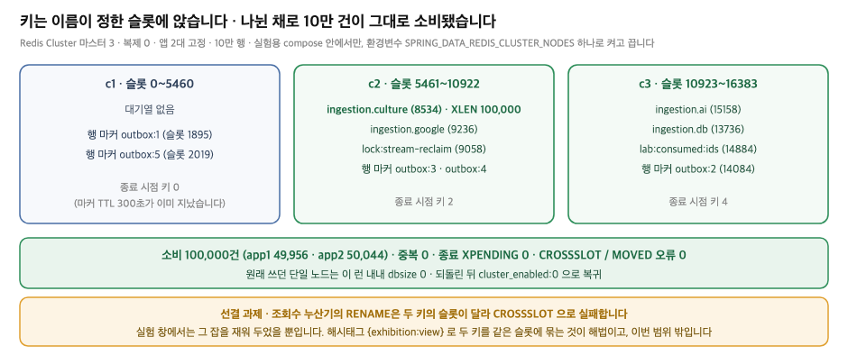

# 2. 대기열이 처리 대상을 배분하는 구조

## 왜 이 시도였나

앞 편이 남긴 문장은 하나였습니다. **탐색 비용은 인스턴스 수에 비례하는데 처리량은 그렇지 않다.** 읽은 행이 1.50배가 되는 동안 소진 시간은 0.97배였고, 원인은 판정 방식이 아니라 각 인스턴스가 스스로 같은 목록을 가지러 간다는 구조에 있었습니다.

그래서 바꿀 곳을 판정에서 **배분**으로 옮겼습니다. 인스턴스가 대상을 찾으러 가는 대신, 누군가 "너는 이 건, 너는 저 건"이라고 나눠 주면 같은 행을 두 번 읽을 이유 자체가 없어집니다. 나눠 주는 쪽이 소비자 목록을 알고 있으므로, 인스턴스를 한 대 더 붙였을 때 늘어나는 것도 읽기 낭비가 아니라 처리량이 됩니다. 이 편은 그 구조를 세우고 세 가지를 확인한 기록입니다. 두 대가 실제로 나눠 일하는지, 한 대를 더 붙이면 몫이 갈리고 그 한 대가 죽으면 맡던 몫이 회수되는지, 그리고 이 구조의 쓰기 부하를 나중에 Redis 여러 대로 나눌 수 있는지입니다.

## 나누는 기준과 선택지

배분해 주는 쪽을 두려면 대기열이 필요합니다. 후보를 고르기 전에 무엇을 기준으로 볼지부터 정했습니다.

1. **새로 운영해야 하는 구성 요소가 몇 개 늘어나는가.** 지금 이 서비스를 도는 사람은 한 명이고, 늘어난 구성 요소는 전부 그 한 명의 운영 부담입니다.
2. **지금 규모에서 무엇이 실제로 필요한가.** 수집 실행은 `CollectScheduler`의 `0 0 1,13 * * *`로 하루 두 번 깨어나지만 두 번째는 회차 키 선점에 실패해 곧바로 끝나므로 실효 1회입니다. 회차당 상한은 `max-items: 500`이고 주석에 적힌 실측 원천은 266건입니다. 이벤트 종류는 `IngestionEventType` 일곱입니다. 그래서 하루 이벤트는 **상한 기준 1 × 500 × 7 = 3,500건(약 0.04건/초), 실측 원천 기준 1 × 266 × 7 = 1,862건(약 0.02건/초)**입니다. 두 값 모두 계산식으로 얻은 **추정**이고, 실사용 로그로 센 값이 아닙니다.
3. **병렬성을 어떻게 늘리고 그 상한은 무엇인가.**
4. **처리 도중 죽은 항목을 되찾는 절차가 있는가.**

| 기준 | Kafka | Redis Streams | 폴링 유지 |
|---|---|---|---|
| 늘어나는 구성 요소 | 브로커 1종(토픽·컨슈머 그룹 운영·모니터링 포함) | **0종.** Redis는 이미 캐시 L2(`config/CacheConfig`)·무효화 pub/sub(`infra/cache/RedisPublisher`)·AI 초안 보관(`infra/ai/redis/RedisAiDraftStore`)·조회수 누산(`infra/exhibition/redis/RedisExhibitionViewCounter`)·수집 마커(`ingestionv2/common/lock/RedisMarkerLock`) 다섯 용도로 이미 서 있습니다 | 0종 |
| 하루 3,500건(상한 추정) 처리 | 남습니다 | 남습니다 | 남습니다 |
| 병렬성을 늘리는 방법 | 파티션 수를 늘린다. **상한이 파티션 수**이고 변경은 재파티셔닝 | 컨슈머 수를 늘린다(`external-stream-consumers`). 인스턴스를 늘리는 것도 같은 효과 | 늘려도 같은 행을 함께 읽는다(앞 편 결과) |
| 방치 항목 회수 | 브로커가 재배정 | `XPENDING`·`XCLAIM`(`PendingReclaimer`) | 해당 없음 |
| 메시지 보존·재처리 | 로그 보존 기간 안에서 자유롭게 되감기 | 스트림 길이 상한까지. 되감기는 제한적 | 원본이 DB에 남음 |

**Redis Streams를 골랐습니다.** 결정적인 칸은 첫 줄입니다. 이 규모에서 Kafka가 주는 이점은 보존과 되감기인데 그 둘은 지금 필요하지 않고(원본 이벤트는 아웃박스 테이블에 그대로 남습니다), 그 대가로 운영해야 할 것이 한 종류 늘어납니다. 반대로 Streams는 이미 서 있는 Redis에 명령 몇 개가 더 붙는 일입니다.

두 가지는 정직하게 적어 둡니다. **Kafka를 실제로 세워 견준 실측은 없습니다.** 위 표의 판단 근거는 코드 사실(이미 있는 Redis 용도 다섯, 컨슈머 수가 프로퍼티라는 점, 회수가 이미 코드에 있다는 점)과 규모 추정식뿐입니다. 그리고 규모가 이 추정을 넘어서면(예: 원천이 늘어 하루 이벤트가 자릿수로 커지거나, 되감기가 요구되면) 이 결정은 다시 봐야 합니다.

**폴링은 제거하지 않고 남겼습니다.** 아웃박스에서 스트림으로 내보내는 발송 틱은 그대로 돕니다. 스트림에 넣는 일 자체가 실패하거나 앱이 그 사이에 죽어도 행은 `PENDING`으로 남아 다음 틱이 다시 집기 때문입니다. 큐와 폴링을 이중으로 운영하는 대가는 발송 단계에 앞 편의 낭비가 그대로 남는다는 것이고, 그 크기는 아래 시연 ①의 표에 그대로 나옵니다.

## 무엇을 바꿨나

배분의 실체는 Consumer Group입니다. 스트림 하나에 그룹 하나를 두고 인스턴스마다 이름이 다른 컨슈머를 붙이면, 같은 그룹의 컨슈머들에게 레코드가 **겹치지 않게** 나뉩니다.

```java
// src/main/java/modi/backend/ingestionv2/common/IngestionConfig.java:82~88
for (IngestionStream stream : IngestionStream.values()) {          // 대기열 4개
    int consumers = stream.external() ? properties.externalStreamConsumers()   // 외부 호출 스트림은 두껍게
            : properties.dbStreamConsumers();
    for (int index = 0; index < consumers; index++) {
        container.register(readRequest(stream, consumerName(properties, stream, index), properties),
                streamConsumer);       // 구독 하나 = 스레드 하나
    }
}
```

```java
// 같은 파일 :98~105 - 확인을 자동으로 하지 않는다
return StreamReadRequest
        .builder(StreamOffset.create(stream.key(), ReadOffset.lastConsumed()))
        .consumer(Consumer.from(properties.consumerGroup(), consumerName))   // 그룹 ingestion-v2
        .autoAcknowledge(false)      // 읽었다고 확인하지 않는다 - 처리에 성공해야 확인한다
        .cancelOnError(throwable -> false)
        .build();
```

확인 시점이 이 구조의 핵심입니다. 읽는 순간 확인해 버리면 처리 도중 죽은 항목이 사라지므로, 확인은 소비 어댑터가 성공한 뒤에만 합니다.

```java
// src/main/java/modi/backend/ingestionv2/common/queue/StreamConsumer.java:79~97
try {
    handler.handle(event.aggregateId());
    acknowledge(message);            // 성공한 것만 확인(XACK)
    record(event, "success", started);
} catch (CoreException failure) {
    ...
    record(event, "retry", started); // 실패는 미확인으로 남긴다 - 회수 대상이 된다
}
```

대기열은 단계가 아니라 **벤더로** 나눴습니다(`IngestionStream` L18~21: `ingestion.culture`·`ingestion.ai`·`ingestion.google`·`ingestion.db`). 한 벤더의 호출 한도가 다른 벤더의 이벤트를 굶기지 않게 하기 위해서이고, 외부 호출 스트림에 컨슈머를 더 붙이는 기준도 이 구분입니다.

이 배선은 이미 코드에 있던 것입니다. **이번에 새로 만든 것은 측정 훅뿐입니다.** 도메인 핸들러 여섯은 넷이 외부 유료 호출로, 둘이 DB 작업으로 이어져 부하 실험에서 그대로 돌릴 수 없어, `consume-handler` 프로퍼티가 `STUB`일 때만 지연만 흉내내는 빈 하나가 등록되고 실제 핸들러 여섯은 **컨텍스트에 아예 올라오지 않도록** 조건부 등록으로 갈랐습니다. 운영 기본값은 `REAL`이고 그 경로의 동작은 바뀌지 않았습니다. 실험 창에서 유료 호출이 0건이었다는 것은 감사 테이블로 직접 확인했습니다(`SELECT COUNT(*) FROM external_api_call_log WHERE source='INGESTION'` = 0) [raw: `../_workspace/03_measurer_raw/push-2/attachments/before-check.txt`].

## 시연 ① 두 인스턴스가 나눠 일하는가



무대는 10만 행 `DETAIL_READY`를 한 번에 적재한 뒤 앱 두 대를 동시 기동해 소진까지 관측한 런입니다. 스텁 지연 20ms · 발송 틱 1초 · 배치 500 · 방치 판정 15초 · MySQL 8.4.10 · Redis 7.4.9 단일 노드 · N=1입니다 [raw: `../_workspace/03_measurer_raw/push-2/run-summary.md`].

| 지표 | 값 | 읽을 것 |
|---|---|---|
| 소비 성공 합 | 100,000건 | 적재한 행 수와 같습니다 |
| 앱별 소비 성공 | app1 **50,007** / app2 **49,993** | 50.01% : 49.99% |
| 고유 처리 키 / 중복 소비 | 100,000 / **0** | 스텁이 처리 끝에 남긴 집합 크기와 중복 카운터 |
| 종료 `XPENDING`(스트림 4개 합) | 0 | 미확인으로 남은 것이 없습니다 |
| `XLEN ingestion.culture` / 그룹 lag | 100,000 / 0 | 그룹 컨슈머 4(앱당 2), 전부 pending 0 |
| 아웃박스 (총 / SENT / PENDING / FAILED) | 100,000 / 100,000 / 0 / 0 | |
| 외부 API 호출 감사(`source='INGESTION'`) | **0건** | 유료 경로가 돌지 않았다는 직접 증거 |
| 소진 / 관측 경과 / 표본 | 622초 / 665초 / 49회 | 구간 분당 소비 9,022.6건(665초 기준) |
| **발송 단계 대조** — 선점 호출 / 선점 행수 | 1,455회 / **127,000행** | 10만 행을 내보내려고 12.7만 행을 읽었습니다 |
| **발송 단계 대조** — 마커 획득 / 건너뜀 | 100,000 / **27,000** | 앱1 783 + 앱2 26,217 |

원시: `../_workspace/03_measurer_raw/push-2/run-summary.json` · 앱별 값은 `../_workspace/03_measurer_raw/push-2/attachments/{app1,app2}/prom-1788092194.txt`(마지막 스크랩)의 `ingestion_consume_seconds_count{event_type="DETAIL_READY",result="success"}`, 스트림 상태는 `attachments/stream-status-end.txt`, 아웃박스 집계는 `attachments/outbox-status-count.txt`입니다.

**같은 런 안에서 두 단계가 정반대로 갈립니다.** 아래쪽 두 줄은 앞 편의 그림 그대로입니다. 아웃박스에서 스트림으로 내보내는 일은 여전히 두 앱이 각자 폴링하므로, 10만 행을 내보내는 데 12.7만 행을 읽고 27,000행(읽은 행의 21.3%)을 버렸습니다. 앱2만 놓고 보면 읽은 27,000행 중 26,217행, 97.1%가 낭비였습니다 [raw: `attachments/app2/prom-1788092194.txt`의 `ingestion_outbox_marker_total{result="skipped"}`].

반면 위쪽은 낭비가 없습니다. 스트림에 들어간 뒤로는 두 앱이 **읽은 것을 버리는 일 자체가 없고**(그룹이 겹치지 않게 나눠 주므로), 10만 건이 50,007 대 49,993으로 갈렸습니다. 중복 소비 0건과 종료 `XPENDING` 0은 "한 건은 한 번만, 그리고 빠짐없이" 처리됐다는 뜻입니다.

표본 시계열도 같은 이야기를 합니다. 12~17초 간격(마지막 한 표본만 3초) 49개 표본에서 두 앱의 누적 소비는 처음부터 끝까지 서로 30건 이내로 붙어 갔고(예: T+100초 8,965 대 8,966, T+365초 30,055 대 30,064), 표본 사이 분당 소비는 대체로 9,000~11,000건이었습니다 [raw: `attachments/{app1,app2}/prom-*.txt` 49개 표본의 소비 카운터 델타]. 소진 기준 처리율은 100,000 ÷ 622초 = 160.8건/초이고, 구독 4개 × (1초 ÷ 20ms) = 200건/초라는 계산상의 상한 대비 80%입니다(상한은 계산값입니다).

## 시연 ② 인스턴스를 한 대 더 붙이고 되돌리기



①이 보인 것은 두 대가 나눠 일한다는 사실까지입니다. 남은 질문은 둘입니다. **인스턴스를 한 대 더 붙이면 몫이 그만큼 갈리는가**, 그리고 **늘린 것을 되돌렸을 때 그 한 대가 맡고 있던 몫은 어떻게 되는가.**

한 런 안에서 확인했습니다. 10만 행을 같은 방식으로 적재하고 앱 두 대로 시작해, T+60초에 app3을 기동하고(소비 카운터가 처음 0을 넘은 표본의 앞 표본을 합류 경계로 잡아 T+61초) T+231초에 **`docker kill -s KILL`로 강제 종료**했습니다 [raw: `../_workspace/03_measurer_raw/push-scale/attachments/app3-events.txt`]. 정지에 `compose stop`을 쓰지 않은 이유는 SIGTERM을 받은 컨테이너가 구독을 정리하면서 손에 쥔 레코드를 확인하거나 반납해 버리면 **회수할 대상이 남지 않아** 되돌리기 시연이 성립하지 않기 때문입니다. app3만 힙을 `-Xmx1g`로 잡았습니다(호스트가 6 CPU · 12GB이고 앞의 두 대가 각각 `-Xmx2g`입니다).

| 구간 | 길이 | 소비 | 분당 | 앱별 | app3 비중 |
|---|---|---|---|---|---|
| 2대 | 61초 | 11,548건 | 11,358.7 | app1 5,754 / app2 5,794 | — |
| **3대** | 171초 | 41,969건 | 14,726.0 | app1 14,400 / app2 14,416 / **app3 13,153** | **31.3%** |
| 2대(회수 후) | 343초 | 46,474건 | 8,129.6 | app1 23,266 / app2 23,208 | — |

원시: `../_workspace/03_measurer_raw/push-scale/run-summary.json`의 `consume_per_minute_by_phase`(구간 경계는 표본에서 되읽은 값이고 `phase_boundaries`에 epoch로 남아 있습니다).

**첫째, 몫은 셋으로 갈렸습니다.** 3대 구간에서 app3이 가져간 비중은 31.3%입니다. 이 판정의 기준은 측정 전에 정해 두었습니다. 10% 미만이면 "배분이 아니라 곁다리"로 보고 불합격, 25~40%면 3등분이 성립한 것으로 봅니다. 붙이자마자 곧바로 3분의 1 가까이를 가져갔다는 것은, 인스턴스가 대상을 찾아 경쟁하는 것이 아니라 그룹이 새 컨슈머에게 나눠 준다는 뜻입니다. 앞 편에서 두 번째 앱이 가져간 몫이 100만 건 중 238건이었던 것과 대비됩니다.

**둘째, 강제로 죽인 앱의 몫은 회수됐습니다.** kill 직후 app3 이름으로 남아 있던 미처리 레코드는 **18건**이었습니다(`app3-culture-0` 8건 · `app3-culture-1` 10건, 원문은 `attachments/app3-pending.txt`). 회수기가 그 18건을 전부 가져갔고(`ingestion_stream_reclaim_total{result="claimed"}` 18 · skipped 0), 회수는 kill 26초 뒤 표본에 이미 반영돼 있었습니다(방치 판정 15초 · 회수 주기 30초) [raw: `attachments/app1/prom-1788092582.txt`]. 회수를 수행한 것은 app1 한 대뿐입니다. 전체를 훑는 잡이라 `lock:stream-reclaim`으로 단일 실행을 걸어 두었기 때문이고, app2의 계기에는 회수 카운터 자체가 없습니다.

**셋째, 잃은 것은 없습니다.** 고유 처리 키 100,000 · 처리 호출 100,000 · 중복 소비 0 · 종료 `XPENDING` 0입니다. 회수된 18건이 중복이 되지 않은 이유가 이 숫자들 안에 있습니다. 처리 호출 수가 적재 행수와 정확히 같으므로 **그 18건은 app3이 배달만 받고 아직 처리하지 못한 것**이었고, 회수 뒤 app1이 처음으로 처리했습니다. 처리를 마친 뒤 죽었다면 재처리가 일어나 중복 카운터가 올라갔을 텐데 그런 일은 없었습니다.

여기서 규모를 정직하게 적어 둡니다. **18건은 수십 건 단위이고, 이것은 대량 유실을 막았다는 증명이 아닙니다.** 구독 2개가 한 번에 읽는 배치가 10이므로 한 앱이 쥘 수 있는 미처리는 많아야 20건이고, 실제로 그 상한 근처인 18건이 남았습니다. 이 시연이 증명하는 것은 **`XPENDING`으로 방치된 것을 찾아 `XCLAIM`으로 가져오고 다시 처리해 확인까지 가는 경로가 실제로 돈다**는 사실입니다.

소비 성공 카운터의 합은 99,991로 적재 행수보다 9건 적습니다. app3의 마지막 계기판 스크랩이 강제 종료 1초 전이라(마지막 스크랩 `1788092555` · kill `1788092556`) 그 사이에 app3이 처리한 9건이 계기에 잡히지 않았습니다. **유실이 아니라 표본 시각의 차이**이고, 잃은 것이 없다는 근거는 고유 처리 키 100,000입니다.

처리율은 **기록만** 합니다. 2대 11,358.7건/분에서 3대 14,726.0건/분으로 1.30배가 됐지만, 이 값으로 선형 확장을 주장하지 않습니다. 조건당 1회이고(N=1) 구간 길이가 61초·171초·343초로 제각각이며, 회수 후 구간의 분당 값(8,129.6)은 앞의 2대 구간보다 오히려 낮습니다. 이 마지막 값이 낮은 이유는 확정하지 못했고 해석 후보가 셋 있습니다. 회수 대기(방치 판정 15초 + 주기 30초) 동안 소비가 멈춘 구간이 이 구간에 포함된 점, 소진을 판정하려고 붙인 유휴 표본 세 개가 구간 끝에 들어 있는 점, 그리고 꼬리에서는 읽을 것이 얇아져 배치가 차지 않는 점입니다. 어느 쪽인지는 이 런의 원시로 가릴 수 없습니다.

3대 구간이 자원 포화 때문에 눌리지는 않았습니다. app3의 CPU는 부팅 순간 340.4% 뒤로 17.0~55.5%였고 메모리는 671.4MiB / 3GiB에서 끝났습니다. 같은 구간 app1은 최대 73.2%, app2는 최대 36.0%로 호스트 6 CPU(=600%) 대비 여유가 있었습니다 [raw: `attachments/docker-stats.csv`]. 그래서 비중 판정(31.3%)은 그대로 쓰고, 처리율은 위와 같이 기록만 합니다.

마지막으로 이 런에서도 두 단계는 갈립니다. 앱이 셋이 되자 **발송 단계의 낭비는 더 커졌습니다.** 선점 조회 1,428회로 135,749행을 읽어 35,749행을 버렸고(①의 27,000행보다 늘었습니다), app3의 선점 조회 156회는 집어 온 행이 0이었습니다 [raw: `attachments/app3/prom-1788092555.txt`의 `ingestion_outbox_claim_rows_total` 0]. 즉 **인스턴스를 늘려 얻은 이득은 소비 단계에 한정되고, 폴링으로 남겨 둔 발송 단계에서는 인스턴스가 늘수록 빈 조회와 버리는 행이 함께 늘어납니다.**

## 시연 ③ Redis Cluster로 나누고 되돌리기



Result 3의 "쓰기 병목을 DB에서 Redis로 옮겼다"는 문장은, 옮겨 간 쪽이 나중에 **나뉠 수 있을 때만** 의미가 있습니다. RDB는 쓰기를 수평으로 나누기가 어렵고 그래서 앞 편의 부하가 마스터 한 대에 몰렸는데, 옮겨 간 Redis도 한 대뿐이라면 병목의 위치만 바뀐 셈입니다. 그래서 확인할 것을 셋으로 잡았습니다. 이 구조가 쓰는 키들이 **여러 노드에 나뉘어 앉는가**, 나뉜 상태에서 **소비가 그대로 도는가**, 그리고 **되돌릴 수 있는가**입니다.

실험용 compose 안에만 마스터 3·복제 0 프로파일을 두고, 앱은 환경변수 `SPRING_DATA_REDIS_CLUSTER_NODES` 하나로 클러스터를 봅니다. `application.yaml`은 건드리지 않았습니다. 빈 `cluster:` 키를 선언해 두면 노드 0개로 바인딩돼 평소 기동이 깨지기 때문이고, 변수가 없으면 단일 노드 그대로입니다. 앱 2대 고정, 같은 10만 행, app3도 강제 종료도 없는 런 하나입니다.

클러스터는 `cluster_state:ok` · 슬롯 16,384 전부 배정 · 노드 3으로 섰고, 슬롯은 c1이 0~5460, c2가 5461~10922, c3이 10923~16383을 가졌습니다 [raw: `../_workspace/03_measurer_raw/push-cluster/attachments/cluster-end-info.txt`].

| 키 | 슬롯 | 앉은 노드 |
|---|---|---|
| `ingestion.culture` | 8534 | c2 |
| `ingestion.google` | 9236 | c2 |
| `ingestion.ai` | 15158 | c3 |
| `ingestion.db` | 13736 | c3 |
| `lock:stream-reclaim`(회수 잡 락) | 9058 | c2 |
| `lab:consumed:ids`(처리 키 집계) | 14884 | c3 |
| 마커 표본 `outbox:1` ~ `outbox:5` | 1895 · 14084 · 10021 · 6082 · 2019 | c1 · c3 · c2 · c2 · c1 |

원시: `attachments/cluster-end-keyslot.txt`(키 이름에서 계산한 슬롯과 소유 노드) · `attachments/cluster-end-nodes.txt`(노드별 키 수와 스트림 길이).

**대기열 네 개는 두 노드에 나뉘었고, 행 마커는 세 노드에 흩어졌습니다.** 사전 기준은 "스트림이 두 노드 이상에 나뉘면 성립"이었고 그것을 충족합니다. 세 노드 전부에 걸리지 않은 것은 **키 이름이 슬롯을 정하기 때문**이며, 분산을 예쁘게 만들려고 이름을 바꾸지는 않았습니다. 종료 시점 노드별 키 수는 c1 0 · c2 2(`ingestion.culture` 100,000건과 `ingestion.google`) · c3 4입니다. 마커가 어느 노드에도 남아 있지 않은 것은 TTL 300초가 이미 지났기 때문이고, 위 표의 배치는 키 이름으로 계산한 슬롯입니다.

**나뉜 상태에서 소비는 그대로 돌았습니다.** 소비 성공 100,000건(app1 49,956 / app2 50,044) · 고유 처리 키 100,000 · 중복 0 · 종료 `XPENDING` 0 · `XLEN` 100,000 · 아웃박스 SENT 100,000 / PENDING 0이고, 앱 로그에 `CROSSSLOT`도 `MOVED` 오류도 없었습니다 [raw: `attachments/{app-logs.txt,stream-status-end.txt}` · `run-summary.json`]. 클러스터를 실제로 썼다는 증거는 단일 노드 쪽에 있습니다. 원래 쓰던 `outboxlock-redis`는 이 런 내내 `dbsize 0` · `xlen 0`이었습니다 [raw: `attachments/redis-single-node-check.txt`].

여기서 **정직하게 적어야 할 선결 과제**가 하나 있습니다. 코어의 조회수 누산기(`infra/exhibition/redis/RedisExhibitionViewCounter.drain()`)는 `exhibition:view:delta`를 `exhibition:view:delta:draining`으로 `RENAME`하는데, 두 키의 슬롯이 달라 클러스터에서는 `CROSSSLOT`으로 실패합니다. 이번 런이 깨지지 않은 것은 실험 창에서 그 잡을 재워 두었기 때문이지 문제가 없어서가 아닙니다. 해법은 해시태그 `{exhibition:view}`로 두 키를 같은 슬롯에 묶는 것이고, 코드 변경은 이번 범위 밖이라 하지 않았습니다. 그 밖의 Redis 사용처(행 마커 해제 Lua는 키 하나, 캐시는 키 하나, AI 초안 보관, 스트림 명령 전부)는 단일 키 연산이라 클러스터에서 그대로 동작합니다.

**되돌리는 것도 절차 안에 넣었습니다.** 클러스터 서비스 넷을 지우자 `outboxlock-redis` 한 대만 남았고 `cluster_enabled:0`으로 돌아왔습니다 [raw: `attachments/revert-check.txt`]. 환경변수 하나를 빼면 앱은 다시 단일 노드를 봅니다. 되돌린 구성에서 축소 런(100행)을 다시 돌려 소비 100건(app1 52 / app2 48) · 고유 처리 키 100 · 중복 0 · 종료 `XPENDING` 0 · 단일 노드 Redis를 확인했습니다 [raw: `../_workspace/03_measurer_raw/_smoke/push-2/run-summary.md`].

이 런의 소진 시간(617초)은 단일 노드 런(622초)과 **배수로 견주지 않습니다.** 노드 셋이 같은 호스트에 있고 복제도 없어 성능 비교의 조건이 아니며, 이 시연의 목적은 배치와 정상 동작 확인입니다.

## 이 실험이 뒷받침하는 것과 뒷받침하지 못하는 것

②·③이 끝나면 Result 2·3 행을 이어 붙입니다.

| README 문장 | 판정 | 근거 |
|---|---|---|
| (요약) 폴링 구조를 Consumer Group 기반 푸시로 전환했다 | **뒷받침함** | 배달 경로가 그룹 `ingestion-v2` 위에 서 있습니다(`IngestionConfig` L82~105). 이 런에서 10만 건이 그 경로로만 처리됐고 아웃박스는 SENT 100,000 / PENDING 0입니다 |
| Result 1 "각 인스턴스는 배분받은 메시지만 처리한다" | **뒷받침함** | app1 50,007 · app2 49,993 · 중복 소비 0 · 고유 처리 키 100,000 · 종료 `XPENDING` 0 · 그룹 lag 0 |
| Problem "인스턴스별 중복 조회" 가 소비 단계에서 사라졌다 | **뒷받침함** | 소비 단계에는 읽고 버리는 건수 자체가 없습니다. 같은 런의 발송 단계는 여전히 27,000행을 버렸습니다 |
| Action 3 "폴링은 제거하지 않고 복구 경로로 남겼다" | **코드 사실 + 부수 증거** | `OutboxDispatchScheduler`(틱 1초)와 `PendingReclaimScheduler`(30초)가 그대로 돕니다. 시연 ①에서 발송 틱이 선점 조회를 1,455회 돌았고, 시연 ②에서는 회수기가 방치된 18건을 실제로 되살렸습니다(claimed 18 / skipped 0 · 최종 유실 0). 다만 **발송 폴링이 재발행에 쓰이는 장면**은 두 런 모두에 없습니다. 발행 실패가 0건이었습니다 |
| Result 2 "인스턴스 추가만으로 처리량 증가" | **부분** | 배분은 성립합니다. app3 합류 구간의 비중 31.3%(사전 등록 기준 25~40%)이고 회수·유실 0까지 확인했습니다. 다만 처리율(11,358.7 → 14,726.0건/분, 1.30배)은 N=1의 **기록**이고 선형 확장의 근거로 쓰지 않습니다. 그리고 이 확장은 **소비 단계에 한정**됩니다 — 같은 런의 발송 단계는 3대가 되자 버린 행이 27,000에서 35,749로 늘었습니다 |
| Result 3 "쓰기 병목을 DB에서 Redis로, Cluster 샤딩으로 확장 · Sentinel도 선택지" | **부분** | 샤딩은 시연했습니다. 대기열 4개가 두 노드에, 행 마커가 세 노드에 앉았고 그 상태에서 소비 100,000 · 중복 0 · `XPENDING` 0 · `CROSSSLOT`/`MOVED` 0입니다. 다만 **"쓰기 병목 이관"은 성능으로 재지 않았고**(클러스터 런을 단일 노드 런과 배수로 견주지 않습니다), 코어의 조회수 누산 키 하나는 해시태그가 필요한 **선결 과제**로 남아 있습니다. Sentinel은 세워 보지 않았고 선택지 서술까지입니다 |

## 근거로 쓰지 않기로 한 것

| 쓰지 않은 것 | 이유 |
|---|---|
| 앞 편(100만 행·틱 60초·컨슈머 OFF) 숫자와의 개선율 | 재는 구간과 규모가 다릅니다. 앞 편은 발송까지, 이 편은 소비까지이고 행수도 10만입니다 |
| Kafka와의 실측 비교 | 브로커를 세우지 않았습니다. 운영 부담 비교는 코드 사실과 규모 추정식까지입니다 |
| 소진 622초를 처리 성능으로 | 스텁 지연 20ms가 정한 값입니다. 실제 핸들러는 외부 호출이라 비용이 다릅니다 |
| 하루 이벤트 3,500건·1,862건을 실사용 수치로 | 코드값(`max-items` 500 · 주석의 원천 266 · 이벤트 7종 · 실효 1회/일)으로 만든 **추정**입니다 |
| 50.01% 대 49.99%를 배분 알고리즘의 균등성 증명으로 | 스텁이라 처리 비용이 모든 건에서 같습니다. 비용이 제각각인 실제 핸들러에서는 이 비율이 유지되지 않습니다. N=1이기도 합니다 |
| 2대 → 3대의 1.30배를 선형 확장으로 | 조건당 1회이고 구간 길이가 61초·171초·343초로 다릅니다. 배분이 성립한다는 판정(비중 31.3%)까지만 씁니다 |
| 회수 18건을 "대량 유실 방지"의 증명으로 | 구독 2 × 읽기 배치 10 = 최대 20건 규모입니다. 회수 경로가 도는 것의 증명입니다 |
| 회수 후 구간의 분당 8,129.6이 낮은 이유 | 이 런의 원시로 가려지지 않습니다. 해석 후보 셋을 본문에 병기했습니다 |
| 클러스터 런 617초와 단일 노드 런 622초의 비교 | 노드 셋이 같은 호스트에 있고 복제가 없습니다. 성능 비교의 조건이 아닙니다 |
| "Cluster 샤딩으로 확장할 수 있다"를 조건 없이 | 조회수 누산기의 `RENAME`이 `CROSSSLOT`으로 걸립니다. 해시태그 적용이 선결이고 이번 범위 밖입니다 |
| Sentinel 구성의 동작 | 세워 보지 않았습니다. 선택지 서술까지입니다 |

## 남은 문제 / 판정

**채택입니다.** 세 시연이 각각 하나씩을 답했습니다. 대기열이 배분하자 두 대가 50,007 대 49,993으로 갈라 일했고 읽고 버리는 건수는 0이 됐습니다. 한 대를 더 붙이자 곧바로 31.3%를 가져갔고, 그 한 대를 강제로 죽였을 때 손에 쥐고 있던 18건은 회수돼 남은 두 대가 끝냈으며 잃은 것은 없었습니다. 대기열의 키들은 노드 셋에 나뉘어 앉았고 나뉜 상태에서도 소비는 그대로 돌았습니다. 앞 편의 마지막 숫자가 "두 번째 앱의 발행 238건"이었다면, 이 편에서 같은 자리를 차지한 숫자는 "두 번째 앱의 소비 49,993건"입니다(재는 단계와 규모가 달라 배수로 견주지 않습니다).

못 본 것도 분명합니다.

**발송 단계의 낭비는 그대로입니다.** 복구 경로로 폴링을 남긴 대가이고, 세 런에서 각각 27,000 · 35,749 · 33,588행을 읽고 버렸습니다. 인스턴스를 늘릴수록 이 값이 커지는 것도 그대로여서, 앞 편이 남긴 문제가 발송 단계에는 아직 남아 있습니다. 아웃박스를 훑는 대신 커밋 직후 발송을 깨우거나 인스턴스마다 다른 구간을 읽게 하는 것이 다음 과제입니다. **폴링 주기를 줄였을 때 빈 조회가 얼마나 늘어나는지**는 재지 않았고 구조 논증까지만 했습니다. **클러스터 전환은 코어의 조회수 누산 키 하나가 선결 과제**이며, 이번 시연은 성능 비교가 아니라 배치와 정상 동작 확인입니다. 세 런 모두 조건당 1회이고(N=1) 처리 비용은 20ms 스텁이 정한 값이라, 외부 호출이 붙는 실제 핸들러에서는 배분 비율도 처리율도 달라집니다.
