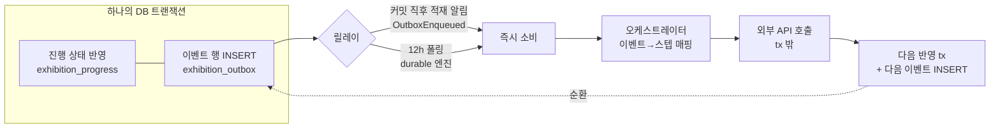
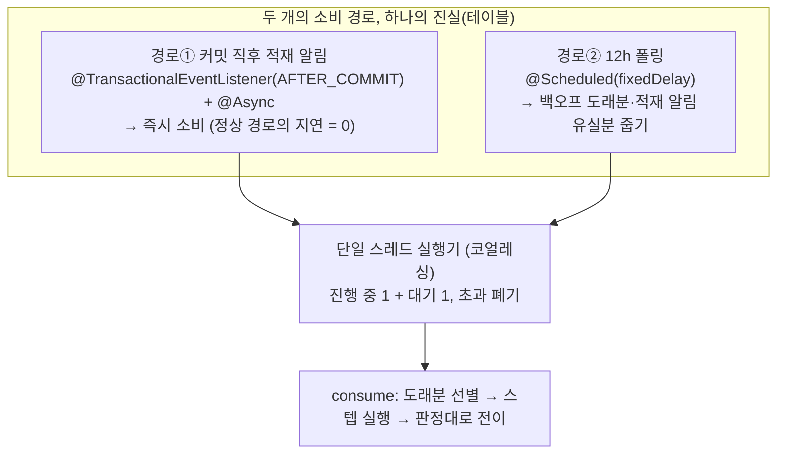
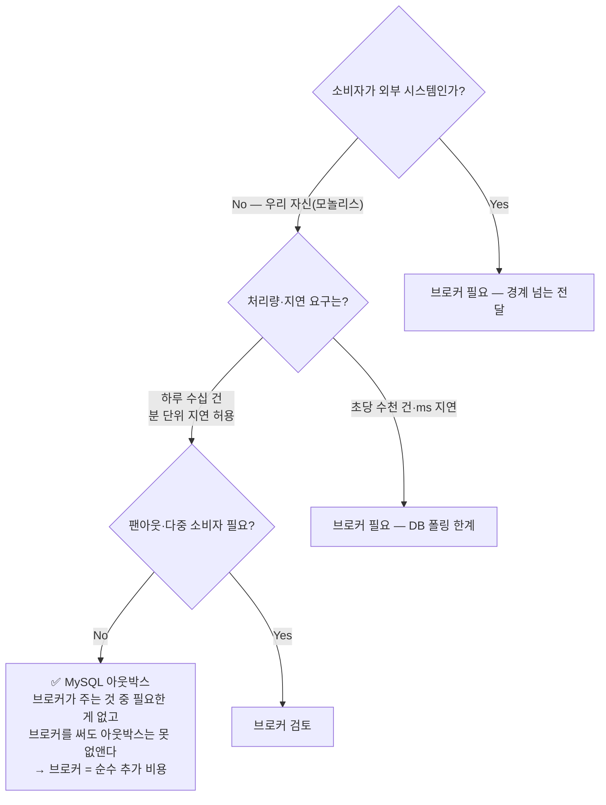

# 트랜잭션 아웃박스 PR — 교과서 패턴과 우리 구현의 차이, 그리고 이유

> 관련 문서: [전시수집_파이프라인PR.md](./전시수집_파이프라인PR.md) · [이벤트구조PR.md](./이벤트구조PR.md)
> 레퍼런스(교과서 패턴)와 비교하며 "우리는 어떻게, 왜 그렇게 했는지"를 답한다.

---

## 0. 왜 Outbox 패턴이 필요한가

**상황**

- 매일 스케줄 수집에서 외부 API(공공데이터·구글·AI) 호출이 많고 하나의 스크립트형 메서드로 묶여 있어 중간 실패 시 처음부터 재시도했다.
- 유료 API 중복 호출, 한도 실패의 무한 반복, 서버 재부팅과 겹치면 회차 전체 유실.

**원인 분석**

- "어디까지 했는지"가 **메모리에만** 있었다. 메서드가 죽으면 진행 상태도 함께 사라진다.
- 상태 변경(전시 저장)과 후속 작업 신호(다음 스텝)가 원자적으로 묶이지 않았다 — 저장은 됐는데 후속이 유실되거나, 그 반대.

**해결 방안**

- 후속 작업 신호를 **상태 변경과 같은 DB 트랜잭션으로 기록**한다(Outbox). 별도 릴레이가 그 테이블을 읽어 실행한다.
- 우리는 MQ가 없다 — **MySQL 테이블 자체가 큐**다. 이 선택의 이유는 §5에서.

---

## 1. Dual Write 문제 — 우리 코드에서는 어디였나

교과서의 Dual Write는 "DB 커밋 + MQ 전송"이지만 우리 시스템에서는 **"진행 상태 반영 + 다음 스텝 실행"** 사이에 같은 문제가 있었다.

```java
// 개선 전(개념) — 스크립트형: 반영과 다음 스텝이 한 호출 체인
for (item : 목록) {
    draft 저장;               // DB 커밋
    상세 조회();               // 💥 여기서 죽으면? draft는 있는데 상세는 영원히 안 옴
    AI 분류();                // 💥 여기서 죽으면? 재시작 시 상세를 또 호출(유료 중복)
    전시 등록();
}
```

- DB에 남은 것과 실제 실행된 것 사이의 **정합이 코드 흐름에만 의존**한다. 크래시 지점마다 복구 방법이 다르다(= 사실상 복구 불가).
- `@TransactionalEventListener(AFTER_COMMIT)`로 후속을 걸어도 동일하다. 커밋과 리스너 실행 사이에 죽으면 신호가 유실된다(스프링 이벤트는 인메모리). → [이벤트구조PR.md §3](./이벤트구조PR.md)

## 2. Outbox 패턴 핵심 구조 — 우리 파이프라인



교과서와의 구조적 차이: 교과서는 Outbox가 MQ로 나가는 출구(단방향)지만, 우리는 스텝이 끝날 때마다 **다음 이벤트가 다시 Outbox로 들어오는 순환 파이프라인**이다. 같은 테이블 하나가 상세→장르→승격→전시장 전 스텝의 재시도 엔진을 겸한다.

## 3. Outbox 테이블 설계 — 교과서 vs 우리

교과서 설계(aggregate_type + aggregate_id + event_type + **payload JSON** + status/retry):

| 교과서 컬럼 | 우리(`exhibition_outbox`) | 왜 다르게 했나 |
|---|---|---|
| aggregate_type + aggregate_id | `event_type` + `target_key` 로 통합 | 소비자가 우리 자신(모놀리스)이라 토픽/파티션 라우팅이 필요 없다. 키는 이벤트 종류에 따라 external_id(전시 축) 또는 place_key(전시장 축) |
| **payload TEXT (JSON)** | **없음 — 재조회 방식** | 아래 별도 설명 ★ |
| status: PENDING/SENT/FAILED | PENDING / **FAILED_RETRYABLE** / SUCCEEDED / **FAILED_PERMANENT** | "전송했나"가 아니라 "**작업이 성공했나**"를 추적한다. 일시/영구 실패를 상태로 갈라 재시도 대상 선별이 쿼리 한 방 |
| retry_count | `attempt_count` + **`next_attempt_at`** | 지수 백오프의 도래 시각을 행에 저장 — 선별 쿼리가 `status IN (…) AND next_attempt_at <= now` 하나로 끝난다 |
| (없음) | **`version` (낙관락)** | 폴링과 적재 알림 소비가 같은 메시지를 동시에 집는 경합 — 종료 전이 저장에서 한쪽만 이기고 다른 쪽은 skip |
| (없음) | **UK(event_type, target_key)** | 멱등 enqueue의 물리 가드. 같은 장소 전시 10개가 한 sync에 와도 PLACE_STAGED는 1행 = 유료 구글 호출 장소당 1번 |
| INDEX(status, created_at) | INDEX(status, next_attempt_at) | 선별 축이 "생성 순"이 아니라 "도래 순"이라서 |

★ **payload를 없앤 이유** — 교과서의 payload는 소비자가 다른 프로세스(MQ 너머)라 필요한 것이다. 우리 소비자는 같은 DB를 보는 우리 자신이므로, 이벤트엔 키만 싣고 **소비 시점에 진행 상태·원장을 재조회**한다. 얻는 것: 이벤트 스키마가 안 바뀌어 필드 추가 때 아웃박스 마이그레이션이 필요 없고, 판정이 늘 최신 상태 기준이라 낡은 payload로 실행하는 사고가 없다. 중복 데이터도 없다. 잃는 것: 소비 시 조회 1회. 하루 수십 건 규모에서 무의미한 비용이다.

## 4. 스프링에서 Outbox 저장 구현 — 우리 구현

교과서(OrderService가 `@Transactional` 안에서 outboxRepository.save)와 원리는 같고, 우리는 발행을 **컴포넌트로 분리**해 REQUIRED 전파로 호출자 트랜잭션에 합류시킨다:

```java
// ExhibitionProgressService.applyGenre — 상태 반영 tx의 실제 모습
@Transactional
public void applyGenre(String externalId, GenreResult result, LocalDateTime now) {
    ExhibitionProgress progress = progressRepository.findByExternalId(externalId).orElse(null);
    if (progress == null || !progress.needsGenre()) {
        return;                                        // 재전달 멱등 — 이미 분류됐으면 no-op
    }
    ledger.recordGenre(externalId, result, now);       // 원장(genre_snapshot)도 같은 tx에 합류
    progress.markGenreClassified(now);                 // 마커
    enqueueReadyIfGateFilled(progress, now);           // 게이트 충족 시 DRAFT_READY 행 INSERT (같은 tx!)
    progressRepository.save(progress);
}
```

```java
// OutboxPublisher.enqueue — 발행 컴포넌트 (REQUIRED: 호출자 tx에 합류)
@Transactional
public void enqueue(IngestionEventType eventType, String targetKey, LocalDateTime now) {
    if (outboxMessageRepository.findByMessageTypeAndTargetKey(eventType, targetKey).isPresent()) {
        return;                                        // 멱등 — UK가 물리 가드, 이 검사는 빠른 경로
    }
    outboxMessageRepository.save(OutboxMessage.enqueue(eventType, targetKey, now));
    eventPublisher.publishEvent(new OutboxEnqueued(eventType));  // 커밋 후 릴레이 깨우는 적재 알림
}
```

교과서와 다른 점 하나: 발행이 서비스 메서드가 아니라 **컴포넌트**다. 여러 서비스가 발행해야 하는데 "서비스→서비스 의존 금지" 규칙이 있어서 발행 능력을 컴포넌트로 내려 공유한다.

## 5. 메시지 발행 — 교과서 Polling Publisher vs 우리 릴레이

교과서: `@Scheduled(fixedDelay=1000)` 1초 폴링 → MQ 전송 → SENT 마킹.

우리는 **MQ가 없고**(소비자가 우리 자신이라 전송할 곳이 없다), 릴레이가 곧 소비 실행기다. 그리고 폴링 주기가 1초가 아니라 **12시간**이다:



**왜 1초가 아니라 12시간인가**: 교과서에서 폴링이 곧 전달 지연이지만 우리는 즉시성을 적재 알림(경로①)이 담당한다. 폴링은 [실패 백오프 도래분 + 적재 알림이 유실된 드문 창]만 주우면 되고, 하루 10건 규모에서 빈 폴링을 1초마다 도는 건 낭비다. 적재 알림이 유실돼도(인메모리 스프링 이벤트의 크래시 창) **지연일 뿐 손실이 아니다**: 테이블이 진실이라 다음 폴링이 줍는다.

**코얼레싱 실행기**: 한 번의 sync가 이벤트 수백 건을 적재하면 적재 알림도 수백 번 발행되는데, 실행기가 [스레드 1 + 큐 1 + 초과 폐기]라 소비는 "진행 중 1 + 대기 1"로 뭉쳐진다. 버려도 되는 이유 역시 테이블이 진실이기 때문이다. 대기 중인 소비 한 번이 그 시점까지의 도래분을 전부 집는다.

## 5-1. 왜 진짜 큐(MQ)가 아니라 MySQL인가 — 장단점과 한계, 선택의 이유

"테이블을 큐처럼 쓴다"는 건 의식적인 선택이었다. 양쪽의 장단점·한계를 우리 맥락에 놓고 비교한 결과다.

### MySQL을 큐로 썼을 때

**장점 (우리가 실제로 가져가는 것)**

| 장점 | 왜 우리에게 유효한가 |
|---|---|
| **원자성이 공짜** | 상태 변경(progress+원장)과 이벤트 기록이 **같은 DB 트랜잭션** — Dual Write 문제가 아예 소멸한다. 이게 아웃박스 패턴의 존재 이유인데, 큐가 DB 안에 있으면 패턴이 가장 순수하게 성립한다 |
| **소비도 트랜잭셔널** | 소비 반영(마커+원장+다음 이벤트)도 같은 DB tx — "처리했는데 상태 반영 유실" 창이 없다 |
| 인프라 0 | 브로커 도입·HA·모니터링·버전업이라는 운영 부담이 없다. 앱 2대+MySQL 1대 토폴로지 그대로, 추가 비용 0 |
| 큐 상태가 SQL | attempt·last_error·next_attempt_at이 행에 있으니 관리자 대시보드가 SELECT 하나다. 브로커면 lag 메트릭·콘솔을 따로 붙여야 한다 |
| 소비 제어의 유연함 | UK dedup(같은 장소 이벤트 1건 = 유료 호출 1번), 지수 백오프를 행에 저장(next_attempt_at), 종료 메시지 수동 부활(reactivate) — 브로커에선 각각 별도 기능이거나 어렵다(지연 재전달, 선택적 재발행 등) |
| 테스트 단순 | MySQL 컨테이너 하나로 전 구간 검증 — 브로커 컨테이너·토픽 셋업이 없다 |

**단점과 한계 (정직하게)**

| 한계 | 내용 | 우리에게 실제로 문제인가 |
|---|---|---|
| **폴링 기반 — push가 없다** | 브로커는 소비자에게 밀어주지만 테이블은 읽으러 가야 한다. 우리는 커밋 직후 적재 알림으로 지연을 없앴지만 적재 알림은 인메모리라 유실 창이 있다(= 최대 폴링 주기만큼 지연) | 지연이 곧 손실이 아닌 도메인(하루 1회 수집)이라 수용 |
| **처리량 상한** | 선별 SELECT + 행 단위 UPDATE라 대략 수백~수천 msg/s부터 DB가 병목이 된다. `SKIP LOCKED` 등으로 늘려도 브로커의 순차-로그 처리량엔 못 미친다 | 하루 수십 건 — 상한까지 4~5자릿수 여유 |
| **DB 부하 공유** | 큐 트래픽이 서비스 DB와 커넥션·IO를 나눈다. 대량 적체 시 본 서비스 쿼리에 영향 | 규모상 무시 가능, 인덱스 선별로 적체에도 쿼리 비용 일정 |
| **팬아웃·구독 모델 없음** | 컨슈머 그룹, 토픽 구독, 브로드캐스트가 없다. "이 이벤트를 다른 시스템도 구독하고 싶다"가 오면 직접 만들어야 한다 | 소비자가 우리 자신 하나 — 현재 요구 없음 |
| **다중 소비자 스케일아웃 비용** | 여러 노드가 동시에 집으면 낙관락 충돌·중복 선별 비용이 커진다 | 분산락 단일 노드 실행 전제라 회피(낙관락은 안전망) |
| 재생(replay) 없음 | Kafka처럼 offset 되감기로 과거 이벤트를 다시 흘릴 수 없다 | 원장(스냅샷)이 재조회 소스라 재생이 필요 없는 구조 — 재처리는 reactivate로 개별 부활 |

### 진짜 큐(Kafka·RabbitMQ·SQS)를 썼을 때

**장점**: 높은 처리량과 push 기반 저지연 / 컨슈머 그룹으로 소비자 수평 확장 / 팬아웃(여러 구독자가 같은 이벤트 소비) / 서비스 DB와 부하 격리 / DLQ·백프레셔 같은 성숙한 운영 기능 / (Kafka) offset 재생.

**단점과 한계**:

- **Dual Write 문제가 그대로 남는다** — DB 커밋과 브로커 발행은 원자가 아니므로, 결국 아웃박스 테이블 + 릴레이를 또 만들어야 한다. 즉 우리 규모에서 MQ 도입 = 지금 구조 위에 브로커만 얹는 것.
- 브로커도 기본이 at-least-once라 **소비자 멱등성 요구는 사라지지 않는다**(§7의 일은 그대로 해야 한다).
- 운영 비용: 브로커 HA·모니터링·버전업, 관리형이어도 비용 + 운영 지식. 로컬·CI 환경 복잡도 증가.
- 메시지의 지금 상태를 묻기 어렵다. 재시도 몇 번째인지·왜 실패했는지 대시보드를 만들려면 결국 상태를 DB에 적재하게 된다(그 테이블이… 아웃박스다).

### 선택의 이유 — 결정 트리



**브로커가 잘하는 것(처리량·팬아웃·부하 격리) 중 지금 필요한 게 하나도 없고 브로커가 못 해주는 것(발행 원자성)은 어차피 아웃박스로 풀어야 한다.** 그래서 아웃박스만 남기고 브로커를 뺀 것이 지금 구조다.

**한계 도달 신호와 전환 경로** — 이 선택이 막히는 시점은 ① 외부 시스템이 우리 이벤트를 구독해야 할 때 ② 처리량이 폴링+적재 알림으로 감당 안 될 때 ③ 소비자를 수평 확장해야 할 때다. 그때의 전환은 표준 경로가 이미 있다: **릴레이 뒤에 브로커를 붙인다**(아웃박스 → 릴레이가 MQ로 발행 → 소비자 이동). 발행 측(서비스 tx + 아웃박스 행)은 한 줄도 바뀌지 않는다. 아웃박스는 브로커 도입 후에도 그대로 쓰이는, 버려지지 않는 투자다.

---

## 6. 소비(소비) 수명주기 — 예외를 판정으로 번역하는 단일 지점

```java
// ExhibitionOutboxService.consume — 소비 메커니즘의 심장
private StepResult runStep(Function<OutboxMessage, StepResult> step, OutboxMessage message) {
    try {
        return step.apply(message);
    } catch (OptimisticLockingFailureException e) {
        return StepResult.skip();                      // 다른 워커 선점 — 무전이
    } catch (RuntimeException e) {
        return StepResult.fail(OutboxFailures.classify(e), OutboxFailures.describe(e));
    }
}
```

- **실패 분류 규칙**(OutboxFailures): timeout/5xx/429 → RETRYABLE, 4xx(429 제외)/파싱 실패 → PERMANENT, 원인 불명 → RETRYABLE(안전 기본값. 잘못 영구 폐기하느니 재시도하고 소진되면 어차피 PERMANENT로 승격).
- 스텝(오케스트레이터)엔 try/catch가 없다. "이 예외가 재시도인가 영구인가"는 메시지 수명주기의 어휘라 consume 한 곳만 안다. 스텝 4개에 같은 catch를 복붙하면 규칙이 흩어진다.
- **재시도 정책은 하나**: 총 3회(최초 1+재시도 2), 지수 백오프, 소진 시 FAILED_PERMANENT + `onPermanentFailure` 콜백으로 진행 상태 FAILED 가시화. 이후는 관리자 수동 재시도만.

## 7. 소비자 멱등성 — 교과서 processed_event vs 우리 "상태가 곧 멱등 키"

교과서는 `processed_event` 테이블에 이벤트 ID를 기록해 중복을 거른다. **우리는 그 테이블이 없다** — 대신 도메인 상태 자체가 멱등 키다:

| 스텝 | 중복 수신 시 어떻게 1번만 반영되나 |
|---|---|
| 상세 | ① `needsDetail()` 마커 검사로 성공 마감(외부 호출도 스킵) + 마커 메서드 자체가 no-op 가드 + 원장 UK upsert |
| 장르 | 동일 (`needsGenre()` + genre_snapshot UK) |
| 승격 | **3겹**: progress terminal 재검사 → Registrar가 findByExternalId 선조회 재사용 → `exhibitions.external_id` UK가 물리 최후 가드 |
| 전시장 | resolve-or-create가 자연키(place_key UK) 멱등 + `created` 판정으로 유료 구글 호출은 신규 1회만 |

### 실제 소비자 코드로 보는 멱등성

**① 판정 가드 — 중복 수신이면 외부 호출 자체를 스킵하고 성공 마감**

```java
// ExhibitionIngestionOrchestrator.genreStep — 소비의 첫 줄이 멱등 검사다
private StepResult genreStep(OutboxMessage message) {
    String externalId = message.getTargetKey();
    if (!progressService.needsGenre(externalId)) {          // ① 이미 분류됐으면
        return StepResult.success();                        //    호출 없이 성공 마감 — "할 일 없음도 성공"
    }
    Optional<GenreClassification> input = cultureService.genreInputOf(externalId);
    if (input.isEmpty()) {
        return StepResult.success();
    }
    var result = genreService.classify(externalId, input.get());   // ② 외부 호출(tx 밖)
    progressService.applyGenre(externalId, result, LocalDateTime.now()); // ③ 반영(tx)
    return StepResult.success();
}
```

**②→③ 사이 재전달 — 반영 트랜잭션과 엔티티가 이중으로 no-op 가드**

```java
// ExhibitionProgressService.applyGenre — ①과 ③ 사이에 다른 소비가 끼어든 경합까지 재검사
@Transactional
public void applyGenre(String externalId, GenreResult result, LocalDateTime now) {
    ExhibitionProgress progress = progressRepository.findByExternalId(externalId).orElse(null);
    if (progress == null || !progress.needsGenre()) {
        return;                                  // 재전달·경합 — 이미 분류됐거나 대상이 아니다
    }
    ledger.recordGenre(externalId, result, now); // 원장은 UK(external_id) upsert — 두 번 써도 1행
    progress.markGenreClassified(now);
    enqueueReadyIfGateFilled(progress, now);     // DRAFT_READY 발행도 멱등 enqueue(UK)
    progressRepository.save(progress);
}
```

```java
// ExhibitionProgress.markGenreClassified — 마지막 방어선은 엔티티 자신
public void markGenreClassified(LocalDateTime now) {
    if (this.status.isTerminal() || this.genreClassifiedAt != null) {
        return;                                  // 이미 해소된 스텝은 불변 — 시각도 안 바뀐다
    }
    this.genreClassifiedAt = now;
    markEnriching();
}
```

**승격 — "중복 결제"에 해당하는 지점이라 3겹**

```java
// 1겹: ExhibitionProgressService.completePromotion — 소비 시점 상태 재검사
@Transactional
public void completePromotion(String externalId, LocalDateTime now) {
    ExhibitionProgress progress = progressRepository.findByExternalId(externalId).orElse(null);
    if (progress == null || progress.getStatus().isTerminal() || !progress.isReadyForPromotion()) {
        return;      // 재전달·경합 — 이미 승격됐거나 게이트 미충족(잔존 메시지)
    }
    ExhibitionRegistrar.Registered registered =
            exhibitionRegistrar.register(assembler.assemble(externalId), now);
    progress.complete(registered.exhibitionId(), now);
    progressRepository.save(progress);
}
```

```java
// 2겹: ExhibitionRegistrationFacade.register — 코어가 선조회로 재사용
@Override
@Transactional
public Registered register(ExhibitionRegistration r, LocalDateTime now) {
    Exhibition existing = exhibitionRepository.findByExternalId(r.externalId()).orElse(null);
    if (existing != null) {
        return new Registered(existing.getId());   // 새로 만들지 않고 그 전시로 응답
    }
    // ... 전시 + 부속 생성 ...
}
// 3겹: exhibitions.external_id UNIQUE — 1·2겹을 뚫는 어떤 경합도 DB가 물리적으로 차단
```

**전시장 — 자연키 멱등 + 신규 판정으로 유료 호출 차단**

```java
// PlaceRegistrarFacade — 몇 번 불려도 전시장은 1개, 구글 호출은 "이 호출이 만든 신규"일 때만
@Transactional
public Resolved resolveOrCreate(String placeName, ExhibitionRegion region, ...) {
    boolean existed = exhibitionPlaceRepository.findByPlaceKey(PlaceKey.of(placeName)).isPresent();
    ExhibitionPlace place = exhibitionPlaceRepository.resolveOrCreate(placeName, region, ...);
    return new Resolved(place.getId(), place.getPlaceKey(), !existed);
    // 재전달이면 existed=true → created=false → placeInitStep이 구글 호출 없이 성공 마감
}
```

방어선은 세 층이다: **소비 진입 판정(외부 호출 절약) → 반영 tx 재검사 + 엔티티 no-op(상태 1회 반영) → UK(물리 최후 가드)**. 어느 층이 뚫려도 다음 층이 막는다.

왜 processed_event가 아니라 이 방식인가:

1. **재조회 방식이라 공짜다** — 소비가 어차피 진행 상태를 읽고 시작하므로, "이미 처리했나"가 별도 조회가 아니라 판정 그 자체다.
2. processed_event는 "이벤트를 봤다"만 기록하지 "작업이 됐다"를 보장하지 않는다 — 기록 후 본작업 전에 죽으면 그 이벤트는 영원히 스킵된다(우리 방식은 상태가 안 바뀌었으면 다시 실행된다).
3. 유일한 대가는 **중복 외부 호출 가능성**("호출 성공 후 반영 전 크래시" 창). 상태는 1회만 반영되고 비용은 콜 1건이라 수용한다.

원칙: **"할 일 없음도 성공 마감"** — 중복 수신을 에러가 아니라 정상 소비로 처리한다.

## 8. 직접 발행 vs Outbox — 우리 시스템에서의 비교

| | 직접 실행(구 스크립트) / AFTER_COMMIT 직접 후속 | Outbox (현재) |
|---|---|---|
| 신호 유실 | 커밋↔실행 사이 크래시에 유실 | 불가능 — 신호가 커밋의 일부 |
| 실패 격리 | 한 항목 실패가 체인 전체 중단 | 스텝·항목 단위 격리, 각자 백오프 |
| 재시도 상태 | 없음(로그뿐) | 테이블 = 대시보드 |
| 유료 API 중복 | 재시도마다 전 구간 재호출 | 실패 지점만 재시도 |
| 지연 | 즉시 | 적재 알림으로 사실상 즉시(장애 시 백오프만큼) |

## 9. Outbox 테이블 정리 전략 — 주간 배치 삭제 (100만 건 실험이 설계한 절차)

교과서 선택지(즉시 삭제/배치 삭제/파티션/아카이브) 중 **배치 삭제**를 채택했다 — 단, 절차의 디테일은 전부 [100만 건 실험](./아웃박스_100만건_부하실험.md)의 실측에서 나왔다.

**무엇을, 언제, 어떻게 지우나**

| 항목 | 값 | 근거 |
|---|---|---|
| 대상 | **SUCCEEDED + 보존 7일 경과**만 | FAILED_PERMANENT는 보존 — 관리자 감사·수동 재시도의 재료다. 7일 보존은 대시보드에서 최근 성공 이력을 볼 수 있게 하는 관측 창 |
| 주기 | 매주 일요일 03시 (`ExhibitionOutboxCleanupScheduler`) | 01시 수집·즉시 소비 burst가 끝난 한가한 시간대. 수동 트리거도 있다(`POST /api-admin/v1/ingestion/outbox/purge`) |
| 방식 | **소량 배치 반복**(배치당 500건 · 배치당 tx) — 루프는 관리자 파사드, 배치 tx는 아웃박스 서비스 소유 | 실험 §4의 반전: 대량 일괄 DELETE는 삭제 마크·통계 왜곡으로 직후 30배 악화 + 공간 미반환. "DELETE 한 방"은 금지 패턴 |
| OPTIMIZE | 주간 배치엔 **불필요** | 주간 삭제량이 수백 행 수준이라 InnoDB 퍼지가 자연 소화한다 — 실험의 악화는 98.4만 건 일괄 삭제 케이스였다 |

**지워도 안전한 이유 (설계가 이미 보장)** — SUCCEEDED 행은 "멱등 enqueue의 1차 필터"를 겸했지만, 지워져도 시스템은 무너지지 않는다:
- 전시 축: 종료(COMPLETED/FAILED) progress는 재sync가 스테이징 자체를 SKIP하므로 재발행이 아예 없고, 미종료 progress의 치유는 `enqueueOrReactivate`가 **행이 없으면 새로 만들어** 오히려 자연스럽다.
- 전시장 축: 행이 지워진 뒤 같은 장소에 새 전시가 오면 PLACE_STAGED가 새로 생기지만, 소비의 resolve-or-create가 "기존"으로 판정해 **유료 구글 호출은 여전히 0**이다(멱등의 진짜 소유자는 행이 아니라 자연키·마커다 — §7).
- 잃는 것은 7일 지난 성공 이력의 attempt·last_error 열람뿐 — 실패 이력(PERMANENT)은 남으므로 감사 가치의 손실이 아니다.

## 10. 프러덕션 장애 사례 — 교과서 사례를 100만 건으로 직접 재현했다

교과서 사례: 1초 폴링 + 인덱스 부재 + 미삭제 비대 → 폴링 쿼리 수 초 → 릴레이 지연 5분+ → 정산 불일치.

"우리라면?"을 말로 답하는 대신 **재현 실험**을 했다. 운영과 동일한 DDL의 별도 스키마에 "미정리 1년 누적" 분포로 1,000,000행(SUCCEEDED 98.4만, 선별 대상 1,300행 = 0.13%)을 적재하고, 실제 운영 쿼리를 `EXPLAIN ANALYZE`로 실측했다. 전 과정·원문은 [아웃박스_100만건_부하실험.md](./아웃박스_100만건_부하실험.md).

### 재현 — 인덱스를 빼는 순간 교과서 장애가 그대로 나온다

```
| type | key  | rows   | Extra                       |
| ALL  | NULL | 994744 | Using where; Using filesort |   ← 풀 테이블 스캔

-> Table scan on exhibition_outbox (actual time=0.012..337 rows=1e+6)  → 폴링 1회 445~509ms
```

50건을 꺼내려고 100만 행을 전부 읽는다. 더 아픈 건 **멱등 enqueue 조회(413ms)가 발행 트랜잭션 안에서 돈다**는 점이다. 인덱스 부재는 소비만이 아니라 스테이징 tx를 행마다 0.4초씩 늘려 **발행측까지 무너뜨린다**. 교과서의 "릴레이 지연 5분+"는 이 축적이다.

### 방어 검증 — 교과서 원인별로 우리 방어가 실측으로 확인됐는가

| 교과서 원인 | 우리의 방어 | 100만 건 실측 결과 |
|---|---|---|
| PENDING 조회 풀스캔 | `(status, next_attempt_at)` 복합 인덱스(V35부터 존재) | 폴링 **445ms → 1.8~2.4ms (220배)** — 인덱스가 도래분 1,300행만 짚고, SUCCEEDED 98.4만 행은 레인지 밖이라 비용 0 |
| 1초 폴링 부하 | 폴링 12h(즉시성은 적재 알림 담당) | 부하가 구조적으로 없음 + 있어도 회당 2.4ms |
| 테이블 비대 | 인덱스 선별이라 비대 무해(§9 "안 지운다") | **실측 검증**: 98.4% 완료 누적 상태에서도 2.4ms. 오히려 대량 DELETE 직후가 **70ms(30배 악화)** — 삭제 마크 유령 + 통계 왜곡으로 옵티마이저가 UK로 오판, 공간도 미반환(101.6MB 유지, free 47MB). OPTIMIZE 후에야 2.5MB/6ms |
| 미발행 적체를 모름 | 관리자 대시보드 요약 카드(카운트) | countByStatus가 커버링 인덱스로 **2.9ms**(무인덱스 191ms) — 적체 감시 자체가 싸다 |

### 교과서 해법과 달라진 우리 결론

- 교과서: "인덱스 추가 + **완료 레코드 주기 삭제**". 실측: 앞은 맞고(220배), **뒤는 우리 규모에선 역효과** — 인덱스가 있으면 비대는 선별 성능에 영향이 없고 섣부르게 대량 삭제하면 오히려 30배 악화된다. §9의 "안 지운다"가 이 실험의 결론이다.
- 임계 도달 시 정리 절차도 실측 기반으로 확정: **소량 배치 삭제 → 저트래픽 시간대 OPTIMIZE → ANALYZE**(통계 복구). "DELETE 한 방"은 금지 패턴.
- 파티셔닝·CDC는 100만 건(하루 수십 건 유입 기준 수십 년 치)에서도 불필요함이 확인됐다. 도입 검토 트리거는 §5-1의 한계 신호와 동일하다.

## 11. 체크리스트 — 우리 구현 기준

- [x] **같은 트랜잭션** — 상태 반영(progress+원장)과 이벤트 행 INSERT를 한 `@Transactional`로 (Publisher REQUIRED 합류)
- [x] **인덱스** — `(status, next_attempt_at)` 복합 인덱스로 도래분 선별
- [x] **멱등 소비자** — 도메인 상태(마커)·UK가 멱등 키 (별도 processed_event 없음, §7)
- [x] **중복 발행 방지** — UK(event_type, target_key) + 멱등 enqueue
- [x] **동시 소비 제어** — @Version 낙관락, 선점 = 정상 skip
- [x] **실패 가시화** — 소진 시 FAILED_PERMANENT + progress FAILED + 대시보드, 자동 치유 없음(수동 재시도)
- [x] **모니터링** — 대시보드 요약 카드로 적체·영구실패 카운트 상시 노출
- [x] **테이블 정리 배치** — 주간(일 03시) SUCCEEDED 7일 경과분 소량 배치 삭제 + 관리자 수동 트리거 (§9 — 100만 건 실험이 절차를 설계)
- [ ] CDC(Debezium) 전환 — 트래픽이 폴링+적재 알림의 한계를 넘으면 검토 (현 규모에선 불필요)
