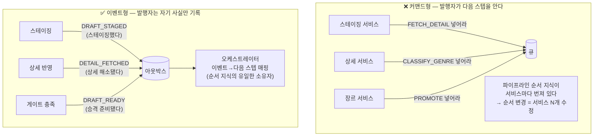
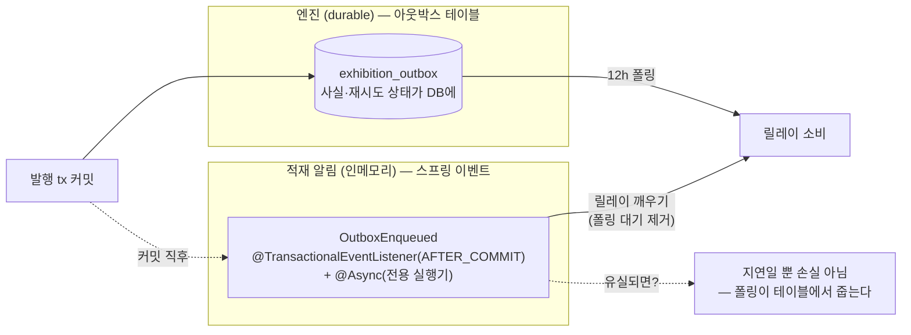

# 이벤트 구조 PR — "이벤트는 사실이다": 커맨드가 아닌 이벤트로 파이프라인을 잇는 법

> 관련 문서: [전시수집_파이프라인PR.md](./전시수집_파이프라인PR.md) · [아웃박스PR.md](./아웃박스PR.md)
> 레퍼런스(스프링 이벤트 강의)의 개념을 우리 시스템에 대입해, 무엇을 채택하고 무엇을 채택하지 않았는지 정리한다.

---

## 0. 처음의 고민 — "우리가 넣는 게 커맨드 아닌가?"

이벤트 구조로 쪼개기로 하고 아웃박스를 붙이려는데 어휘가 걸렸다. 아웃박스에 넣는 레코드가 `FETCH_DETAIL`(상세를 조회하라)이면 그건 이벤트가 아니라 **커맨드**다. 이벤트는 구독의 느낌인데, 우리는 다음 할 일을 지시하는 것 아닌가?

결론: **레코드는 사실("내가 한 일")로 쓰고, "다음이 뭔지"는 소비자 쪽 한 곳에 몬다.** 이 구분이 이 설계의 뼈대라서 문서 하나를 할애한다.

## 1. 커맨드 vs 이벤트 — 무엇이 달라지나

같은 테이블, 같은 릴레이라도 레코드의 어휘에 따라 지식의 위치가 달라진다:



커맨드 어휘를 쓰면 "스테이징 다음은 상세"라는 지식이 스테이징 서비스에 박힌다. 그 순간 오케스트레이션은 껍데기가 되고, 스텝 순서를 바꾸려면 서비스들을 고쳐야 한다. 사실 어휘를 쓰면 발행자는 다음이 뭔지 모른 채 자기 트랜잭션에 사실만 남기고, **순서는 `ExhibitionIngestionOrchestrator` 한 파일**에서만 바뀐다.

## 1-1. 그래서 우리 구조는 커맨드형인가 이벤트형인가

솔직한 답: **제어 모델은 커맨드형(오케스트레이션)이고, 기록 어휘만 이벤트(사실)다.**

두 층을 갈라서 봐야 한다. "커맨드형 vs 이벤트형"은 보통 조율 방식의 구분이다:

- **커맨드형 = 오케스트레이션**: 중앙 조율자가 "다음에 무엇을 할지"를 결정하고 각 서비스를 시킨다. 흐름 지식이 한 곳에 모인다.
- **이벤트형 = 코레오그래피**: 중앙이 없다. 각 서비스가 남의 이벤트를 구독해 스스로 반응한다. 흐름은 구독들의 합에서 창발한다.

이 기준으로 우리는 명백히 **오케스트레이션**이다 — DETAIL_FETCHED를 누가 소비해 무엇을 할지는 오케스트레이터 한 파일이 결정하고, 서비스들은 구독하지 않는다. 다만 §1에서 본 것처럼 **레코드의 어휘를 커맨드(다음 할 일)가 아니라 사실(내가 한 일)로** 적어서, 발행자에게서 순서 지식만 제거했다. 순수 커맨드형 오케스트레이션에서 딱 한 가지(발행자의 다음-스텝 결합)를 이벤트형에서 빌려온 하이브리드인 셈이다.

### 이벤트형(코레오그래피)의 장점 · 단점 · 한계

**장점**
- 발행자와 구독자의 완전 분리 — 발행자는 누가 반응하는지 모른다. **1:N 팬아웃**에 최적(주문 완료 → 알림·포인트·통계가 각자 구독).
- 기능 추가 = 리스너 추가 — 기존 코드 무수정(개방-폐쇄). 팀이 나뉘어 있어도 서로의 코드를 안 건드린다.
- 중앙 조율자가 없어 단일 비대 지점·단일 수정 병목이 없다.

**단점**
- **전체 흐름이 코드 어디에도 없다.** "전시가 등록되기까지 무슨 일이 일어나는가"를 알려면 구독 관계를 전부 뒤져 머릿속에서 재조립해야 한다. 디버깅·온보딩 비용이 크다.
- 순서·의존("상세 후에 장르")을 표현할 일급 수단이 없다 — 이벤트 체인 설계에 암묵적으로 인코딩되고, 바꾸려면 여러 리스너를 동시에 이해해야 한다.
- 여러 조건의 합류(우리의 승격 게이트 같은 것)를 어디서 판정할지 애매하다 — 각 리스너에 흩어지거나 결국 상태 테이블이 필요해진다.

**한계**: 스텝 간 순차 의존이 본질인 파이프라인엔 구조적으로 안 맞는다. 이벤트형이 진가를 내는 건 "한 사실에 서로 무관한 반응 여럿"이지, "한 줄로 이어지는 공정"이 아니다.

### 커맨드형(오케스트레이션)의 장점 · 단점 · 한계

**장점**
- **흐름이 한 곳에 명시된다** — 시퀀스 다이어그램이 곧 코드 한 파일. 디버깅은 그 파일에서 시작하면 된다.
- 순서·조건·게이트·실패 정책(어느 스텝이 굳으면 FAILED 가시화) 같은 공정 지식을 자연스럽게 표현한다.
- 파이프라인 변경(스텝 추가·순서 교체)이 국소적이다 — 매핑 한 곳.

**단점**
- 조율자가 모든 스텝을 알아야 한다 — 결합이 중앙에 모인다(분산이 아니라 집중을 선택한 것). 스텝이 계속 늘면 조율자가 비대해질 수 있다.
- 새로운 반응 추가(예: "승격되면 통계도 갱신")도 조율자 수정을 거친다 — 구독형처럼 리스너만 얹을 수 없다.

**한계**: 여러 팀·서비스가 같은 사실에 독립적으로 반응을 붙여가는 조직/시스템에선 조율자가 협업 병목이 된다. 1:N 팬아웃 요구가 크면 어색해진다.

### 우리 상황, 선택의 이유, 감수하는 것

**우리 상황** — ① 스텝이 1:1 순차 의존이다(상세 없이 장르 없고, 게이트 없이 승격 없다). ② 소비자가 우리 자신뿐이고(모놀리스·단일 팀) 같은 사실을 구독할 제3자가 없다. ③ 운영 요구가 "이 전시가 어느 스텝에서 왜 막혔나"라서 흐름의 가독성·추적성이 1순위다.

**그래서 커맨드형(오케스트레이션)을 선택했다.** 이벤트형이 주는 것(구독 자유·팀 독립성·팬아웃)은 지금 쓸 곳이 없고, 이벤트형이 앗아가는 것(흐름의 한곳 명시·게이트 판정 위치·순차 의존 표현)은 정확히 우리가 가장 필요로 하는 것들이다.

**감수하고 있는 것 (알고 선택한 비용)**
1. 오케스트레이터가 전 스텝의 지식을 가진 **중앙 결합점**이다 — 모든 파이프라인 변경이 이 파일을 지난다(우리는 이걸 단점이 아니라 "흐름이 궁금하면 이 파일 하나"라는 계약으로 삼았지만, 결합 자체는 실재한다).
2. 새로운 반응을 리스너 추가만으로 못 붙인다 — 예컨대 "승격 시 슬랙 알림"을 원하면 오케스트레이터(또는 승격 스텝)를 수정해야 한다.
3. 조율자 자체의 비대화 위험 — 지금은 스텝 4개 + 진입점 1개라 얇지만, 스텝이 10개를 넘어가면 분할 압력이 생긴다.

**이 선택이 부적절해지는 조건 = 이벤트형으로 가야 하는 신호** — 판단 기준을 미리 박아둔다:
- 같은 사실을 소비하는 **두 번째 독립 구독자**가 생길 때(예: DRAFT_READY를 승격 외에 수집 통계·알림도 원할 때)
- 반응을 붙이는 주체가 **다른 팀/다른 배포 단위**가 될 때
- 스텝 간 의존이 순차가 아니라 **그물형**이 되어 중앙 매핑이 오히려 읽기 어려워질 때

이 신호가 오면 그 이벤트부터 코레오그래피를 병행하면 된다 — 그리고 **그때 전환 비용이 낮은 이유가 바로 사실 어휘다**. 레코드가 이미 "DRAFT_READY(승격 준비됐다)"라는 소비자 중립적 사실이라, 두 번째 구독자는 발행측 무수정으로 붙는다. 커맨드("PROMOTE 하라")로 적어뒀다면 두 번째 구독자를 위해 발행측부터 고쳐야 했을 것이다. 즉 지금의 하이브리드(오케스트레이션 제어 + 사실 어휘)는 **현재에 최적화하면서 이벤트형으로의 출구를 열어둔** 구성이다.

## 2. 우리 이벤트 카탈로그 — 발행자 하나, 소비 매핑 하나

| 이벤트 | 사실 | 발행 트랜잭션 | 소비 → 다음 스텝 |
|---|---|---|---|
| `DRAFT_STAGED` | 목록이 스테이징됐다 | 스테이징 tx | 상세 조회 |
| `PLACE_STAGED` | 전시장 할 일이 발견됐다 | 스테이징 tx(같은 tx) | 전시장 초기화 |
| `DETAIL_FETCHED` | 상세 스텝이 해소됐다 | 상세 반영 tx | AI 장르 분류 |
| `DRAFT_READY` | 승격 게이트를 채웠다 | 게이트를 채운 스텝의 tx | 승격(어셈블) |

- **발행자는 `ExhibitionProgressService` 하나다.** 4종 모두 "진행 상태가 바뀌었다"에 붙는 사실이라 상태 소유자가 발행하는 게 자연 귀결이다. (처음엔 스윕용 이벤트를 다른 서비스도 발행했는데, 그 이벤트가 정책 변경으로 폐기되면서 발행자가 하나로 수렴했다.)
- 발행은 `OutboxPublisher` 컴포넌트 경유 — "서비스→서비스 의존 금지" 규칙 때문에 발행 능력을 컴포넌트로 내렸다.
- 이벤트에 **payload가 없다**(키만) — 소비 측이 상태를 재조회한다. 이유는 [아웃박스PR.md §3](./아웃박스PR.md).

## 3. 스프링 이벤트의 자리 — 적재 알림으로만 쓴다

레퍼런스 강의의 스프링 이벤트(@EventListener·@TransactionalEventListener·@Async)를 우리는 **도메인 흐름에 쓰지 않는다**. 이유는 강의에도 나오는 그 성질 때문이다:

> `@TransactionalEventListener(AFTER_COMMIT)`도 커밋 후 전송이므로, 커밋과 리스너 실행 사이에 애플리케이션이 죽으면 이벤트가 유실된다.

스프링 이벤트는 **인메모리·비durable**이다. "조금 늦어도 최소 1회 무조건"이 필요한 파이프라인 전진 신호를 여기에 실으면 크래시 창마다 전시가 조용히 멈춘다. 그래서 역할을 갈랐다:



**"이벤트=적재 알림, 테이블=엔진."** 스프링 이벤트가 하는 일은 단 하나 — enqueue 커밋 직후 릴레이를 깨워 폴링 주기(12h)를 기다리지 않게 하는 것. durability는 0이어도 된다. 유실은 곧 "다음 폴링까지 지연"일 뿐이다.

### 강의의 주의사항 대입표

| 강의 주의사항 | 우리 적용 |
|---|---|
| @EventListener는 동기 — 리스너 에러가 발행자에 전파 | 안 씀. 적재 알림은 @Async라 발행 tx와 완전 분리 |
| 외부 호출·알림은 AFTER_COMMIT으로 | 적재 알림이 AFTER_COMMIT — 롤백된 tx의 유령 소비 없음 |
| @Async 리스너 에러는 발행자가 모름 → 별도 처리 필요 | 소비 실패는 아웃박스 상태(RETRYABLE)로 남는다 — 리스너 에러 처리가 테이블에 위임됨 |
| 스레드풀 설정 | 전용 실행기 [스레드 1 + 큐 1 + 초과 폐기] — 수백 건 enqueue돼도 소비 "진행 1+대기 1"로 코얼레싱(테이블이 진실이라 버려도 무손실) |
| 1:1 관계까지 이벤트로 만들면 추적 어려움 (남용 금지) | 도메인 내부 협력은 전부 **직접 호출**이다. 이벤트는 [tx 경계를 넘는 전진 신호] 딱 한 용도 |

마지막 줄이 중요하다. 강의의 "이벤트로 결합도 낮추기"(주문→알림/포인트/통계 1:N 분리)는 우리 케이스가 아니다 — 우리 스텝들은 1:1 순차 파이프라인이고, 이걸 스프링 이벤트로 이으면 **결합도가 낮아지는 게 아니라 흐름이 숨는다**. 우리가 이벤트에서 취한 가치는 결합도가 아니라 **원자성(발행=커밋의 일부)과 durable 재시도**다.

## 4. 발행 코드 — "이벤트 발행"의 실체는 행 INSERT

```java
// 발행 = 상태 반영과 같은 tx에서 아웃박스 행 INSERT. 스프링 이벤트는 그 뒤의 적재 알림일 뿐.
@Transactional
public void applyDetail(String externalId, CultureDetailPayload payload, LocalDateTime now) {
    ExhibitionProgress progress = ...;
    if (progress == null || !progress.needsDetail()) return;   // 재전달 멱등

    ledger.recordDetail(externalId, payload);                  // 원장 합류
    progress.markDetailResolved(now);                          // ① 내가 한 일 (상태)
    publisher.enqueue(DETAIL_FETCHED, externalId, now);        // ② 그 사실의 기록 (같은 tx)
    enqueueReadyIfGateFilled(progress, now);                   // ③ 게이트 찼으면 DRAFT_READY도
    progressRepository.save(progress);
}
```

주목할 것 — **게이트 검사가 모든 스텝 해소 지점에서 반복**된다(③). "마지막 스텝은 장르"라는 순서 가정에 기대지 않아서, 스텝 순서가 바뀌거나 병렬화돼도 게이트를 채운 마지막 트랜잭션이 반드시 승격 사실을 남긴다. 발행이 상태 변경과 원자이므로 "상태는 바뀌었는데 신호가 유실"되는 창이 없다.

## 5. 소비 코드 — 매핑은 선언, 실행은 메커니즘

```java
// ExhibitionIngestionOrchestrator — 이벤트→스텝 매핑의 전부 (한 파일, 각 한 줄)
public void consumeDetailFetch()         { outboxService.consume(DRAFT_STAGED,   this::detailStep, this::visualizeProgressFailure); }
public void consumeGenreClassification() { outboxService.consume(DETAIL_FETCHED, batch, maxBatches, this::genreStep, this::visualizeProgressFailure); }
public void consumePromotion()           { outboxService.consume(DRAFT_READY,    this::promoteStep, this::visualizeProgressFailure); }
public void consumePlaceInitialization() { outboxService.consume(PLACE_STAGED,   this::placeInitStep); }
```

- 스텝 메서드는 [판정 → 외부 호출 → 반영] 합성만 하고 try/catch가 없다 — 예외를 재시도/영구/선점으로 번역하는 건 consume(소비 수명주기)의 몫.
- 영구 실패 콜백(`visualizeProgressFailure`)은 흐름 정책이라 조합자가 콜백으로 넘긴다 — 어느 필수 스텝이 굳어도 진행 상태가 FAILED로 보인다.

## 6. 정리 — 세 종류의 "이벤트"를 혼동하지 않기

| 층 | 실체 | durability | 역할 |
|---|---|---|---|
| 도메인 이벤트 | `exhibition_outbox` 행 (`IngestionEventType` + target_key) | **DB — durable** | 파이프라인 전진 사실. at-least-once 재시도 엔진 |
| 스프링 이벤트 | `OutboxEnqueued` record | 인메모리 — 유실 허용 | 릴레이 깨우는 적재 알림(지연 제거 전용) |
| (안 씀) MQ 이벤트 | — | — | 소비자가 우리 자신이라 브로커가 줄 게 없다. 규모가 요구하면 릴레이 뒤에 붙일 수 있는 구조 |

한 줄 요약: **사실은 테이블에, 신호는 메모리에, 순서는 한 파일에.**
