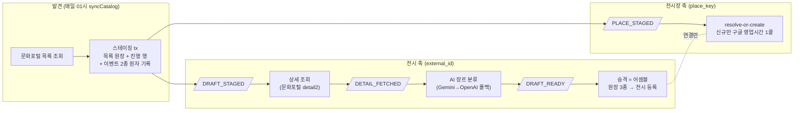
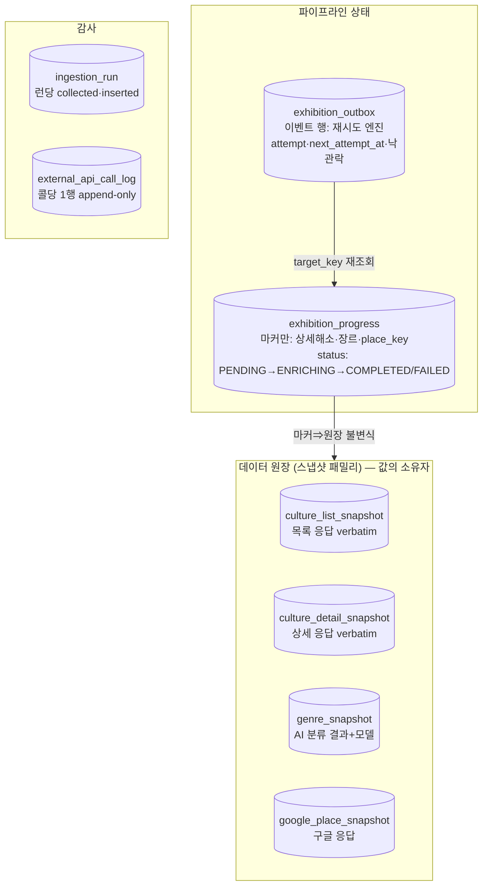
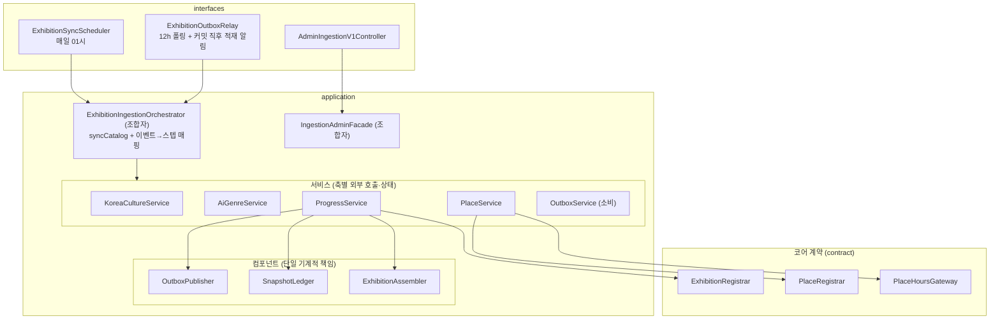
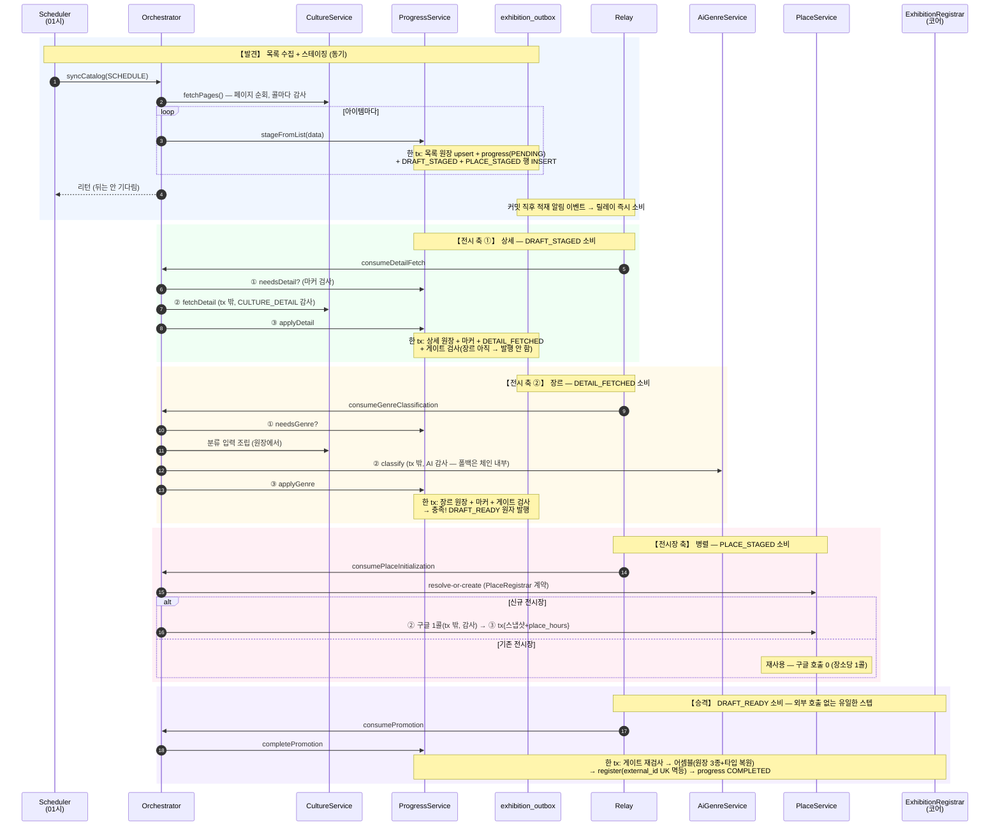
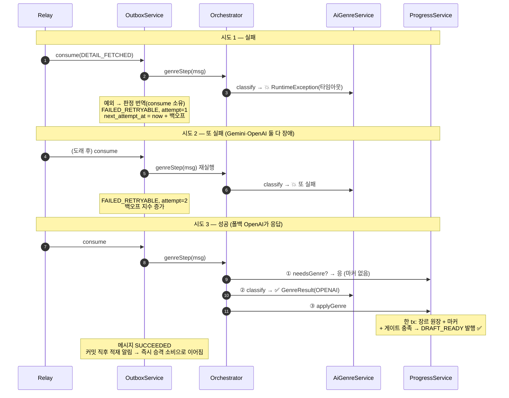
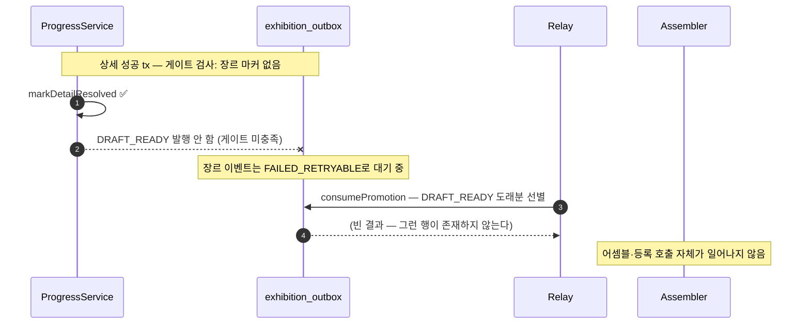
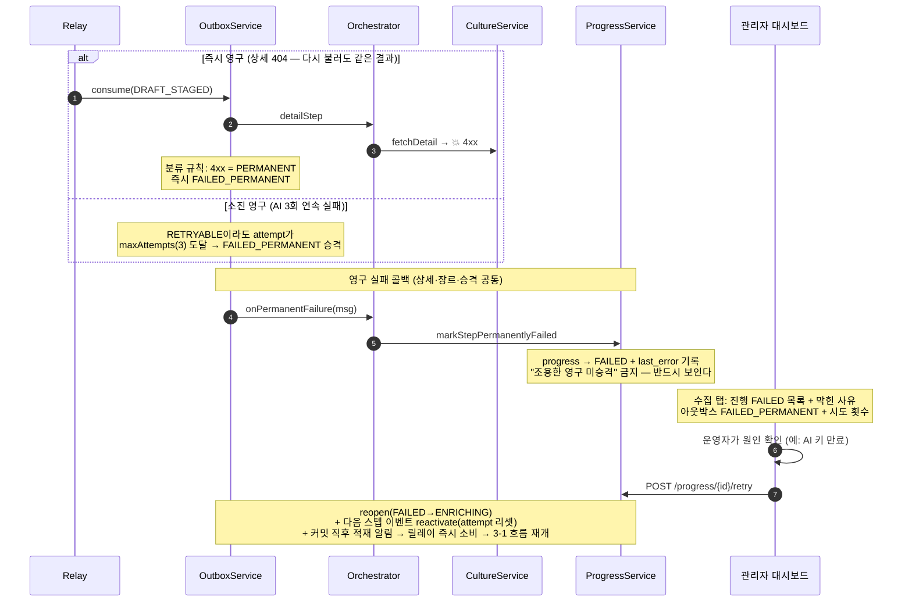
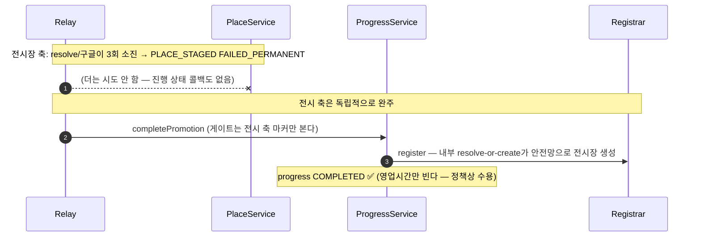
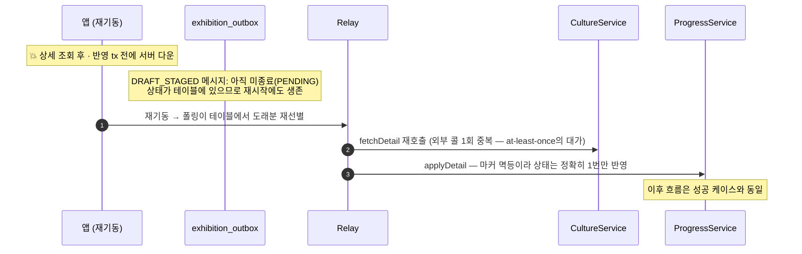
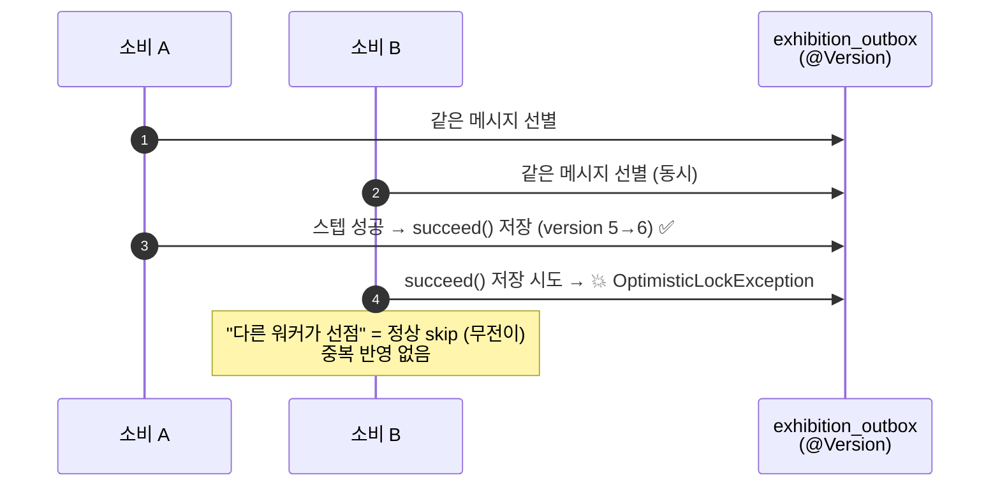

# 전시 수집 파이프라인 PR — 스크립트형 배치에서 이벤트 아웃박스 오케스트레이션으로

> 관련 문서: [아웃박스PR.md](./아웃박스PR.md) · [이벤트구조PR.md](./이벤트구조PR.md)
> 심화: [아웃박스_100만건_부하실험.md](./아웃박스_100만건_부하실험.md) (정리 전략·인덱스 실측)

---

## 0. 배경 — 무엇이 문제였나

**상황**

- 매일 스케줄링으로 전시 데이터를 수집·보강한다. 공공데이터(한눈에보는문화정보) 목록/상세, Google Places(유료), AI 장르 분류(Gemini→OpenAI 폴백)까지 **외부 API 호출이 많고**, 하루 10건 안팎의 전시가 추가된다.
- 수집이 **빈번하게 실패**했다. 외부 API 한도 초과·일시 장애, 서버 1대 운영이라 잦은 배포·재부팅 시간과 겹치면 그 회차 수집이 통째로 죽었다.

**원인 분석**

- 구조가 **하나의 스크립트형 메서드 + try/catch**였다. [목록 조회 → 행마다 상세 조회 → AI 분류 → 저장]이 한 호출 체인에 묶여 있었다.
- 그래서 중간에 하나만 실패해도 **처음부터 전부 재시도**했다 — 이미 성공한 유료 API를 중복 호출하고, 한도 문제로 실패한 항목은 재시도마다 같은 자리에서 또 실패했다.
- 재시도 상태가 어디에도 남지 않았다. "어떤 전시가 어느 단계에서 왜 막혔는지"는 로그를 grep해야만 알 수 있었다.

**해결 방향**

- 수집을 **스텝(상세/장르/전시장/승격) 단위로 쪼개고**, 스텝별 진행·재시도 상태를 DB에 남긴다 → **트랜잭션 아웃박스**가 재시도 엔진이 된다.
- 스텝 간 연결은 커맨드가 아니라 **이벤트(발행자가 한 일 = 사실)** 로 하고, "다음에 뭘 할지"는 오케스트레이터 한 곳만 안다.
- 실패는 롤백(보상)이 아니라 **전진 복구**로 처리한다 — 재시도로 메우고, 소진되면 FAILED로 가시화해서 관리자가 개입한다.

---

## 1. 전체 구조

### 1-1. 두 축, 네 개의 이벤트

수집은 **전시 축**과 **전시장 축**이 병렬로 진행되는 파이프라인이다. 스테이징 한 트랜잭션이 두 축을 동시에 출발시킨다.

| 이벤트 | 발행 시점(같은 tx) | 키 | 소비 → 다음 스텝 |
|---|---|---|---|
| `DRAFT_STAGED` | 스테이징 | external_id | 상세 조회 |
| `PLACE_STAGED` | 스테이징(같은 tx, 장소당 1건 dedup) | place_key | 전시장 초기화 |
| `DETAIL_FETCHED` | 상세 반영 | external_id | AI 장르 분류 |
| `DRAFT_READY` | 게이트를 채운 마지막 스텝의 반영 | external_id | 승격(어셈블) |

- 이벤트는 전부 **사실**이다("내가 한 일") — 커맨드("다음에 할 일")가 아니다. 발행자는 진행 상태 서비스 하나, **이벤트→스텝 매핑은 오케스트레이터 한 파일**에만 있다. → 왜 이렇게 갈랐는지는 [이벤트구조PR.md](./이벤트구조PR.md)
- 전시장 축이 `place_key`(정규화 이름) 단위인 이유: 전시장은 여러 전시가 공유한다. 아웃박스 UK`(event_type, target_key)`가 dedup해서 **한 sync에 같은 장소 전시 10개여도 유료 구글 호출은 장소당 1번**이다.

### 1-2. 데이터 모델 — 상태와 값을 가른다

핵심 결정 두 가지:

1. **진행 상태(`exhibition_progress`, 구 draft)는 슬림하다** — 데이터 컬럼 없이 스텝 해소 마커만 갖는다. 값(제목·설명·장르…)은 전부 스냅샷 원장이 갖고, 승격 시 어셈블러가 원장 3종을 모아 전시를 만든다.
2. **원장 합류 규칙**: 스냅샷 기록은 best-effort가 아니라 **진행 상태 반영과 같은 트랜잭션**이다. 그래서 "마커가 있으면 원장이 반드시 있다" — 어셈블이 스냅샷을 안심하고 읽는 근거다.

### 1-3. 계층과 의존 규칙

의존 규칙(이 PR에서 확정): **서비스→서비스 금지, 조합자→조합자 금지.** 이벤트 발행·원장 쓰기·어셈블처럼 여러 서비스가 공유해야 하는 능력은 **컴포넌트**(Publisher/Ledger/Assembler)로 내려서 주입한다. 규칙 위반이 실제 2건 있었고(구 DraftService·PlaceService → OutboxService), 발행부를 `OutboxPublisher`로 분리해 해소했다.

---

## 2. 성공 케이스 — 전 구간 시퀀스

전시 하나가 목록에서 발견되어 서비스에 등록되기까지. **동기 구간은 스테이징까지**이고, 그 뒤는 전부 릴레이가 이벤트를 소비한다.

읽는 포인트:

- **매 스텝이 3박자**다: [① 판정(tx) → ② 외부 호출(tx 밖, 직후 콜 감사) → ③ 반영(tx + 다음 사실 발행)]. 외부 호출은 어떤 트랜잭션에도 속하지 않는다(커넥션 홀딩 방지).
- **DRAFT_READY를 폴링으로 검사하는 주체가 없다.** 게이트 검사는 모든 스텝의 반영 tx 안에서 일어나고, 게이트를 채운 마지막 스텝의 트랜잭션이 스스로 발행한다 — "검사 시점엔 미충족, 1초 뒤 충족" 경합이 구조적으로 없다.
- 승격은 **연결만** 한다. 전시장은 전시장 축이 이미 만들어뒀고, 만약 승격이 먼저 도착해도 resolve-or-create가 멱등이라 안전하다(전시장 축은 그 경우 "기존"으로 판정해 구글 중복 호출이 없다).

---

## 3. 실패 케이스들 — 각각 어떻게 동작하는가

설계 원칙: **보상(compensation) 없음, 전진 복구만.** 일시 실패는 백오프 재시도, 영구 실패(4xx·시도 소진)는 FAILED로 가시화하고 관리자 수동 재시도만 남긴다. 재시도 정책은 전 스텝 단일 — **총 3회(최초 1 + 재시도 2)**.

### 3-1. 일시 실패 → 재시도 → 성공 (AI 장르 예시)

가장 흔한 케이스. AI가 일시 장애(타임아웃·5xx·429)면 이벤트가 RETRYABLE로 남고, 다음 소비 기회에 같은 자리에서 다시 시도한다. **성공하는 순간 그 반영 트랜잭션이 직접 승격 신호를 쏜다.**

- 실패의 의미 번역(재시도인가/영구인가/선점인가)은 스텝이 아니라 **consume 메커니즘 한 곳**이 한다. 오케스트레이터 스텝엔 try/catch가 없다.
- 그 사이 이 전시는 `ENRICHING` 상태로 대기하고, 아웃박스 행에 attempt·last_error가 남아 관리자 대시보드에서 "지금 재시도 중"으로 보인다.

### 3-2. 부분 실패 상태 — 왜 반쪽 어셈블이 불가능한가

"상세는 성공했는데 장르가 실패 중"인 상태에서 승격이 실수로 돌면? **안 돈다 — 돌 수 있는 신호 자체가 없다.**

승격 신호(DRAFT_READY)는 게이트(전시장 키 + 상세 해소 + 장르 마커)를 채운 트랜잭션만 만들 수 있으므로, **"반쪽 데이터로 어셈블"은 버그가 아니라 상태로 표현이 불가능**하다. 이게 게이트+이벤트 구조의 핵심 이득이다.

### 3-3. 영구 실패 — 즉시(4xx) 또는 소진(3회) → FAILED 가시화

- 자동 치유는 없다(정책 결정). 소진된 실패를 기계가 계속 두드리는 대신, **관리자 대시보드가 유일한 회생 경로**다.
- 예전 설계는 장르만 "무기한 재시도" 특례가 있었는데, 재시도 상한을 3회로 조이면서 특례를 폐지하고 대신 **장르에도 FAILED 가시화 콜백**을 달았다 — 어느 스텝이 굳어도 조용히 사라지는 경로가 없다.

### 3-4. 전시장 축 실패 — 승격은 막히지 않는다

승격 게이트는 전시장 축을 기다리지 않는다(**비차단**). 전시장 축이 영구 실패해도 등록의 resolve-or-create가 멱등 안전망으로 전시장을 만들어 연결하고, 잃는 것은 구글 영업시간뿐이다(부가 정보 — 정책상 수용, 필요 시 일회성 배치).

### 3-5. 크래시/재배포 — 어느 지점에서 죽어도 복구는 한 가지

인메모리 사가(한 메서드 완주)를 쓰지 않는 이유가 이것이다. **진행 상태가 전부 DB에 있으므로**, 크래시 복구는 "마지막으로 커밋된 이벤트부터 릴레이가 다시 집는다" 하나로 통일된다. 재전달 안전성은 소비자 멱등성이 보장한다 → 상세는 [아웃박스PR.md §7](./아웃박스PR.md).

### 3-6. 동시 소비 경합 — 낙관락으로 한쪽만 이긴다

스케줄 폴링과 커밋 직후 적재 알림 소비가 같은 메시지를 동시에 집는 창이 있다(단일 노드 직렬 실행기로 대부분 코얼레싱되지만, 크래시 직후·수동 트리거 겹침 대비 안전망).

---

## 4. 검증 — 위 시나리오들이 테스트로 고정되어 있다

`IngestionPipelineScenarioTest` — 인메모리 리포 페이크 + 실제 조율 로직(진행/발행/소비/오케스트레이터)으로 Testcontainers 없이 전 구간을 돌린다. 외부 접점(문화포털·AI·구글·코어 등록)만 mock, **실 API 호출 0**.

| 시나리오 | 검증 내용 | 본문 |
|---|---|---|
| `happy_path_completes_via_events_only` | 스테이징 후 소비만으로 완주, 전시 정확히 1개 | §2 |
| `partial_failure_never_assembles` | 장르 실패 중엔 DRAFT_READY 부재 → 어셈블·등록 0회 | §3-2 |
| `retry_then_success_assembles` | 2회 실패 후 3회째 성공 → 그 tx가 승격 트리거 | §3-1 |
| `exhausted_attempts_visualize_failure` | 3회 소진 → PERMANENT + progress FAILED, 이후 시도 0 | §3-3 |
| `place_axis_failure_does_not_block_promotion` | 전시장 축 영구 실패 + 전시 COMPLETED | §3-4 |
| `place_staged_deduplicated_per_place` | 같은 장소 전시 2건 → 이벤트 1건, 구글 1콜 | §1-1 |

그 외: 게이트/마커 멱등(`ExhibitionProgressTest`), 어셈블 타입 복원·원장 결손 예외(`ExhibitionAssemblerTest`), 상태머신·백오프(`OutboxMessageTest`·`RetryPolicyTest`), consume 수명주기(`ExhibitionOutboxServiceTest`). 전체 스위트 291개 그린.

---

## 5. 운영

| 항목 | 값 | 근거 |
|---|---|---|
| 동기화 스케줄 | 매일 01시 (`0 0 1 * * *`) | 신규 등록 포착이 목표 — 하루 1회면 충분 |
| 릴레이 폴링 | 12시간 | 즉시성은 커밋 직후 적재 알림이 담당. 폴링은 [백오프 도래분+적재 알림 유실분] 줍기 전용 → 실질 재시도 간격 ~12h |
| 재시도 | 총 3회 후 FAILED_PERMANENT | 외부 API 장애는 대부분 수 시간 내 회복 — 그 이상은 사람이 봐야 할 문제 |
| 회생 | 관리자 대시보드 수동 재시도만 | `/api-admin/v1/ingestion` + admin.html 수집 탭 |
| 정리 | 주간(일 03시) SUCCEEDED 7일 경과분 소량 배치 삭제 | 100만 건 실험이 절차 설계 — [부하실험](./아웃박스_100만건_부하실험.md) |
| 관측 | run 요약 → 아이템 상세 2층 | ingestion_run → progress(단계·막힌 사유·새/기존) + outbox(재시도중·영구실패) + call_log(콜당 비용 사실) |

**대시보드가 답하는 질문**: 오늘 몇 건 수집했나(run) / 이 전시는 어느 단계에서 왜 막혔나(progress.last_error) / 지금 재시도 중인 건 뭔가(outbox RETRYABLE) / 구글을 몇 번 불렀나(call_log, 시도=비용이라 재시도 3회=3행).

---

## 6. 트레이드오프 — 얻은 것과 지불한 것

**얻은 것**

- 실패가 **스텝 단위로 고립**된다. AI가 죽어도 상세 수집은 진행되고, 회복되면 실패 지점부터 이어진다 — 유료 API 중복 호출 없음.
- 모든 진행·재시도 상태가 **질의 가능한 테이블**이다. "왜 안 올라왔지?"가 grep이 아니라 대시보드 한 화면이다.
- 크래시 복구가 **무설계**다 — 어디서 죽어도 테이블에서 이어진다.

**지불한 것**

- 결과적 일관성 — 전시 하나가 목록 발견부터 서빙까지 수 초~수 분(장애 시 최대 12h×3) 걸린다. 신규 전시 등록이라는 도메인 특성상 수용.
- at-least-once의 중복 외부 호출 — "호출 성공 후 반영 전 크래시" 창에서 외부 콜 1회 중복 가능. 상태는 멱등으로 1회만 반영되고, 비용은 콜 1건이라 수용.
- 코드 양 — 스크립트 1개가 [오케스트레이터 + 서비스 5 + 컴포넌트 3 + 테이블 4]가 됐다. 대신 각 조각의 책임이 한 줄로 설명되고, 흐름은 오케스트레이터 한 파일에서 읽힌다.
