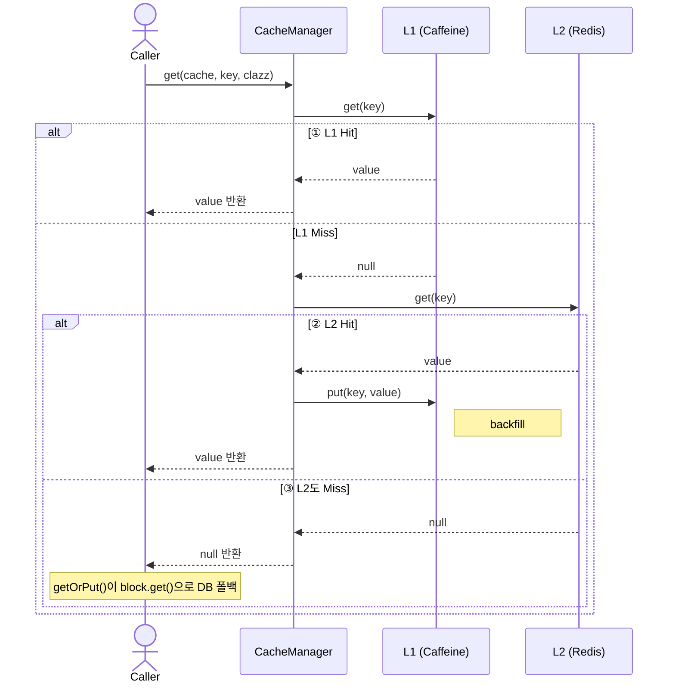
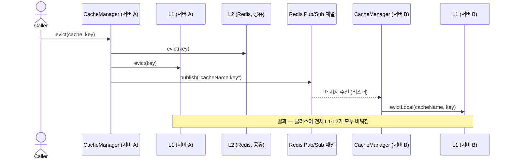
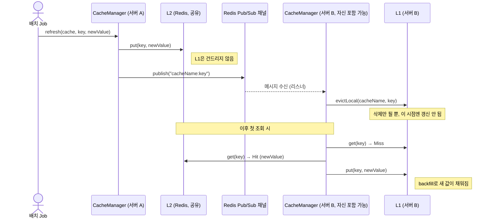

# `CacheManager` 분석: 2단 캐시 조회·무효화 게이트웨이

## 대상 코드

```java
package modi.backend.support.cache;

@Slf4j
@Component
@RequiredArgsConstructor
public class CacheManager {
    private final CaffeineCacheManager localCacheManager;   // L1
    private final RedisCacheManager redisCacheManager;      // L2
    private final RedisPublisher redisPublisher;            // 무효화 방송. refresh/evict에 내장
    // ... (아래 섹션에서 메서드별로 다룬다)
}
```

이 클래스는 "캐시를 다루는 유일한 창구"라는 클래스 주석 그대로, L1(로컬 Caffeine)·L2(Redis) 2단 캐시의 조회·쓰기·무효화·클러스터 전파를 전부 캡슐화한다. 호출부는 `MyCache` 선언과 키만 넘기면 되고, 어느 층에서 히트했는지·되채움이 일어났는지는 알 필요가 없다.

---

## 1. 필드 구성

| 필드 | 역할 |
|---|---|
| `localCacheManager` (Caffeine) | L1 — 각 서버 인스턴스 로컬 메모리 캐시. 가장 빠르지만 서버마다 따로 논다 |
| `redisCacheManager` (Redis) | L2 — 서버 간 공유되는 "전 서버 공통의 진실" |
| `redisPublisher` | L2 변경/삭제를 다른 서버들에게 방송해서 각자의 L1을 정리시키는 통로 |

`MyCache`가 `LOCAL` / `REDIS` / `TWO_TIER` 중 어떤 타입인지에 따라 이 세 필드 중 무엇을 쓸지가 갈린다.

---

## 2. 조회 흐름

### `getOrPut` — read-through 패턴

```java
public <T> T getOrPut(MyCache cache, String key, Class<T> clazz, Supplier<T> block) {
    T cached = get(cache, key, clazz);
    if (cached != null) return cached;

    T loaded = block.get();     // loader(DB) 예외만 그대로 던진다
    if (loaded != null) put(cache, key, loaded);
    return loaded;
}
```

- 캐시에서 먼저 찾고, 없으면 `block`(보통 DB 조회 람다)으로 값을 만들어 캐시에 채운 뒤 반환한다.
- 캐시 조회/저장 중 발생한 예외는 내부의 `swallow`/`swallowRun`이 삼켜서 `null`로 만들기 때문에, 캐시가 죽어도 자연스럽게 `block.get()`(DB 폴백)으로 넘어간다. 반면 `block.get()` 자체에서 던진 예외(예: DB 조회 실패)는 그대로 호출부로 전파된다 — 캐시 장애와 원본 데이터 조회 실패를 구분해서 다룬다는 뜻이다.

### `get` — TWO_TIER는 2단 조회, 그 외는 단일층

```java
public <T> T get(MyCache cache, String key, Class<T> clazz) {
    if (cache.getType() == CacheType.TWO_TIER) {
        T v1 = swallow(() -> local(cache).get(key, clazz));
        if (v1 != null) return v1;                          // ① L1 Hit

        T v2 = swallow(() -> redis(cache).get(key, clazz));
        if (v2 != null) {
            swallowRun(() -> local(cache).put(key, v2));     // ② L2 Hit → L1 backfill
            return v2;
        }
        return null;                                         // ③ 전부 Miss → getOrPut이 loader로
    }
    return swallow(() -> getByCache(cache).get(key, clazz));
}
```

`TWO_TIER`일 때의 조회 순서:

1. **L1 Hit** — 로컬 캐시에 있으면 즉시 반환. 가장 빠른 경로.
2. **L2 Hit** — L1엔 없지만 Redis엔 있으면, 그 값을 L1에 되채워 넣고(`backfill`) 반환. 다음 조회부터는 L1에서 바로 히트하게 된다.
3. **전부 Miss** — `null` 반환 → 이 메서드를 호출한 `getOrPut`이 `block`(DB)으로 폴백한다.

`LOCAL`/`REDIS` 단일 타입은 `getByCache`로 해당 저장소 하나만 조회한다.

---

## 3. 쓰기 흐름 — `put`

```java
public void put(MyCache cache, String key, Object value) {
    if (cache.getType() == CacheType.TWO_TIER) {
        swallowRun(() -> redis(cache).put(key, value));     // L2 먼저 — 전 서버 공통의 진실이다
        swallowRun(() -> local(cache).put(key, value));
        return;
    }
    swallowRun(() -> getByCache(cache).put(key, value));
}
```

- `TWO_TIER`는 **Redis(L2)를 먼저** 쓰고 그다음 로컬(L1)을 쓴다. 순서가 중요한 이유는, L2가 "전 서버가 공유하는 정답"이기 때문이다. 만약 L1을 먼저 쓰고 L2 쓰기가 실패하면, 이 서버의 L1만 새 값을 갖고 다른 서버 L1·L2는 옛날 값을 갖는 불일치가 생길 수 있다. L2를 먼저 확정해두면 이후 다른 서버들도 결국 같은 값으로 수렴한다.

---

## 4. 무효화 — `evict`

```java
public void evict(MyCache cache, String key) {
    swallowRun(() -> redis(cache).evict(key));
    swallowRun(() -> local(cache).evict(key));
    swallowRun(() -> redisPublisher.publish(cache.getName() + ":" + key));
}
```

- `evict`는 **L2 삭제 + 자기 L1 삭제 + 클러스터 방송**을 항상 세트로 수행한다.
- 방송을 받은 다른 서버들은 (아래 `evictLocal`을 통해) 자기 L1만 지운다. 결과적으로 클러스터 전체의 L1·L2가 모두 정리된다.

---

## 5. 배치 재적재 — `refresh`

```java
public void refresh(MyCache cache, String key, Object value) {
    swallowRun(() -> redis(cache).put(key, value));
    swallowRun(() -> redisPublisher.publish(cache.getName() + ":" + key));
}
```

`evict`와 비교하면 차이가 명확하다.

| | `evict` | `refresh` |
|---|---|---|
| L2 | 삭제 | 새 값으로 **갱신** |
| 자기 L1 | 삭제 | 건드리지 않음 |
| 방송 | O | O |
| 용도 | 일반 무효화 | 배치job이 원본 데이터를 갱신한 뒤 캐시를 새 값으로 밀어넣는 경우 |

- `refresh`는 이미 새 값을 알고 있는 배치 재적재 상황을 위한 메서드다. L2는 새 값으로 바로 갱신하고, 방송을 통해 **다른 서버들의 L1**을 지운다 — 자기 자신의 L1도 방송을 구독하고 있다면 결국 같은 경로로 지워지고, 다음 조회 시 `get()`의 L2 Hit → backfill 경로를 타고 새 값이 L1에 다시 채워진다. 즉 L1 갱신을 직접 하지 않고 "지우고 나중에 backfill되게" 맡기는 방식이다.

---

## 6. 방송 수신 — `evictLocal`, `clearLocal`

```java
public void evictLocal(String cacheName, String key) {
    Cache cache = localCacheManager.getCache(cacheName);
    if (cache != null) {
        cache.evict(key);       // 없어도, 중복이어도 무해하다 (멱등)
    }
}
```

- Redis pub/sub 리스너가 메시지를 받았을 때 호출하는 **수신 전용 진입점**이다. 자기 자신의 L1만 지운다.
- 멱등(idempotent)하게 설계되어 있다 — 캐시가 없거나 키가 이미 없어도 예외 없이 조용히 끝난다. 방송이 중복 수신되어도 안전하다.

```java
public void clearLocal() {
    for (String name : localCacheManager.getCacheNames()) {
        Cache cache = localCacheManager.getCache(name);
        if (cache != null) cache.clear();
    }
}
```

- Redis 구독이 끊겼다가 재연결되는 등, **어떤 무효화 이벤트를 놓쳤는지 알 수 없는 상황**을 위한 안전판이다. "무엇을 지워야 할지 모르겠으면 전부 지운다"는 보수적인 전략으로, 이 서버의 L1 전체를 비워 다음 조회부터 L2/DB로부터 다시 채워지게 만든다.

---

## 7. 저장소 결정 — `getByCache`

```java
private Cache getByCache(MyCache cache) {
    return switch (cache.getType()) {
        case LOCAL -> local(cache);
        case REDIS, TWO_TIER -> redis(cache);
    };
}
```

- `MyCache` 선언의 `CacheType`이 실제로 어느 저장소를 쓸지 결정한다.
- 이건 **enum에 대한 switch 표현식**이다. Java의 switch 표현식은 모든 case를 다뤄야 컴파일이 통과한다 — `CacheType`에 새로운 값이 추가되는데 이 switch를 안 고치면, `default` 분기가 없는 한 **컴파일 에러**로 즉시 드러난다.
- **주의**: 완전성을 주는 것은 `MyCache`의 `sealed`가 아니라 `CacheType`이 **enum**이라는 사실이다. 여기서 스위치하는 대상이 `cache`가 아니라 `cache.getType()`이기 때문이다. 혼동하기 쉬운 지점이라 코드 주석에도 그렇게 적어 두었다.
- 그래서 **`default`를 습관적으로 넣으면 안 된다.** 넣는 순간 새 `CacheType` 상수가 생겨도 컴파일러가 침묵하고, 새 저장소가 조용히 Redis로 라우팅된다.
- 참고로 `getByCache`는 `TWO_TIER`도 단순히 `redis(cache)`로 매핑하지만, 실제로 `TWO_TIER`는 `get`/`put`에서 이 메서드를 거치지 않고 별도 분기(L1→L2 순서 로직)를 탄다. `getByCache`가 `TWO_TIER`를 다루는 건 이론상 도달 가능성을 막기 위한 안전망 성격에 가깝다.

---

## 8. 실패 격리 — `swallow` / `swallowRun`

```java
private <T> T swallow(Supplier<T> supplier) {
    try {
        return supplier.get();
    } catch (Exception e) {
        log.warn("캐시 조회 실패, DB로 폴백한다", e);
        return null;
    }
}

private void swallowRun(Runnable runnable) {
    try {
        runnable.run();
    } catch (Exception e) {
        log.warn("캐시 반영 실패, 건너뛴다", e);
    }
}
```

- 캐시 계층(Redis 다운, Caffeine 예외 등)에서 발생하는 모든 예외는 여기서 잡혀 로그만 남고 삼켜진다.
- 이 덕분에 `get()`이 `null`을 반환하면 `getOrPut`이 자연스럽게 `block.get()`(DB 조회)으로 폴백한다 — **"캐시 장애 ≠ 서비스 장애"** 를 코드로 보장하는 지점이다.
- `put`/`evict`/`refresh` 역시 캐시 반영이 실패해도 예외를 던지지 않고 건너뛴다. 캐시는 어디까지나 성능 최적화 계층이지, 실패해도 되는 부가 기능이라는 설계 철학이 이 두 헬퍼에 응축되어 있다.

---

## 흐름 요약 시퀀스 다이어그램

### `get(TWO_TIER)` — L1→L2→backfill



### `evict` — 클러스터 전체 무효화



### `refresh` — 배치 재적재 후 전파



---

## 한눈에 보는 요약표

| 메서드 | 대상 | 동작 |
|---|---|---|
| `getOrPut` | 호출부 진입점 | 조회 → 없으면 loader 실행 후 캐시 채움 |
| `get` | 조회 | TWO_TIER는 L1→L2→backfill, 그 외는 단일층 조회 |
| `put` | 쓰기 | TWO_TIER는 L2 먼저, 그다음 L1 |
| `evict` | 무효화 | L2 삭제 + 자기 L1 삭제 + 방송 |
| `refresh` | 배치 재적재 | L2 갱신 + 방송 (L1은 backfill에 맡김) |
| `evictLocal` | 방송 수신 | 자기 L1만 삭제 (멱등) |
| `clearLocal` | 안전판 | 구독 공백 대비, 로컬 캐시 전체 삭제 |
| `getByCache` | 저장소 라우팅 | `CacheType` switch 표현식, exhaustive 강제 |
| `swallow`/`swallowRun` | 실패 격리 | 캐시 예외를 삼켜 DB 폴백/무해한 건너뜀으로 전환 |
